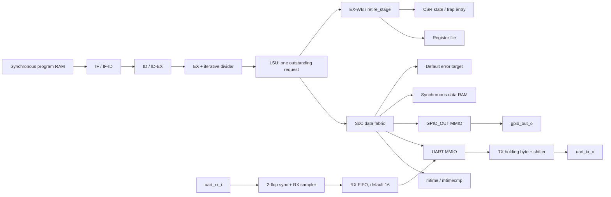

# RV32IM RISC-V SoC

A small 32-bit RISC-V processor and SoC written in SystemVerilog as a learning
project. The immediate goal is a transparent, testable path from instruction
fetch to bare-metal UART interaction and eventually preemptive FreeRTOS on an
FPGA—not maximum performance or Linux compatibility.

> I want to understand why every instruction retires exactly once, even when
> memory stalls, a branch redirects the pipeline, or a trap interrupts the
> normal path.

The repository records the reasoning as well as the RTL. Focused `AR*.md`
reports preserve failures, alternatives, decisions, consequences, and proof;
the [project knowledge base](doc/PROJECT_KNOWLEDGE_BASE.md) is the best gradual
introduction.

## Current development status

Phases 1–4 are complete. Phase 5 provides a split-image C runtime, minimal
drivers, and three bare-metal programs; it is complete. Phase 6 now boots the pinned official
FreeRTOS V11.3.0 GCC RISC-V port in ModelSim with preemption, queues, UART,
GPIO, and context sentinels. Phase 7 provides the ZYNQ MINI REVB
top/XDC and routed bitstreams for all three programs. JTAG plus the physical
`timer_gpio` and `timer_irq` LED tests pass; external-UART `hello`, repeated
reset, speed-grade identification, an extended FreeRTOS simulation, and
FreeRTOS FPGA execution remain open.

| Area | Implemented now |
|---|---|
| ISA | RV32I plus RV32M; iterative 32-cycle DIV/DIVU/REM/REMU |
| Pipeline | In-order packed packets, RAW stalls, redirects, delayed fetch kill, and canonical bubbles |
| Retirement | Central architectural decision point for RF/CSR writes, traps, MRET, WFI, and `minstret` |
| Privilege | Machine CSRs, legality/WARL behavior, precise synchronous exceptions and timer interrupts |
| WFI | Retires once, then enters a logical wait state until an eligible interrupt |
| Memory | Synchronous program/data RAM, one-outstanding LSU, byte lanes, alignment, wait states, and access faults |
| Fabric | Registered response-owner mux for timer, UART, GPIO, RAM, and default error target |
| Timer | 64-bit `mtime`/`mtimecmp`, MTIP level, local offsets `0xBFF8`/`0x4000` |
| UART | Polling 8N1 TX and RX, default 16-byte RX FIFO, sticky overrun/framing errors |
| GPIO | 32-bit R/W MMIO register driving parameterized low output bits; default width 8 |
| Verification | Focused protocol tests, 22/22 smoke, 47/47 applicable ACT4 I/M refreshed 2026-08-17, Phase 3 2/2, Phase 4 3/3, Phase 5 4/4, Phase 6 1/1 |
| FPGA | ZYNQ MINI REVB top/XDC/build; four routed 25 MHz bitstreams including FreeRTOS, 0 DRC errors, WNS +22.093 ns or better; remaining hardware observation open |
| Software | Reset-to-C runtime, split linker/drivers, three bare-metal apps, and pinned official FreeRTOS V11.3.0 demo |

This is a verified development baseline, not a complete ISA-compliance or
production-readiness claim. There is no cache, MMU, S-mode, PLIC, AXI fabric,
or full forwarding network.

## Architecture at a glance



Instruction RAM has one-cycle read latency, so fetch carries a delayed request
PC beside each response and kills the stale response after a redirect. The LSU
captures a memory request, holds its payload stable until accepted, waits for
exactly one response, and advances the owning instruction only after completion.

`retire_stage.sv` is the architectural boundary. Execution may produce a
redirect or trap candidate, but only retirement chooses register/CSR effects,
trap entry, MRET, WFI entry, and the next architectural PC. This distinction
keeps younger or faulting instructions from leaking side effects.

The data fabric decodes full addresses, subtracts each target base, and records
which target accepted the request. The registered owner—not the current
address—selects the later response. That is essential when RAM or a peripheral
responds after the request cycle.

## UART: the current FPGA interaction path

The UART uses the native `core_bus_req_t`/`core_bus_rsp_t` protocol; there is no
APB bridge and no packet/CRC layer.

| Address | Register | Access | Meaning |
|---:|---|---|---|
| `0x1000_0000` | `TXDATA` | W | Enqueue low byte for transmission |
| `0x1000_0004` | `STATUS` | R | TX ready/busy, RX valid/full/errors/count |
| `0x1000_0008` | `RXDATA` | R | Pop oldest received byte; zero when empty |
| `0x1000_000C` | `RXERROR` | R/W1C | Sticky overrun and framing-error flags |

`STATUS[0]` is TX ready, `[1]` TX busy, `[2]` RX valid, `[3]` RX full,
`[4]` RX overrun, `[5]` RX framing error, and `[15:8]` RX count.

The RX pin first passes through a two-flop synchronizer. A separate midpoint
8N1 sampler emits byte or framing-error events; the MMIO target then owns FIFO
and sticky-error policy. If the FIFO is full, the newest byte is dropped and
old ordered data is preserved. An empty RXDATA read returns immediately rather
than deadlocking the core bus.

See the [Phase 4 UART guide](docs/phase4-uart-guide.md),
[AR-020 TX](doc/AR020_MINIMAL_POLLING_UART_TX.md), and
[AR-021 RX FIFO](doc/AR021_POLLING_UART_RX_FIFO.md).

## GPIO: the current LED/output path

`GPIO_OUT` is a 32-bit R/W register at `0x1000_1000`. Its low
`GPIO_WIDTH` bits drive `gpio_out_o`; the default width is eight and the
default reset value is zero. Legal byte, aligned halfword, and aligned word
writes merge only their selected lanes. Invalid offsets, alignment, or strobes
return a registered error and cannot change the output.

See the [Phase 4 GPIO guide](docs/phase4-gpio-guide.md) and
[AR-022](doc/AR022_MEMORY_MAPPED_GPIO_OUTPUT.md).

## Verification evidence

Tests report completion through a committed store to `tohost`: value 1 is
PASS; another nonzero value is a test-specific failure. The regression runner
also requires simulator exit zero, the architectural PASS marker, no fatal
marker, and zero ModelSim errors, preventing PASS-looking false positives.

| Gate | Current result | What it proves |
|---|---:|---|
| Smoke regression | 22/22 PASS | Directed CPU, CSR, trap, LSU, and bus behavior |
| Applicable ACT4 | 47/47 PASS, refreshed 2026-08-17 | 39 RV32I and 8 RV32M architectural cases |
| Phase 3 | 2/2 PASS | Precise timer/WFI behavior and long-duration timer run |
| Phase 4 | 3/3 PASS | UART text, 16-byte RX-to-TX echo, and GPIO pin waveform/readback |
| Phase 5 | 4/4 PASS | Split data image, C startup/UART, timer-polled GPIO, and ten full-context timer interrupts |
| Phase 6 | 1/1 PASS | Official FreeRTOS tick/preemption, queue traffic, context sentinels, UART heartbeat, and GPIO activity |
| Unified release command | PASS, 2026-08-17 | Map/tool gates, focused fabric, smoke, Phases 3–6, ACT4 classification, and ACT4 47/47 |
| SoC-map generator unit tests | 9/9 PASS | Canonical map validation and generated addresses |
| UART focused tests | PASS | TX/RX framing, FIFO order/full/error/W1C, and bus semantics |
| Vivado 2019.2 OOC SoC check | PASS | 0 errors/critical warnings; BRAM, LSU, UART RX/TX, and GPIO hierarchy retained |
| ZYNQ MINI REVB route/bitgen | 4/4 PASS | Three bare-metal plus one FreeRTOS bitstream; 0 DRC errors, TNS 0, WNS +22.093 ns or better, and initialized program/data BRAM |
| ZYNQ MINI REVB hardware | 2/3 applications PASS | JTAG recovered; `timer_gpio` LED sequence and ten-count `timer_irq` observed; external-UART `hello` pending |

The Phase 4 echo test drives actual 8N1 waveforms into `uart_rx_i`. Firmware
polls and drains a 16-byte stream, writes each byte to TX, and an independent
serial decoder checks `RX FIFO 16 OK!\r\n`. The focused FIFO test separately
fills all 16 entries and verifies full/overrun behavior. Together they verify
the complete pin → receiver → FIFO → CPU → transmitter → pin path in simulation.

The 2026-08-17 release-cleanup run regenerated ACT4 4.0.0 artifacts before
execution, then passed 47/47 ACT4, 22/22 directed smoke, the focused data-fabric
test, 12/12 converter/importer tests, 9/9 map-generator tests, and the regression
classifier test. It also removed the obsolete fixed-low core `halt_o` port;
committed `tohost` stores and `commit_pkt_t` are the completion and retirement
observation contracts. See [AR-012](doc/AR012_RETIREMENT_INTERFACE_CLEANUP.md).

After per-extension ACT4 tagging and the unified runner were added, the single
release command passed again in 497.3 seconds: every local gate plus 39 RV32I
and eight RV32M cases, with zero failed steps and zero nonzero simulator exits.

## Try it

### Requirements

- ModelSim or QuestaSim (`vlog` and `vsim` on `PATH`)
- Windows PowerShell for the regression scripts
- Python 3 for map/tool tests
- a RISC-V GNU toolchain under WSL when rebuilding assembly images
- WSL Ubuntu with the pinned ACT4 dependencies when regenerating official
  architecture-test artifacts
- Vivado 2019.2 or compatible for optional synthesis checks

The recorded reference environment is Windows 11, Windows PowerShell 5.1,
ModelSim SE-64 2019.2, Python 3.12.9, WSL2 Ubuntu 26.04 LTS,
`riscv64-unknown-elf-gcc` 14.2.0, Clang/LLVM 21.1.8 plus Sail 0.10 for ACT4,
and Vivado 2019.2. See the [Phase 0 tool inventory](doc/PHASE0_BASELINE_2026-07-24.md)
for the exact recorded versions.

### Main core simulation

```powershell
Set-Location .\sim
vsim -do run.do
```

### Focused peripheral and fabric tests

From `sim/`:

```powershell
vsim -c -do run_uart_tx.do
vsim -c -do run_uart_rx.do
vsim -c -do run_core_bus_uart.do
vsim -c -do run_core_bus_uart_rx.do
vsim -c -do run_core_bus_gpio.do
vsim -c -do run_soc_data_fabric.do
```

### Regressions

From `sim/regress/`:

```powershell
Set-ExecutionPolicy -Scope Process -ExecutionPolicy Bypass
.\run_regression.ps1 -Tag smoke
.\run_regression.ps1 -Manifest .\phase3_tests.json
.\run_regression.ps1 -Manifest .\phase4_tests.json -Tag phase4
.\run_regression.ps1 -Manifest .\phase5_tests.json -Tag phase5
.\run_regression.ps1 -Manifest .\phase6_tests.json -Tag phase6
.\test_regression_result.ps1
python -m unittest test_elf_to_mem.py test_import_act4.py
```

### One-command release verification

From `sim/regress/`, run every local map/tool gate, the focused data-fabric
test, smoke, Phase 3–6, and the existing generated ACT4 manifest with:

```powershell
Set-ExecutionPolicy -Scope Process -ExecutionPolicy Bypass
.\run_release_verification.ps1
```

For a clean checkout, regenerate the pinned ACT4 I/M artifacts inside the same
fail-fast command:

```powershell
.\run_release_verification.ps1 -RegenerateAct4
```

`-SkipAct4` is a faster local preflight and is deliberately reported as
incomplete release evidence. See the [regression guide](sim/regress/README.md)
for the exact gate sequence.

Useful selectors include `-List`, `-Test soc_uart_echo`, `-Tag lsu`, and
`-Trace -DumpWaves`. See the [regression guide](sim/regress/README.md).

### Regenerate and run applicable ACT4

ACT4 4.0.0 generation uses WSL, Clang/LLVM 21, Sail 0.10, and the repository
configuration under `verif/act4/`. Build I before M so the shared target and
final manifest contain all 47 applicable cases:

```powershell
Set-Location .\sim\regress
Set-ExecutionPolicy -Scope Process -ExecutionPolicy Bypass
.\run_act4_build.ps1 -Extension I
.\run_act4_build.ps1 -Extension M

Set-Location ..\..
.\sim\regress\run_regression.ps1 `
  -Manifest .\build\act4\tests.json `
  -Tag act4
```

ACT4 is an ISA regression gate, not a certification claim and not a substitute
for directed bus, trap, peripheral, firmware, synthesis, or board tests. See
the [ACT4 integration guide](verif/act4/README.md) for tool versions and
environment details and the
[compact 2026-08-17 baseline](doc/evidence/act4/BASELINE_2026-08-17.md) for the
39 RV32I plus eight RV32M result and per-extension manifest classification.

### Build the FreeRTOS images

The default image targets the board's 25 MHz CPU/MTIME clock and real 500 ms/
1 s task periods:

```powershell
wsl.exe -e bash -lc "cd /mnt/d/Rsicv-soc-worktrees/phase2-act4-cleanup && bash sw/build_firmware_wsl.sh --install freertos_demo"
```

The focused RTL regression uses a distinct time-scaled image while retaining a
1 kHz kernel tick:

```powershell
wsl.exe -e bash -lc "cd /mnt/d/Rsicv-soc-worktrees/phase2-act4-cleanup && SOC_FREERTOS_MTIME_HZ=5000000 SOC_FREERTOS_DEMO_TIME_SCALE=100 SOC_FREERTOS_SIM_COMPLETION=1 SOC_FREERTOS_IMAGE_SUFFIX=_sim bash sw/build_firmware_wsl.sh --install freertos_demo"
```

See [AR-025](doc/AR025_OFFICIAL_FREERTOS_RISCV_PORT.md) for the port boundary,
memory policy, and verification evidence.

### Generate and validate the SoC map

[`config/soc_map.json`](config/soc_map.json) is the single editable source for
RTL, firmware, linker, simulation, synthesis, and ACT4 address artifacts.

```powershell
python .\tools\gen_soc_map.py
python .\tools\gen_soc_map.py --check
python -m unittest tools/test_gen_soc_map.py
```

Do not hand-edit generated map files. An `accepted` map freezes the hardware/
software ABI; implementation status is recorded separately.

### Optional Vivado boundary checks

From `sim/synth/`:

```powershell
vivado -mode batch -source .\check_riscv_soc_ar003.tcl
vivado -mode batch -source .\check_riscv_soc_configured_ram.tcl
vivado -mode batch -source .\check_phase5_firmware_init.tcl
vivado -mode batch -source .\compare_riscv_soc_ram_utilization.tcl -tclargs ram_16k
vivado -mode batch -source .\compare_riscv_soc_ram_utilization.tcl -tclargs ram_64k
```

These are out-of-context checks using the provisional FPGA part. They prove
synthesizability and resource retention, not post-route timing or correct board
pins. For the exact-board routed build and programming flow, see
[`fpga/zynq_mini_revb/README.md`](fpga/zynq_mini_revb/README.md).

## Repository map

```text
src/
  core/       CPU pipeline, packets, control, LSU, divider, retirement, CSRs
  bus/        RAM adapter, SoC fabric, and default error target
  generated/  Generated SoC-map SystemVerilog constants
  mem/        Synchronous program and data RAM
  periph/     Machine timer, UART MMIO/TX/RX, and GPIO MMIO
  riscv_soc.sv

sim/
  tb/         Core, SoC, protocol, timer, and UART testbenches
  regress/    Manifests, runner, image tools, and ACT4 adapters
  synth/      Vivado out-of-context checks
  generated/  Generated normalized map/Tcl data

config/       Authoritative SoC map and generator contract
fpga/         Exact-board top, constraints, Vivado flow, and board guide
firmware/     Generated C/linker map consumers
sw/           Reset runtime, linker, minimal drivers, and bare-metal apps
third_party/  Pinned, provenance-recorded FreeRTOS Kernel source subset
testdata/     Directed assembly and readmemh images
tools/        Map generator and dependency-free tests
verif/act4/   RISC-V Architecture Test integration
doc/          Living architecture documents and focused AR reports
docs/         Phase-oriented implementation guides
```

Build scripts list sources explicitly. Planned modules are added only when a
phase defines a real interface; empty future placeholders are not kept.

## Interview preparation

The [RV32IM SoC interview guide](docs/INTERVIEW_GUIDE.md) turns the repository
into a design narrative: requirements, module boundaries, pipeline and bus
protocols, refinement stories, peripherals, startup/FreeRTOS integration,
verification layers, FPGA bring-up, tradeoffs, and concise questions and
answers. Use the linked AR reports when an interviewer asks for failure evidence
or alternatives considered.

## Roadmap and open gates

The repository is interview-ready and has a refreshed CPU/SoC simulation
baseline, but it is not a completed Phase 8 hardware release. One local gate—the
extended FreeRTOS scheduler/stack-corruption run—remains alongside the external
UART/reset/speed-grade and FreeRTOS-on-board evidence.

The next practical steps are:

1. wire a 3.3 V external UART on U15/W15 and observe `Hello, UART!`;
2. repeat PL K2 reset testing and record the result;
3. confirm the device speed grade from a reliable record;
4. add the extended FreeRTOS scheduler/stack-corruption simulation;
5. build and test the production FreeRTOS demonstration on the FPGA;
6. add UART interrupts/PLIC only after the polling baseline is stable on
   hardware.

You do not need to connect the FPGA board to develop or verify the RTL. You do
need it to close the remaining hardware gate. JTAG compatibility, oscillator,
LED polarity, BRAM boot, GPIO, timer progression, and timer interrupts now have
physical evidence. Repeated reset and the external-UART crossover/baud path
still cannot be closed by implementation reports.

[`TODO.md`](TODO.md) is the authoritative checklist. Design semantics and
naming standards are in
[`doc/SEMANTIC_SIGNAL_SPEC.md`](doc/SEMANTIC_SIGNAL_SPEC.md); accepted choices
and their history are in
[`doc/ARCHITECTURE_DESIGN_AND_DECISIONS.md`](doc/ARCHITECTURE_DESIGN_AND_DECISIONS.md).

## A personal note

This is a learning record, not a production-ready processor. Mature open-source
cores are far ahead in features, performance, and verification. The unfinished
parts are kept visible because they often contain the most useful lessons.

AI tools have helped with implementation and documentation, but generated code
or prose is not proof. A change is accepted only when its behavior is
understood, its failure mode is testable, and the focused and full regressions
remain green.
