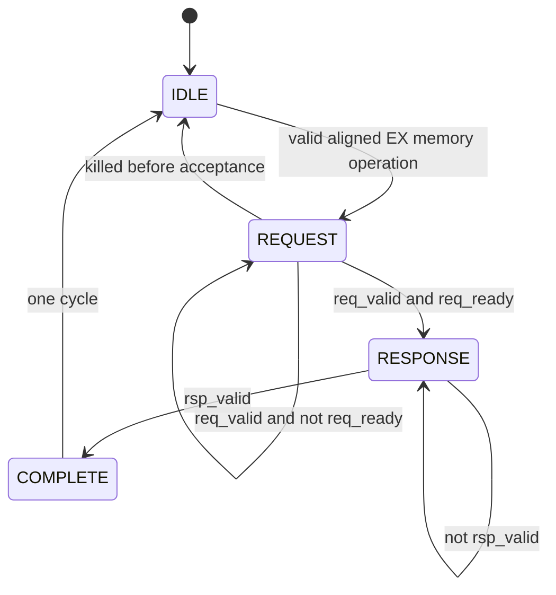

# AR-003 — Wait-State-Safe LSU Transaction Control

**State:** Fixed and verified

**Date:** 2026-07-28

## Result

The CPU data-memory path now uses a single-outstanding request/response
protocol. The LSU owns the transaction from the first EX-stage memory
operation until one response produces one EX/WB completion. Request
back-pressure and independent response delay no longer duplicate or drop
loads/stores.

The CPU boundary is intentionally smaller than AXI or APB:

```text
request:  valid, ready, byte address, write, size, write data, write strobes
response: valid, full-word read data, error
```

Both loads and stores receive exactly one response. `rsp_ready` is omitted
because the single-outstanding LSU is always able to capture its expected
response.

## Problem

Before AR-003:

- the LSU exposed placeholder RAM ready/response signals with incorrect
  ownership;
- request fields were regenerated combinationally from the live ID/EX packet;
- `core_ctrl` tied the EX stall path low;
- EX/WB had no event meaning “this memory instruction completed.”

Holding ID/EX without changing that design would keep the same instruction live
for several cycles. A store could be presented repeatedly, and the same memory
instruction could enter EX/WB and commit more than once.

## Root cause

The old path described RAM timing, not a transaction lifetime. It had no single
module responsible for:

1. capturing one memory operation;
2. holding its request stable until acceptance;
3. remembering that the accepted operation is externally visible;
4. waiting for its matching response;
5. generating exactly one pipeline completion.

Variable latency cannot be added safely by inserting a stall wire alone. The
design first needs explicit ownership and an explicit completion event.

## Options considered

### 1. Expose AXI or APB directly from the LSU

Rejected for this stage. AXI channels, IDs, bursts, and APB setup/access phases
would couple the pipeline to a particular interconnect. The current core needs
only one blocking transaction at a time.

### 2. Keep a direct RAM interface and add a fixed delay counter

Rejected. It would model one RAM latency but would not define ready/valid
ownership, response errors, or independently variable target latency.

### 3. Add a separate full MEM pipeline stage

Deferred. A full stage can improve throughput later, but it is not required to
make a blocking single-outstanding core correct.

### 4. Let the LSU own a small protocol state machine

Accepted. This is the smallest interface that defines transaction lifetime,
supports RAM/APB/AXI adapters, and preserves a clear CPU/SoC boundary.

## Implemented design

### Ownership

| Concern | Owner |
|---|---|
| Effective address, alignment, store lanes, load extension | `lsu.sv` |
| Request payload registers and transaction state | `lsu.sv` |
| Pipeline hold/release | `core_ctrl.sv`, using abstract LSU busy |
| Synchronous RAM timing and optional verification delays | `core_bus_data_ram.sv` |
| Physical data RAM instance | SoC/testbench, outside `riscv.sv` |
| Architectural memory retirement | EX/WB, WB, and `commit_o` |

The central control unit does not know request/response protocol states. It sees
only whether EX must wait. This keeps bus policy in the LSU and pipeline policy
in `core_ctrl`.

### LSU state machine



- `IDLE` captures address, size, write intent, aligned write data/strobes, and
  load-extension metadata.
- `REQUEST` holds the captured payload stable until `req_valid && req_ready`.
- `RESPONSE` never reissues the accepted request and waits for one response.
- `COMPLETE` releases ID/EX and presents the memory instruction to EX/WB for one
  cycle.

An unaccepted request may be cancelled by a pipeline kill. An accepted request
is not cancelled, because a store may already be externally visible.

### Pipeline behavior

`lsu_busy` drives the existing EX wait path:

```text
LSU busy -> stall PC, IF/ID, and ID/EX
LSU busy -> send a canonical bubble to EX/WB
LSU complete -> release ID/EX and send one valid memory packet to EX/WB
```

A RAW hazard does not flush ID/EX while the LSU is busy. When the memory
operation completes, the normal RAW bubble is inserted if the held decode-stage
instruction depends on the load result.

### RAM adapter

`core_bus_data_ram.sv` translates the CPU-local protocol to the synchronous
byte-writeable RAM. Parameters can independently delay request acceptance and
response delivery. This makes wait-state behavior testable without putting
verification counters or APB/AXI phases into the LSU.

`riscv.sv` now exposes the data bus. `riscv_soc.sv` owns the RAM adapter and
data RAM, matching the rule that RAM and peripherals are SoC targets rather
than CPU-internal resources.

## Required invariants

The implementation and testbenches check:

- a stalled request payload remains stable;
- only one request can be outstanding;
- an accepted request is not reissued;
- a response cannot arrive without an outstanding request;
- completion lasts one cycle;
- no request is issued while the EX operation is killed;
- a memory commit matches the completed request;
- accepted-request, response, and memory-commit counts agree at test end.

The future interrupt implementation must defer interrupt entry while an
accepted transaction is outstanding. AR-003 provides the busy state needed for
that policy; AR-008 will define the interrupt retirement boundary.

## RED evidence

The desired interface was first added to `tb_lsu_protocol.sv` and run against
the old LSU:

```powershell
Set-Location D:\Rsicv-soc\sim
vsim -c -do run_lsu_protocol.do
```

Compilation succeeded, but elaboration reported nine missing LSU ports:
clock/reset, request valid/ready/payload, response valid/payload, busy, and
completion. This proved that the old LSU had no clocked transaction owner.

The RED contract is preserved in commit `e17122a`.

## GREEN evidence

Focused protocol test:

```text
[LSU-TB] RESULT: PASS
Errors: 0
```

The test covers:

- a word load held for three request-wait cycles and four response-wait cycles;
- a byte store with aligned strobe/data and a delayed error response;
- cancellation of a killed, unaccepted request;
- two acceptances, two responses, and two completions.

Full-core inserted-wait-state test:

```powershell
run_regression.ps1 -Test rv32im_waitstate
```

Result: **1/1 passed** with request wait `2` and response wait `3`.

Complete regression:

```text
directed smoke: 20/20 passed
Python regression utilities: 4/4 passed
```

The zero-delay `rv32im` case also passes through the same external bus adapter,
so the old fixed-latency behavior is no longer a separate path.

Vivado 2019.2 out-of-context synthesis:

```powershell
Set-Location D:\Rsicv-soc\sim\synth
& 'D:\vivado\Vivado\2019.2\bin\vivado.bat' `
  -mode batch -source .\check_riscv_soc_ar003.tcl
```

Result:

```text
AR003_PART=xc7z010clg400-1
AR003_BRAM_COUNT=8
AR003_LSU_STATE_CELL_COUNT=2
AR-003 PASS: SoC bus/LSU/RAM hierarchy synthesized
```

The eight `RAMB36E1` cells are four program-memory plus four data-memory
blocks. The default out-of-context utilization report shows 7,799 slice LUTs,
2,401 registers, and 12 DSPs. No clock/XDC constraint was supplied, so this is
synthesis/interface/resource evidence, not a timing-closure claim.

## Problems encountered while implementing the fix

| Problem | Why it happened | Handling |
|---|---|---|
| The first GREEN unit run reported that the store error was missing | The checker sampled an event-qualified fault output after the one-cycle COMPLETE state had ended | Check load/store fault flags during COMPLETE; do not make stale error state appear valid |
| Direct PowerShell regression invocation was blocked | The host execution policy disables script files by default | Launch the runner with process-local `-ExecutionPolicy Bypass` |
| `powershell.exe` was absent from the restricted command PATH | The tool environment exposes PowerShell as the current shell but not by executable name | Use the full Windows PowerShell executable path |
| A typed string parameter would repeat a known Vivado 2019.2 incompatibility | The new adapter forwards a RAM initialization filename | Use an untyped initialization-file parameter in the synthesizable adapter/RAM path |

## Consequences and performance

- Correctness no longer depends on a one-cycle, always-ready target.
- A simple adapter can translate the core bus to RAM now and APB/AXI later.
- The entire front of the pipeline stalls during a data transaction. This is
  deliberate for a small blocking core, but memory latency directly increases
  cycles per instruction.
- There is no overlap between multiple data operations because only one may be
  outstanding.
- Higher performance should first be justified by measurement. Possible later
  steps are a dedicated MEM stage, buffering, caches, or multiple outstanding
  transactions; each requires stronger response ownership and ordering rules.

## Deliberate AR-004 boundary

AR-003 captures response data/error in LSU registers, which is sufficient to
separate completion from live bus timing. However, EX/WB still contains only
memory metadata. WB load data and commit raw read data are supplied from the
LSU-held response rather than fields inside the registered EX/WB packet.

Therefore AR-004 remains open:

- add raw/aligned response data and fault status to the registered memory result
  packet;
- make WB and commit consume only that packet;
- connect `rsp_error` to load/store access-fault traps;
- define the commit record for a faulting memory instruction.

## Reusable design principles

1. A stall is safe only when the held operation has one explicit owner.
2. `valid/ready` defines acceptance; `valid` alone does not.
3. Capture payload before waiting, then hold it stable.
4. Never cancel a transaction after an externally visible side effect may have
   occurred.
5. Completion, not request presentation, authorizes pipeline advance and
   retirement.
6. Keep the CPU protocol semantic and small; translate implementation-specific
   buses at adapters.
7. Control modules should consume abstract state, not duplicate another
   module's protocol state machine.
8. Verify zero latency and independently delayed acceptance/response paths.
