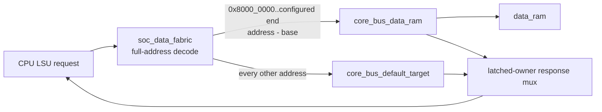

# AR-019 - Centralized data decoder and registered default target

## Status

**Implemented and verified on 2026-08-02.** The data-address portion of Phase 2
now has a centralized decoder, local RAM addressing, transaction-owned response
routing, and a side-effect-free registered error target. Phase 2 remains open
for explicit instruction-access errors, real peripheral targets, and broader
system integration.

## Problem

The CPU exposes a full 32-bit architectural data address, but `riscv_soc`
previously wired that request directly to a finite data RAM. Because the RAM
uses only index bits, an address such as `0x4000_0000` could alias a low RAM
word. There was also no response-source owner to support more than one target.
An unmapped store could therefore modify RAM instead of trapping.

## Root cause

Target selection, address translation, and response routing were absent from
the SoC boundary. A RAM adapter can safely sequence one RAM transaction, but it
cannot decide whether an architectural address belongs to RAM. That decision
must occur before any target sees the request.

## Options considered

| Option | Benefit | Decision |
|---|---|---|
| Put range checks inside `data_ram` | Small wrapper change | Rejected: couples architectural map to storage and does not scale to peripherals |
| Reuse the RAM adapter's injected-error feature | Existing error response | Rejected: verification injection is not a full-address fabric and risks routing invalid writes to the RAM target |
| Return a combinational error in `riscv_soc` | Few registers | Rejected: violates the accepted registered one-cycle target contract |
| Add a centralized single-outstanding fabric plus separate default target | Explicit ownership, scalable target boundary, deterministic faults | Selected |

## Implemented architecture



`soc_data_fabric.sv` has one CPU master, one implemented RAM target, and one
internal default target. On the request handshake it:

1. compares the complete address against the configured RAM interval;
2. forwards exactly one target request;
3. subtracts `DATA_RAM_BASE` only in the RAM-facing request copy; and
4. registers `TARGET_DATA_RAM` or `TARGET_DEFAULT` as the response owner.

While a request is outstanding the fabric deasserts CPU request-ready and does
not re-decode the live request bus. The later response is selected solely by
the registered owner. This prevents an address change after acceptance from
misrouting the response.

`core_bus_default_target.sv` accepts any non-RAM request while idle and raises a
registered response during the following cycle:

```text
rdata = 0x0000_0000
error = 1
write side effect = none
```

No default-target write signal is connected to RAM or another stateful block.
The data-RAM decode end is derived from `DATA_RAM_DEPTH * (DW/8)`, preserving
the parameterized 16 KiB/64 KiB synthesis experiments. The default SoC depths
now consume the accepted generated 16,384-word constants.

## Timing and ownership

```text
cycle N:     cpu_req_valid && cpu_req_ready
edge N:      fabric records target owner; selected target accepts
cycle N+1+:  only the recorded target may provide cpu_rsp_valid/data/error
response edge: CPU/LSU consumes response; fabric clears outstanding ownership
```

The default target responds in cycle N+1 exactly. RAM latency remains owned by
`core_bus_data_ram` and may include request or response wait states.

## Assertions and focused checks

The RTL checks, outside synthesis, that:

- RAM and default requests are never both asserted;
- a second request is never accepted while one is outstanding;
- no CPU response occurs without a registered owner;
- target responses cannot occur simultaneously or from the unowned target;
- translated RAM addresses remain within the local range; and
- request payloads remain stable under back-pressure.

`tb_soc_data_fabric.sv` verifies RAM request back-pressure, base and inclusive
end translation, an invalid store that never reaches RAM, exact registered
default latency, a changed live address while RAM owns the response, and a
held cross-target request immediately following that response.

## Verification evidence

| Check | Result |
|---|---|
| Focused fabric protocol/decode test | PASS at 116 ns; zero errors |
| SoC unmapped load firmware | PASS, cause 5 path |
| SoC unmapped store firmware | PASS, cause 7 and sentinel unchanged |
| SoC unmapped store with RAM waits 2/3 | PASS through real fabric/adapter |
| Remaining invalid-fetch contract | Expected RED; EBREAK/cause 3 remains isolated |
| Existing directed smoke | 22/22 PASS; all native simulator exits 0 |
| Regression result classifier | PASS |
| Generated-map stale check | PASS for `freertos_split_64k_v1` |
| Vivado 2019.2 accepted-map OOC synthesis | PASS; 0 errors, 32 RAMB36, fabric/default hierarchy retained |

The concise command/result record is
[`evidence/ar019_data_fabric/verification_results.txt`](evidence/ar019_data_fabric/verification_results.txt).

## Consequences and remaining risks

- Invalid data loads/stores now terminate precisely instead of aliasing RAM or
  hanging.
- Future timer/UART/GPIO modules can become explicit fabric targets without
  changing CPU or LSU semantics. Until added, their addresses intentionally
  return the default error.
- The fabric is deliberately single-outstanding; throughput optimization is
  deferred until measured need justifies added tags/queues.
- Instruction fetch still lacks an error channel, so AR-018 is not fully
  closed and Phase 2 is not complete.
- The OOC synthesis result proves elaboration and BRAM retention, not
  exact-board routed timing closure.

## Reusable principles

1. Decode a complete architectural address before truncating it for storage.
2. Register transaction identity when the request is accepted, not when the
   response happens to arrive.
3. An error target is a real target: it must obey latency, exactly-once, reset,
   and side-effect rules.
4. Translate addresses in a target-facing copy so architectural commit/debug
   records retain the original address.
