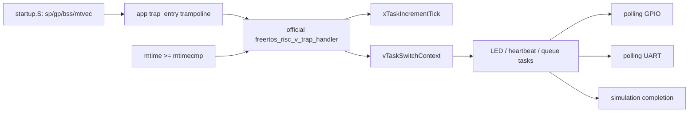

# AR-025 — Official FreeRTOS RISC-V Port Integration

**Date:** 2026-08-16
**State:** Initial ModelSim vertical slice and routed FPGA bitstream verified;
extended simulation and physical FPGA execution remain open
**Stage:** Phase 6

## Problem

The SoC had precise machine-timer interrupts, polling UART/GPIO, and a
split-image C runtime, but no scheduler. Phase 6 requires the reviewed official
FreeRTOS context-switch ABI rather than a repository-specific replacement.

## Selected upstream source

- Repository: <https://github.com/FreeRTOS/FreeRTOS-Kernel>
- Release: `V11.3.0`
- Commit: `9b777ae5c5b8e9e456065a00294d1e5f5f9facf5`
- License: MIT
- Port: `portable/GCC/RISC-V`
- Chip extension: `RISCV_MTIME_CLINT_no_extensions`
- Allocator: `portable/MemMang/heap_4.c`

`third_party/FreeRTOS-Kernel/UPSTREAM.md` records provenance. Hash comparison
against the tagged checkout proved that every imported upstream source is
byte-identical. Platform changes are outside the vendored directory.

## Existing contracts that made the port possible

The CPU already provides the upstream port's required RV32 M-mode behavior:

- RV32IM plus Zicsr, ILP32, and 16-byte stack alignment;
- direct `mtvec`, ECALL, `mret`, and read-only `mhartid=0`;
- `mstatus.MIE/MPIE/MPP`, `mie.MTIE`, and machine timer cause
  `0x8000_0007`;
- CLINT-compatible `mtime=0x0200_BFF8` and `mtimecmp=0x0200_4000`;
- safe three-write RV32 compare updates and a level-sensitive MTIP.

Unsupported `mie.MEIE` is WARL-masked away. No CPU RTL change and no atomic
`A` extension are needed. The built ELF reports
`rv32i2p1_m2p0_zicsr2p0_zmmul1p0`.

## Integration boundary



The application supplies only a one-instruction `trap_entry` trampoline. The
official assembly owns context creation, save/restore, ECALL yield handling,
timer compare updates, and `mret`. Existing bare-metal applications retain
their own trap behavior.

The linker exports `__freertos_irq_stack_top = __stack_top`, repurposing the
pre-scheduler 4 KiB main stack as the interrupt stack. `heap_4.c` owns a 24 KiB
array in data BRAM; task stacks are allocated from it. The linker keeps this
static heap below the reserved interrupt stack and rejects program/data BRAM
overflow.

## Configuration

`sw/apps/freertos_demo/FreeRTOSConfig.h` selects:

- one M-mode hart;
- preemption and time slicing;
- a 1 kHz tick;
- four priorities;
- dynamic allocation through `heap_4.c`;
- stack-overflow, malloc-failure, assertion, task-return, unexpected-exception,
  and unexpected-interrupt failure paths;
- polling UART rather than `printf`.

The default image uses a 25 MHz CPU/MTIME clock and real 500/1000 ms task
periods. `freertos_demo_sim` is a distinct image built with a modeled 5 MHz
clock and 100x shorter demonstration delays. The kernel tick remains 1 kHz.

## Demonstration and context preservation

The application creates:

1. an LED task that toggles GPIO every 500 ms;
2. a heartbeat task that writes `FreeRTOS RV32IM\r\n` and then
   `heartbeat\r\n` every second;
3. queue producer and receiver tasks that exchange increasing 32-bit values.

`context_sentinel_queue_send` loads sentinels into `s2`–`s11` before
`xQueueGenericSend`. Sending wakes the higher-priority receiver and forces the
official ECALL/task-switch path. The wrapper checks every sentinel after the
producer resumes; any corruption prevents PASS.

## Problems encountered and decisions

### Missing target C library headers

The bare cross-toolchain has no target `stdlib.h` or `string.h`, while the
kernel includes them and queues/stack checking require memory functions. A
small freestanding compatibility layer under `sw/common/libc/` plus
`sw/common/minilib.c` supplies declarations and byte-wise implementations.
Upstream code remains unchanged.

### Simulation tick shorter than context overhead

The first model used 500 cycles per tick. At 490,000 cycles, live counters
showed 557 ticks and two heartbeats but zero queue/LED progress. The simple
pipeline took longer than 500 cycles to service and restore some contexts, so
the level-sensitive timer remained in catch-up and starved lower priorities.

The simulation profile now uses 5,000 cycles per 1 ms tick. This is a model
frequency choice, not a scheduler or RTL workaround. The 25 MHz production
image naturally has 25,000 cycles per tick.

## Verification evidence

The focused run checks:

- exact UART prefix `FreeRTOS RV32IM\r\nheartbeat\r\n` and valid repeated
  heartbeat framing;
- alternating GPIO output with at least two transitions;
- at least ten observed machine-timer trap entries;
- queue order and at least eight received values before completion;
- the `s2`–`s11` context sentinels;
- ordered commits, no trap/register-write overlap, native simulator exit zero,
  and committed `tohost=1`.

GREEN evidence on 2026-08-16:

| Gate | Result |
|---|---:|
| Phase 6 focused ModelSim | 1/1 PASS at 177,747 cycles, 11 timer IRQs |
| ZYNQ MINI REVB Vivado build | PASS, routed WNS +22.824 ns, 0 DRC errors |
| Directed smoke | 22/22 PASS |
| Existing Phase 5 firmware | 4/4 PASS |
| ELF converter/importer unit tests | 12/12 PASS |
| Program text | 10,244 bytes after sentinel integration |
| Data `.rodata + .data + .bss` | 25,312 bytes |

Reproduce the simulation image and test:

```powershell
wsl.exe -e bash -lc "cd /mnt/d/Rsicv-soc-worktrees/phase2-act4-cleanup && SOC_FREERTOS_MTIME_HZ=5000000 SOC_FREERTOS_DEMO_TIME_SCALE=100 SOC_FREERTOS_SIM_COMPLETION=1 SOC_FREERTOS_IMAGE_SUFFIX=_sim bash sw/build_firmware_wsl.sh --install freertos_demo"
Set-Location .\sim\regress
.\run_regression.ps1 -Manifest .\phase6_tests.json -Tag phase6
```

Build the production 25 MHz image with real task periods:

```powershell
wsl.exe -e bash -lc "cd /mnt/d/Rsicv-soc-worktrees/phase2-act4-cleanup && bash sw/build_firmware_wsl.sh --install freertos_demo"
```

## Remaining gates

- Add an extended scheduler/stack-corruption simulation rather than treating
  the short deterministic demo as a soak test.
- Observe the banner/heartbeat and LED behavior on the physical FPGA.
- Keep the separate external-UART, repeated-reset, and speed-grade checks open.

The Phase 6 initial port is operational in ModelSim and has a routed board
bitstream, but the full phase remains open until the extended run is added.
Physical execution remains a Phase 7 gate.
