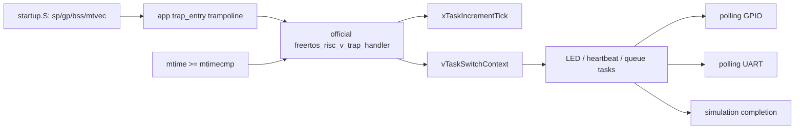

# AR-025 — Official FreeRTOS RISC-V Port Integration

**Date:** 2026-08-16; extended-run follow-up 2026-08-18; hardware follow-up 2026-08-23
**State:** Focused and extended ModelSim profiles, routed FPGA bitstream, and
physical UART/GPIO execution verified
**Stage:** Phase 6

## Problem

The SoC had precise machine-timer interrupts, polling UART/GPIO, and a
split-image C runtime, but no scheduler. Phase 6 requires the reviewed official
FreeRTOS context-switch ABI rather than a repository-specific replacement.

## Selected upstream source

- Repository: <https://github.com/FreeRTOS/FreeRTOS-Kernel>
- Release: `V11.3.0`
- Commit: `9b777ae5c5b8e9e456065a00294d1e5f5f9facf5`
- License: MIT
- Port: `portable/GCC/RISC-V`
- Chip extension: `RISCV_MTIME_CLINT_no_extensions`
- Allocator: `portable/MemMang/heap_4.c`

`third_party/FreeRTOS-Kernel/UPSTREAM.md` records provenance. Hash comparison
against the tagged checkout proved that every imported upstream source is
byte-identical. Platform changes are outside the vendored directory.

## Existing contracts that made the port possible

The CPU already provides the upstream port's required RV32 M-mode behavior:

- RV32IM plus Zicsr, ILP32, and 16-byte stack alignment;
- direct `mtvec`, ECALL, `mret`, and read-only `mhartid=0`;
- `mstatus.MIE/MPIE/MPP`, `mie.MTIE`, and machine timer cause
  `0x8000_0007`;
- CLINT-compatible `mtime=0x0200_BFF8` and `mtimecmp=0x0200_4000`;
- safe three-write RV32 compare updates and a level-sensitive MTIP.

Unsupported `mie.MEIE` is WARL-masked away. No CPU RTL change and no atomic
`A` extension are needed. The built ELF reports
`rv32i2p1_m2p0_zicsr2p0_zmmul1p0`.

## Integration boundary



The application supplies only a one-instruction `trap_entry` trampoline. The
official assembly owns context creation, save/restore, ECALL yield handling,
timer compare updates, and `mret`. Existing bare-metal applications retain
their own trap behavior.

The linker exports `__freertos_irq_stack_top = __stack_top`, repurposing the
pre-scheduler 4 KiB main stack as the interrupt stack. `heap_4.c` owns a 24 KiB
array in data BRAM; task stacks are allocated from it. The linker keeps this
static heap below the reserved interrupt stack and rejects program/data BRAM
overflow.

## Configuration

`sw/apps/freertos_demo/FreeRTOSConfig.h` selects:

- one M-mode hart;
- preemption and time slicing;
- a 1 kHz tick;
- four priorities;
- dynamic allocation through `heap_4.c`;
- stack-overflow, malloc-failure, assertion, task-return, unexpected-exception,
  and unexpected-interrupt failure paths;
- polling UART rather than `printf`.

The default image uses a 25 MHz CPU/MTIME clock and real 500/1000 ms task
periods. `freertos_demo_sim` is a distinct image built with a modeled 5 MHz
clock and 100x shorter demonstration delays. `freertos_demo_soak` uses the same
modeled clock and delays but raises completion thresholds to 1,000 tick hooks,
1,000 ordered queue receives, 100 GPIO updates, and 50 heartbeats. The kernel
tick remains 1 kHz in both simulation profiles.

## Demonstration and context preservation

The application creates:

1. an LED task that toggles GPIO every 500 ms;
2. a heartbeat task that writes `FreeRTOS RV32IM\r\n` and then
   `heartbeat\r\n` every second;
3. queue producer and receiver tasks that exchange increasing 32-bit values.

`context_sentinel_queue_send` loads sentinels into `s2`–`s11` before
`xQueueGenericSend`. Sending wakes the higher-priority receiver and forces the
official ECALL/task-switch path. The wrapper checks every sentinel after the
producer resumes; any corruption prevents PASS.

## Problems encountered and decisions

### Missing target C library headers

The bare cross-toolchain has no target `stdlib.h` or `string.h`, while the
kernel includes them and queues/stack checking require memory functions. A
small freestanding compatibility layer under `sw/common/libc/` plus
`sw/common/minilib.c` supplies declarations and byte-wise implementations.
Upstream code remains unchanged.

### Simulation tick shorter than context overhead

The first model used 500 cycles per tick. At 490,000 cycles, live counters
showed 557 ticks and two heartbeats but zero queue/LED progress. The simple
pipeline took longer than 500 cycles to service and restore some contexts, so
the level-sensitive timer remained in catch-up and starved lower priorities.

The simulation profile now uses 5,000 cycles per 1 ms tick. This is a model
frequency choice, not a scheduler or RTL workaround. The 25 MHz production
image naturally has 25,000 cycles per tick.

### A short deterministic run is not a soak test

**Problem/root cause:** The first Phase 6 image intentionally completed after
eight queue receives, two GPIO transitions, one heartbeat, and ten timer
interrupts. That is an effective fast integration gate, but it is too short to
support claims about repeated stack checks, context preservation, or scheduler
stability.

**Options considered:** Increase the only Phase 6 case, run the production
image for a host-controlled time without architectural completion, or add a
separate image with explicit firmware thresholds. Increasing the only case
would slow every release run, while a host timeout cannot distinguish useful
progress from a live lock.

**Decision:** Keep `phase6` as the fast gate and add a separately tagged
`phase6-soak` case. The build exposes completion thresholds without changing
the production defaults or vendored FreeRTOS code. Firmware owns queue order,
completion, failure hooks, and the `s2`-`s11` sentinels; the testbench
independently owns commit order, timer-trap cause, UART framing/content, GPIO
alternation, and minimum observable counts.

**Consequences:** The soak adds no RTL or kernel fork and does not inflate the
normal release command. It catches repeated context corruption, stack-overflow
hook, allocation/assertion/task-return failures, unexpected trap handlers,
duplicate/out-of-order commits, and malformed peripheral output over a much
longer run. It is still simulation evidence, not a substitute for physical
FreeRTOS execution or memory-protection hardware.

## Verification evidence

The focused run checks:

- exact UART prefix `FreeRTOS RV32IM\r\nheartbeat\r\n` and valid repeated
  heartbeat framing;
- alternating GPIO output with at least two transitions;
- at least ten observed machine-timer trap entries;
- queue order and at least eight received values before completion;
- the `s2`–`s11` context sentinels;
- ordered commits, no trap/register-write overlap, native simulator exit zero,
  and committed `tohost=1`.

GREEN evidence on 2026-08-16:

| Gate | Result |
|---|---:|
| Phase 6 focused ModelSim | 1/1 PASS at 177,747 cycles, 11 timer IRQs |
| ZYNQ MINI REVB Vivado build | PASS, routed WNS +22.824 ns, 0 DRC errors |
| Directed smoke | 22/22 PASS |
| Existing Phase 5 firmware | 4/4 PASS |
| ELF converter/importer unit tests | 12/12 PASS |
| Program text | 10,244 bytes after sentinel integration |
| Data `.rodata + .data + .bss` | 25,312 bytes |

Extended GREEN evidence on 2026-08-18:

| Gate | Result |
|---|---:|
| Phase 6 focused profile after threshold parameterization | PASS |
| Phase 6 soak | PASS at 7,262,975 cycles in 227.39 seconds on the evidence-refresh run |
| Observed machine-timer interrupts | 1,428; required at least 1,000 |
| Firmware queue/context gate | 1,000 ordered receives with `s2`-`s11` checks |
| Independent UART/GPIO observations | 1,579 valid bytes and 286 alternating transitions; required at least 567/100 |
| Simulator result | Native exit 0, `tohost=1`, 0 ModelSim errors |
| Preservation release run | PASS: smoke 23/23, Phases 3–6, ACT4 47/47, all local/tool gates |

Reproduce the simulation image and test:

```powershell
wsl.exe -e bash -lc "cd /mnt/d/Rsicv-soc-worktrees/phase2-act4-cleanup && SOC_FREERTOS_MTIME_HZ=5000000 SOC_FREERTOS_DEMO_TIME_SCALE=100 SOC_FREERTOS_SIM_COMPLETION=1 SOC_FREERTOS_IMAGE_SUFFIX=_sim bash sw/build_firmware_wsl.sh --install freertos_demo"
Set-Location .\sim\regress
.\run_regression.ps1 -Manifest .\phase6_tests.json -Tag phase6
```

Build and run the separate extended profile:

```powershell
wsl.exe -e bash -lc "cd /mnt/d/Rsicv-soc-worktrees/phase2-act4-cleanup && SOC_FREERTOS_MTIME_HZ=5000000 SOC_FREERTOS_DEMO_TIME_SCALE=100 SOC_FREERTOS_SIM_COMPLETION=1 SOC_FREERTOS_IMAGE_SUFFIX=_soak SOC_FREERTOS_MIN_QUEUE_RECEIVES=1000 SOC_FREERTOS_MIN_LED_UPDATES=100 SOC_FREERTOS_MIN_HEARTBEATS=50 SOC_FREERTOS_MIN_TICK_HOOKS=1000 bash sw/build_firmware_wsl.sh --install freertos_demo"
Set-Location .\sim\regress
.\run_regression.ps1 -Manifest .\phase6_tests.json -Tag phase6-soak
```

Build the production 25 MHz image with real task periods:

```powershell
wsl.exe -e bash -lc "cd /mnt/d/Rsicv-soc-worktrees/phase2-act4-cleanup && bash sw/build_firmware_wsl.sh --install freertos_demo"
```

## Physical FPGA follow-up

On 2026-08-23 the production image emitted `FreeRTOS RV32IM` and a sustained
heartbeat stream while PL D1 visibly toggled. Deliberate K2 resets restarted
the banner and returned to heartbeat/D1 operation. The preserved transcript
contains 17 exact banners and 537 exact heartbeats; recurring banners were
explicitly caused by the manual resets rather than spontaneous rebooting.
The transcript spans approximately 22 minutes 52 seconds, divided by those
deliberate resets rather than claimed as one uninterrupted run.

This closes physical FreeRTOS execution and the associated external-UART TX,
GPIO, and reset observation gates. The simulation soak remains the direct
1,000-queue-receive and `s2`-`s11` context-sentinel proof; the physical output
is complementary external behavior evidence. Exact setup, artifacts, hashes,
and limitations are in
[`evidence/board_20260823/README.md`](evidence/board_20260823/README.md).

The XC7Z010 speed grade remains unidentified and is separate from FreeRTOS
port correctness.
