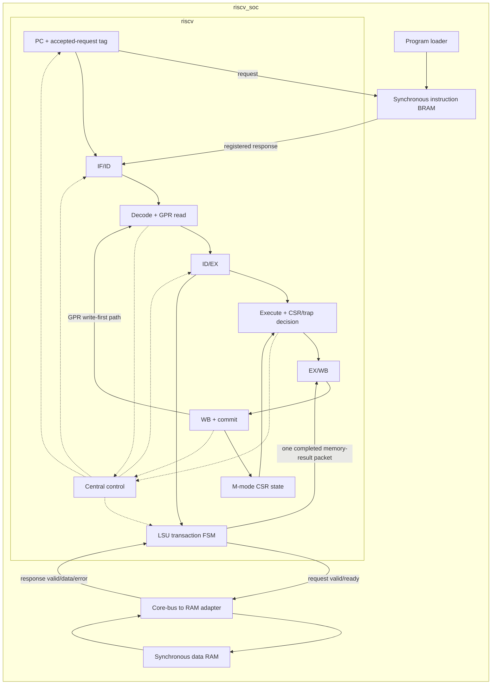
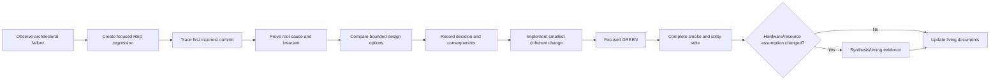

# Architecture Design and Decision Record

**Document type:** Living architecture reference

**Audience:** Designers, reviewers, learners, and future maintainers

**Last updated:** 2026-07-29

**Current milestone:** AR-003 wait-state-safe LSU and AR-004 registered memory
results/access faults implemented and verified

> This is the consolidated record of what the architecture is, why it evolved
> this way, what was learned while fixing problems, and which decisions remain
> open. Detailed RED/GREEN logs remain in the individual `AR*.md` documents.

## 1. How to use this document

Use this document to answer four questions:

1. What architecture is implemented now?
2. Why was each important design choice made?
3. What problem-resolution lessons must future work preserve?
4. What must be decided and verified before the next stage begins?

The companion
[`PROJECT_KNOWLEDGE_BASE.md`](PROJECT_KNOWLEDGE_BASE.md) explains the design as
a study guide. `TODO.md` owns detailed execution checklists. This document owns
architectural intent, decisions, consequences, and design history.

### Decision states

| State | Meaning |
|---|---|
| Proposed | An option is documented but not selected |
| Accepted | The design direction is selected |
| Implemented | RTL/tooling reflects the decision |
| Verified | Focused and regression evidence exists |
| Deferred | Deliberately outside the current milestone |
| Superseded | Replaced by a later documented decision |

## 2. Design goals and constraints

### 2.1 Primary goal

Run a demonstrable preemptive FreeRTOS system on the custom RV32IM core in the
programmable logic of a Zynq XC7Z010:

- machine-timer-driven scheduling;
- polling UART output;
- memory-mapped GPIO;
- reproducible ModelSim regression;
- reproducible Vivado bitstream;
- stable physical-board execution.

### 2.2 Current architectural constraints

- RV32IM, single hart.
- Machine mode only.
- In-order execution.
- No compressed instructions, so `IALIGN=32`.
- Harvard-style instruction and data ports in the current RTL.
- One-cycle synchronous instruction BRAM.
- Blocking, single-outstanding CPU data bus with target-controlled request and
  response latency.
- No general forwarding network beyond register-file write-first bypass.
- Combinational RV32M implementation.
- Vivado 2019.2 and ModelSim 2019.2 compatibility matter.

### 2.3 Deliberate non-goals for the FreeRTOS milestone

- S/U privilege modes.
- MMU/Sv32 and Linux.
- OpenSBI or U-Boot.
- Caches and DDR.
- AXI requirement.
- Atomics.
- PLIC and external interrupt fabric.
- High-performance forwarding or speculative execution.

These are deferred to keep the first complete system small enough to understand
and verify.

## 3. Current architecture



Key boundary facts:

- Program memory is outside the CPU in `riscv_soc`.
- Data memory is outside the CPU behind `core_bus_data_ram.sv`.
- The LSU owns one request from capture through response and emits a one-cycle
  completion to EX/WB.
- The data target may delay request acceptance and response independently.
- `commit_o` is the stable architectural observation boundary.
- EX/WB owns the completed request metadata, raw response, aligned load value,
  and response-error status consumed by WB and commit.
- Retirement, CSR writes, trap entry, and commit construction are still
  distributed across top-level and WB logic.

## 4. Governing architecture principles

These principles were learned from implemented fixes and are requirements for
future work:

1. **Architectural validity gates every side effect.**
2. **Invalid registered state has one canonical representation.**
3. **A faulting instruction is valid but normal-effect-suppressed.**
4. **Cancellation clears an aggregate as an aggregate.**
5. **Request metadata travels with the response it identifies.**
6. **A transaction retires only after one explicit completion.**
7. **Validate a resolved result before enabling its side effect.**
8. **Carry intent rather than reconstructing it from data values.**
9. **Forward the legal architectural value, not a raw operand.**
10. **Memory/resource timing is an architecture contract, not an RTL detail.**
11. **Synthesis evidence is separate from behavioral simulation evidence.**
12. **Every fixed defect becomes a permanent focused regression.**

## 5. Architecture evolution by stage

### Stage A — Basic RV32 core

**Period:** May 2026

**State:** Superseded foundation

The first stage established the essential fetch, decode, execute, memory, and
writeback behavior for a small RV32 core. Program and data memories were simple
simulation-friendly arrays, and verification was based mainly on hand-written
tests and visible register values.

Decisions:

- Use a simple in-order pipeline to make instruction flow observable.
- Begin with RV32 integer behavior before system integration.
- Keep memories tightly coupled to reduce the number of initial interfaces.

Consequences:

- The core was easy to bring up and inspect.
- Timing, cancellation, and ownership rules were implicit.
- Test completion and architectural correctness were not yet cleanly separated.

### Stage B — Pipeline and implementation refinement

**Period:** late May to June 2026

**State:** Implemented, later refined

The pipeline was expanded and adjusted for FPGA-oriented experiments. Decode
critical-path work separated operand selection from the main control case.
Memory code was simplified to improve RAM inference.

Decisions:

- Keep branch/jump resolution in EX.
- Implement RV32M combinationally for functional simplicity.
- Optimize decode structure before adding more architectural features.
- Favor synthesizable memory templates over simulation-only convenience logic.

Consequences:

- The core remained conceptually straightforward.
- Combinational division may become an FPGA timing problem.
- Synchronous-memory latency later had to be specified explicitly.

### Stage C — Packed pipeline packets

**Period:** June 2026

**State:** Implemented and retained

Flat stage wiring was replaced by typed packed structures in `riscv_pkg.sv`.

Decision:

- Treat all information belonging to one instruction as a packet passed between
  stage registers.

Why:

- Flat wiring made top-level integration difficult to read.
- Adding CSR, trap, and memory fields required many synchronized port edits.
- Reset and flush safety needed a clear aggregate boundary.

Consequences:

- Stage interfaces became smaller and more coherent.
- Packet validity became the central architectural qualifier.
- A packet-type edit now affects many modules and requires full regression.
- Later AR-001/AR-002 work showed that aggregate transfer also requires
  aggregate invalidation.

### Stage D — Central control and LSU separation

**Period:** June–July 2026

**State:** Implemented and refined by AR-003

Hazard/flush logic moved to `core_ctrl.sv`, and load/store behavior moved from
`execute.sv` into `lsu.sv`.

Decisions:

- Centralize stalls, flushes, delayed fetch kill, and pipeline kill.
- Make LSU the only owner of data-memory addressing, alignment, byte strobes,
  and load extension.
- Keep execute responsible for ALU, control transfer, RV32M, CSR calculation,
  and exception metadata.

Why:

- Control feedback and data transformation were becoming mixed in the CPU top.
- Future wait-state and bus work needs a single memory-transaction owner.
- Memory alignment must be shared by execution-time faults and WB-time load
  extraction.

Consequences:

- Module responsibilities became easier to reason about.
- `execute` consumes LSU misalignment feedback.
- AR-003 later turned the LSU into the clocked owner of a small
  request/response protocol while keeping pipeline policy in `core_ctrl`.

### Stage E — CSR, traps, retirement, and commit visibility

**Period:** July 2026

**State:** Implemented and under continued cleanup

Machine-mode CSR state, synchronous traps, MRET, architectural commit records,
and `tohost` completion were added.

Decisions:

- Handle implemented traps through CSR state and `mtvec`, not permanent halt.
- Preserve a valid trap packet through WB so it can report cause and value.
- Kill only younger instructions.
- Expose an ordered `commit_pkt_t` for verification.
- Use a committed `tohost` store as the software/test completion ABI.

Why:

- FreeRTOS needs real trap entry/return, not an EBREAK halt mechanism.
- Register-only PASS checks are not a complete architectural record.
- ACT-style verification requires stable retirement information and
  memory-mapped completion.

Consequences:

- `halt_o` became obsolete and is fixed low.
- Trap precision became testable at the architectural boundary.
- Some retirement ownership remains duplicated between top-level and WB logic.

### Stage F — Reproducible verification and ACT4 readiness

**Period:** July 2026

**State:** Implemented; official corpus execution continues

The project gained a manifest-driven ModelSim runner, separate instruction/data
image conversion, `tohost`, commit assertions, and ACT4 adapters.

Decisions:

- Preserve directed tests for microarchitectural and trap behavior.
- Run official ACT4 as a parallel ISA-correctness track.
- Keep ACT4 from blocking independent SoC features, but require it at release
  gates.
- Classify failures before changing RTL.

Consequences:

- Test execution became repeatable.
- Harness/configuration failures can be distinguished from RTL failures.
- Memory-map changes must update RTL, linker, converter, and ACT descriptions
  together.

### Stage G — Phase 0 baseline and Phase 0A precision remediation

**Period:** 2026-07-24 onward

**State:** Partially complete

The architecture review froze a green baseline, then intentionally repaired
precision and timing invariants before introducing wait states or interrupts.

Reason for ordering:

> Backpressure and asynchronous events keep instructions and controls alive for
> more cycles. They would make imprecise side effects, stale packet fields, and
> response-pairing bugs much harder to isolate.

Completed decisions are recorded in the following sections.

## 6. Resolved problem decisions

### AR-001 — Precise CSR squash

**State:** Verified

**Observed failure:** An ECALL followed by a younger `csrw` changed `mscratch`
after the trap.

**Root cause:**

- `pipe_kill` cleared only selected EX/WB fields;
- `csr.valid` remained set;
- top-level CSR write enable did not require packet validity.

**Decision:**

- Require `packet.valid && csr.valid && csr.write && !trap` at the CSR write
  owner.
- Replace partial field masking with a complete EX/WB bubble on kill.

**Alternatives rejected:**

- Extend the field-by-field kill list. It would fail again when packets grow.
- Rely only on `valid`. Defense in depth requires safe packet representation and
  final-effect qualification.

**Consequences:**

- Killed younger CSR, GPR, and store operations are suppressed.
- Precise trap behavior is expressed as an architectural invariant.

**Evidence:** Focused RED/GREEN tests and full 12/12 regression in
[`AR001_PRECISE_CSR_SQUASH_FIX.md`](AR001_PRECISE_CSR_SQUASH_FIX.md).

### AR-002 — Canonical pipeline bubbles

**State:** Verified

**Observed problem:** Reset/flush lists omitted newer CSR, MRET, and WFI packet
fields.

**Root cause:** Packet structure evolved, but safety code duplicated an older
field list.

**Decision:**

- Define typed, all-zero bubble constants beside packet types.
- Use the same bubble for reset, flush, kill, and invalid-input normalization.
- Verify packet representation and effective side effects separately.

**Alternatives rejected:**

- Encode bubbles as valid NOP instructions. A NOP still has decoded controls and
  is not the absence of an instruction.
- Preserve stale payload under `valid=0`. It increases states and weakens debug
  assertions.

**Consequences:**

- Invalid packet state is deterministic.
- New packet fields inherit safe reset/flush behavior automatically.
- Falling-edge immediate assertions observe settled nonblocking updates in the
  current simulator.

**Evidence:** 12/12 regression and packet/effect assertions in
[`AR002_CANONICAL_PIPELINE_BUBBLES.md`](AR002_CANONICAL_PIPELINE_BUBBLES.md).

### AR-005 — Synchronous instruction BRAM

**State:** Verified

**Observed failure:** A live combinational program-memory output did not match
the synchronous BRAM timing assumed by the FPGA plan.

**Root cause:** Converting only the RAM read to clocked behavior would pair the
current request PC with previous-request instruction data.

**Decision:**

- Define request acceptance on `instr_ren_o` at a rising edge.
- Let program RAM register the response word.
- Register only the accepted request PC/valid metadata in the core.
- Hold tag, RAM response, and IF/ID together during stalls.
- Derive one stale redirect response from the one-cycle outstanding-request
  count.

**Implementation problems and resolutions:**

| Problem | Resolution |
|---|---|
| Vivado rejected typed string parameter | Use untyped `FILE` parameter |
| Simulation `$error` entered synthesis | Guard diagnostic with `ifndef SYNTHESIS` |
| RAM still inferred as distributed | Keep raw array read mechanical; move policy outside |
| `ram_style` attribute could not force BRAM | Fix template structure and verify cell types |

**Consequences:**

- One instruction per cycle remains possible after startup.
- Redirect control discards exactly one old-path response.
- Program memory maps to four `RAMB36E1` primitives at default depth.

**Evidence:** 19/19 smoke, 4/4 utility tests, and Vivado BRAM report in
[`AR005_SYNCHRONOUS_INSTRUCTION_BRAM.md`](AR005_SYNCHRONOUS_INSTRUCTION_BRAM.md).

### AR-006 — Precise control-flow misalignment

**State:** Verified

**Observed failure:** Taken branch/JAL/JALR targets at `PC+2` redirected and
could write link registers instead of trapping.

**Root cause:** Target calculation and redirect side effects occurred before an
architectural IALIGN check.

**Decision:**

- Compute one resolved target first.
- Determine whether the transfer occurs.
- Check the post-JALR-mask target against named `IALIGN=32`.
- Choose exactly one result: redirect or valid trap packet.

**Consequences:**

- Not-taken branches do not fault on unused targets.
- Faulting control transfers retain trap metadata but suppress redirect and
  link-register writeback.
- `mtval` and redirect logic use the same resolved target.

**Evidence:** Three focused cases and 15/15 full regression in
[`AR006_CONTROL_FLOW_MISALIGNMENT.md`](AR006_CONTROL_FLOW_MISALIGNMENT.md).

### AR-007 — CSR legality, WARL, and dependencies

**State:** Verified for the minimal M-mode milestone

**Observed failures:**

- adjacent CSR instructions saw stale state;
- real writes to read-only CSRs did not trap;
- unsupported CSR field bits were stored;
- zero-source no-write semantics were incomplete.

**Root causes:**

- unknown/read-only behavior was implicit;
- write intent was reconstructed from data rather than encoding;
- forwarding used special cases rather than one architectural effective value.

**Decision:**

- Use an explicit implemented-address allowlist.
- Separate access legality, write intent, and WARL filtering.
- Carry `csr.write` in the packet.
- Use one WARL effective-value function for storage and WB-to-EX forwarding.
- Reserve `mip.MTIP` as hardware-owned before timer integration.

**Alternatives rejected:**

- Treat unknown CSR reads as zero. The ISA requires an illegal instruction.
- Treat a zero numeric operand as no-write. Write intent depends on encoded
  `rs1`/`zimm`, not its runtime value.
- Forward raw write operands. Younger instructions must observe the value that
  will actually be stored.

**Consequences:**

- Back-to-back CSR operations and `mepc`→MRET see newest legal state.
- The current contract remains intentionally M-mode only.
- Timer integration has a clear MTIP composition point.

**Evidence:** 3/3 focused, 18/18 smoke, and 4/4 utility tests in
[`AR007_CSR_LEGALITY_WARL_AND_HAZARDS.md`](AR007_CSR_LEGALITY_WARL_AND_HAZARDS.md).

### AR-003 — Wait-state-safe LSU transaction control

**State:** Verified

**Observed problem:** The former LSU described direct RAM wires rather than a
transaction lifetime. It had no clocked request owner, correct ready/response
direction, or one-cycle completion event. Holding EX for a future wait state
could re-present a store and repeatedly copy one memory instruction into EX/WB.

**Root cause:** Request generation, RAM timing, pipeline hold, and retirement
authorization were implicit and distributed. No module remembered whether a
request had merely been presented, had been accepted, or had completed.

**Decision:**

- Use a CPU-local, single-outstanding request/response protocol.
- Require a response for loads and stores.
- Put request registers and
  `IDLE -> REQUEST -> RESPONSE -> COMPLETE` state in the LSU.
- Let `core_ctrl` consume only abstract LSU busy state.
- Admit a memory instruction to EX/WB only during the completion event.
- Put RAM/APB/AXI translation outside the CPU.

**Alternatives rejected:**

- Expose AXI/APB phases directly from the LSU. They add coupling without value
  for a blocking core.
- Add only a delay counter or stall signal. Neither defines request acceptance,
  response ownership, or exactly-once retirement.
- Add a full MEM stage immediately. It is unnecessary for correctness at the
  present performance target.

**Consequences:**

- Request and response latency may vary independently.
- An unaccepted request can be killed; an accepted transaction is not
  cancelled.
- The front of the pipeline blocks during each data transaction.
- At the AR-003 boundary, response data/error were registered in the LSU but
  not yet in EX/WB; AR-004 subsequently closed that ownership boundary.
- AR-004 converts `rsp_error` into precise load/store access faults.

**Evidence:** focused LSU protocol GREEN, zero-delay and inserted-wait-state
full-core GREEN, 20/20 smoke, 4/4 utilities, and Vivado 2019.2 SoC
out-of-context synthesis retaining eight `RAMB36E1` cells and LSU state in
[`AR003_WAIT_STATE_SAFE_LSU.md`](AR003_WAIT_STATE_SAFE_LSU.md).

## 7. Verification decision lifecycle

Architecture problems are resolved through this lifecycle:



Required evidence for a resolved architecture issue:

- one failing test or assertion before the fix;
- an explained architectural root cause;
- explicit alternatives or rejected shortcuts;
- focused passing evidence after the fix;
- complete regression evidence;
- synthesis/timing evidence when physical behavior is part of the decision;
- updated knowledge and decision documentation.

## 8. Decision status and open architecture decisions

### AR-004 — Registered memory response ownership

**State:** Verified

**Decision:**

- Carry LSU-held raw/aligned response data and error status in the
  instruction's registered EX/WB memory-result packet.
- Make WB, trap generation, and commit consume that packet rather than live LSU
  response outputs.
- Complete response errors as precise load/store access faults, preserving
  request metadata while suppressing GPR writeback and invalid load data.

Reason:

- AR-003 removed the live bus timing dependency, but WB and commit still
  consumed LSU-held response state outside EX/WB. Instruction-owned packet
  state was required before access faults and more independent pipeline
  movement.

**Evidence:** standalone packet ownership GREEN, precise load/store
access-fault GREEN, unchanged AR-003 protocol GREEN, 22/22 smoke, 4/4 utilities,
and Vivado 2019.2 synthesis in
[`AR004_REGISTERED_MEMORY_RESULT.md`](AR004_REGISTERED_MEMORY_RESULT.md).

### AR-008 — Interrupt retirement boundary

**State:** Proposed

Required decision:

- Define interrupt entry between architectural instructions, including the
  correct resume PC after sequential, branch, jump, CSR, and memory operations.

Likely requirement:

- Add or derive retiring `next_pc`.
- Give the current instruction's synchronous exception priority.
- Defer an interrupt during an accepted data transaction.
- Keep asynchronous interrupt entry separate from a fabricated faulting
  instruction commit.

### AR-009 — Architectural memory topology and map

**State:** Proposed; must close before Phase 2

Options:

| Option | Advantages | Costs |
|---|---|---|
| Unified architectural region, dual-port BRAM | Simple linker/ACT4 view; no duplicated capacity | Requires dual-port implementation and clear self-modifying-code policy |
| Split instruction/data architectural regions | Matches current two-array RTL | Coordinated split linker, images, ACT4 config, and sum of both BRAM capacities |

The provisional addresses in `TODO.md` are not frozen. The final decision must
update RTL constants, linker scripts, firmware headers, converters, ACT4
descriptions, and tests in one change.

### AR-010 — Verification depth

**State:** Ongoing

Required decisions:

- Which architectural values every trap test must check.
- Required load/store lane and dependency matrices.
- Provenance requirements for checked-in `.hex` files.
- Release gate for official ACT4 coverage.

### AR-011 — Early FPGA feasibility

**State:** Proposed

Required evidence:

- BRAM count and inference;
- LUT/FF/DSP use;
- critical path, especially combinational divide;
- provisional clock feasibility.

If RV32M fails timing, the Phase 2 completion/backpressure mechanism should be
reused for a multi-cycle divider.

### AR-012 — Retirement and interface cleanup

**State:** Proposed

Required decisions:

- One owner for retirement, CSR writes, trap entry, and commit construction.
- Removal or explicit deprecation of `halt_o`.
- Removal of unused control ports after bus/interrupt contracts stabilize.
- Rules for placeholder files and build inclusion.

## 9. Future stage architecture gates

| Stage | Architecture decisions required before implementation | Exit evidence |
|---|---|---|
| Phase 1: contract freeze | Memory topology, byte map, faults, timer atomicity; bus lifecycle is verified | Reviewed contract can answer every address/access/error case |
| Phase 2: external data bus | Address decode, default error target, EX/WB response packet, access-fault traps; LSU FSM/backpressure are verified | Unmapped/error tests plus the already-green wait-state and old LSU suites |
| Phase 3: timer interrupt | MTIP ownership, eligibility, retirement boundary, MRET, WFI | Long repeated-interrupt test and precise commit assertions |
| Phase 4: UART/GPIO | Register semantics, partial writes, reset, decode exclusivity | Peripheral and SoC-level scoreboards |
| Phase 5: firmware | Startup ABI, linker map, image split, drivers | Same bare-metal programs in simulation and FPGA |
| Phase 6: FreeRTOS | Official port boundary, tick source, heap/stack policy | Context sentinels, preemption, queues, long run |
| Phase 7: FPGA | Board part, clock/reset, XDC, BRAM init, frequency | Timing closure, utilization, UART/LED evidence |
| Phase 8: release | Applicable ACT4 set and unified regression | Reproducible clean release evidence |

## 10. Architecture decision template

Copy this section when recording a new major decision:

```markdown
### D-XXX — Short decision title

**Date:** YYYY-MM-DD
**State:** Proposed | Accepted | Implemented | Verified | Deferred | Superseded
**Stage:** Phase or subsystem

#### Context
What requirement, failure, or future dependency creates the decision?

#### Observed problem and evidence
What behavior proves the problem exists? Link the RED test, trace, synthesis
report, or resource result.

#### Root cause
Why does the present architecture produce that behavior?

#### Options considered
1. Option A — benefits and costs.
2. Option B — benefits and costs.

#### Decision
State the selected contract or invariant precisely.

#### Consequences
- Positive consequences.
- Costs and new constraints.
- Follow-up work.

#### Verification
- Focused test.
- Full regression.
- Assertions.
- Synthesis/timing evidence if applicable.

#### Learning note
What general design principle should be reused later?
```

## 11. Continuous maintenance policy

An architecture-changing task is incomplete until this document is updated.

### Changes that require an update

- A module is added, removed, split, or becomes the owner of a side effect.
- A packet or architectural interface changes.
- Pipeline latency, stall, flush, redirect, or kill behavior changes.
- A memory or peripheral address/register behavior changes.
- A CSR, trap, interrupt, or privilege rule changes.
- A verification boundary or completion mechanism changes.
- Synthesis results force a structural decision.
- A design assumption is rejected or superseded.

### Required update sequence

1. Update the current architecture description and diagrams.
2. Add or revise the stage/decision entry.
3. Record context, root cause, alternatives, decision, and consequences.
4. Link focused RED/GREEN and full-regression evidence.
5. Update open risks and future gates.
6. Update the companion knowledge base in beginner-friendly language.
7. Update `TODO.md` if phase status or dependency ordering changed.

### Review checklist

- [ ] Current RTL matches the stated architecture.
- [ ] Timing is described in clock-edge or handshake terms.
- [ ] Every architectural effect has a named owner and valid condition.
- [ ] Alternatives and tradeoffs are recorded.
- [ ] Verification proves the contract, not only one implementation.
- [ ] Resource/timing claims have synthesis evidence.
- [ ] New terminology is explained in the knowledge base.
- [ ] Superseded statements are marked or removed.

## 12. Source documents and evidence

- [Project roadmap](../TODO.md)
- [Phase 0 baseline](PHASE0_BASELINE_2026-07-24.md)
- [Architecture review](ARCHITECTURE_REVIEW_AND_ACTION_PLAN.md)
- [Verification framework](../docs/verification_framework.md)
- [Memory-map and bus contract guide](MEMORY_MAP_CONTRACT_DESIGN_GUIDE.md)
- [AR-001 precise CSR squash](AR001_PRECISE_CSR_SQUASH_FIX.md)
- [AR-002 canonical bubbles](AR002_CANONICAL_PIPELINE_BUBBLES.md)
- [AR-005 synchronous instruction BRAM](AR005_SYNCHRONOUS_INSTRUCTION_BRAM.md)
- [AR-006 control-flow misalignment](AR006_CONTROL_FLOW_MISALIGNMENT.md)
- [AR-007 CSR contract](AR007_CSR_LEGALITY_WARL_AND_HAZARDS.md)
- [ACT4 integration handoff](ACT4_RV32I_INTEGRATION_HANDOFF_2026-07-27.md)
- [ACT4 integration guide](../verif/act4/README.md)
