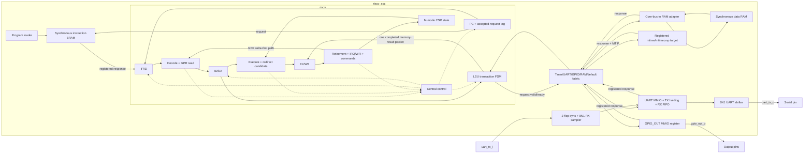
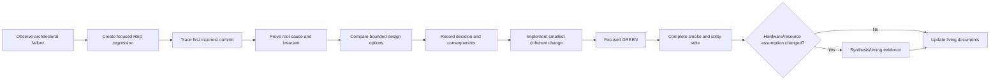

# Architecture Design and Decision Record

**Document type:** Living architecture reference

**Audience:** Designers, reviewers, learners, and future maintainers

**Last updated:** 2026-09-10

**Current milestone:** The first custom-RV32IM FreeRTOS FPGA demonstration is
complete. AR-024 implements the ZYNQ MINI REVB boundary; together with AR-025
the flow produces four routed 25 MHz bitstreams with non-negative timing and no
DRC errors. JTAG, LED/timer applications, external UART TX, production FreeRTOS
heartbeat/D1 behavior, deliberate K2 restarts, and the extended ModelSim soak
all pass. Positive speed-grade identification and optional UART interrupts/PLIC
remain open.

AR-026 now accepts a scalable UVM verification direction for post-release
growth. It is documentation-only: no UVM source or new verification claim is
implemented yet. The first gated slice is a passive adapter from the existing
`commit_pkt_t` to a stable retirement transaction and ordered scoreboard.

AR-027 accepts a constrained `src/common/` admission policy and an
evidence-gated multiplier-pipeline direction. No common RTL or multiplier
register is added: P0 workload activity and an exact routed timing report must
precede such a latency-changing decision. P0 is now active as a measurement-
only phase. One RV32IM VCD/backward-SAIF format spike ran, but the clockless
OOC import mapped only 4% of design nets and its power number is rejected. The
repository licensing policy is also adopted as noncommercial source-available
with commercial use handled through a separate written agreement.

> This is the consolidated record of what the architecture is, why it evolved
> this way, what was learned while fixing problems, and which decisions remain
> open. Detailed RED/GREEN logs remain in the individual `AR*.md` documents.

## 1. How to use this document

Use this document to answer four questions:

1. What architecture is implemented now?
2. Why was each important design choice made?
3. What problem-resolution lessons must future work preserve?
4. What must be decided and verified before the next stage begins?

The companion
[`PROJECT_KNOWLEDGE_BASE.md`](PROJECT_KNOWLEDGE_BASE.md) explains the design as
a study guide. `TODO.md` owns detailed execution checklists. This document owns
architectural intent, decisions, consequences, and design history.

### Decision states

| State | Meaning |
|---|---|
| Proposed | An option is documented but not selected |
| Accepted | The design direction is selected |
| Implemented | RTL/tooling reflects the decision |
| Verified | Focused and regression evidence exists |
| Deferred | Deliberately outside the current milestone |
| Superseded | Replaced by a later documented decision |

## 2. Design goals and constraints

### 2.1 Primary goal

Run a demonstrable preemptive FreeRTOS system on the custom RV32IM core in the
programmable logic of a Zynq XC7Z010:

- machine-timer-driven scheduling;
- polling UART output;
- memory-mapped GPIO;
- reproducible ModelSim regression;
- reproducible Vivado bitstream;
- stable physical-board execution.

### 2.2 Current architectural constraints

- RV32IM, single hart.
- Machine mode only.
- In-order execution.
- No compressed instructions, so `IALIGN=32`.
- Harvard-style instruction and data ports in the current RTL.
- One-cycle synchronous instruction BRAM.
- Blocking, single-outstanding CPU data bus with target-controlled request and
  response latency.
- No general forwarding network beyond register-file write-first bypass.
- Combinational RV32M multiplication plus iterative multi-cycle division.
- Vivado 2019.2 and ModelSim 2019.2 compatibility matter.

### 2.3 Deliberate non-goals for the FreeRTOS milestone

- S/U privilege modes.
- MMU/Sv32 and Linux.
- OpenSBI or U-Boot.
- Caches and DDR.
- AXI requirement.
- Atomics.
- PLIC and external interrupt fabric.
- High-performance forwarding or speculative execution.

These are deferred to keep the first complete system small enough to understand
and verify.

## 3. Current architecture



Key boundary facts:

- Program memory is outside the CPU in `riscv_soc`.
- Data memory is outside the CPU behind `core_bus_data_ram.sv`.
- The LSU owns one request from capture through response and emits a one-cycle
  completion to EX/WB.
- The data target may delay request acceptance and response independently.
- `commit_o` observes instruction retirement; `trap_entry_t` separately
  observes synchronous/asynchronous architectural trap entry.
- EX/WB owns the completed request metadata, raw response, aligned load value,
  and response-error status consumed by WB and commit.
- `retire_stage.sv` owns RF/CSR/trap/MRET/WFI/commit decisions;
  `csr_regfile.sv` owns storage, WARL preview, MTIP composition, and ordered
  state updates.
- The fabric registers timer, UART, GPIO, RAM, or default ownership from request acceptance
  through response.
- `core_bus_uart` owns MMIO legality, one queued TX byte, the parameterized RX
  FIFO/sticky errors, and its registered response. `uart_tx` owns only the
  active output frame; `uart_rx` owns synchronization and input-frame timing.
- `core_bus_gpio` owns GPIO access legality, persistent output state, partial
  write merging, and its registered response; `riscv_soc` exports the pins.

## 4. Governing architecture principles

These principles were learned from implemented fixes and are requirements for
future work:

1. **Architectural validity gates every side effect.**
2. **Invalid registered state has one canonical representation.**
3. **A faulting instruction is valid but normal-effect-suppressed.**
4. **Cancellation clears an aggregate as an aggregate.**
5. **Request metadata travels with the response it identifies.**
6. **A transaction retires only after one explicit completion.**
7. **Validate a resolved result before enabling its side effect.**
8. **Carry intent rather than reconstructing it from data values.**
9. **Forward the legal architectural value, not a raw operand.**
10. **Memory/resource timing is an architecture contract, not an RTL detail.**
11. **Synthesis evidence is separate from behavioral simulation evidence.**
12. **Every fixed defect becomes a permanent focused regression.**
13. **A post-retirement interrupt observes the retiring instruction's effective
    architectural state.**
14. **Group signals by owner, validity, direction, and lifetime—not by visual
    proximity.**
15. **Move data ownership only on an explicit handshake; normal full/busy
    conditions apply backpressure rather than masquerading as errors.**

## 5. Architecture evolution by stage

### Stage A — Basic RV32 core

**Period:** May 2026

**State:** Superseded foundation

The first stage established the essential fetch, decode, execute, memory, and
writeback behavior for a small RV32 core. Program and data memories were simple
simulation-friendly arrays, and verification was based mainly on hand-written
tests and visible register values.

Decisions:

- Use a simple in-order pipeline to make instruction flow observable.
- Begin with RV32 integer behavior before system integration.
- Keep memories tightly coupled to reduce the number of initial interfaces.

Consequences:

- The core was easy to bring up and inspect.
- Timing, cancellation, and ownership rules were implicit.
- Test completion and architectural correctness were not yet cleanly separated.

### Stage B — Pipeline and implementation refinement

**Period:** late May to June 2026

**State:** Implemented, later refined

The pipeline was expanded and adjusted for FPGA-oriented experiments. Decode
critical-path work separated operand selection from the main control case.
Memory code was simplified to improve RAM inference.

Decisions:

- Keep branch/jump resolution in EX.
- Implement RV32M combinationally for functional simplicity.
- Optimize decode structure before adding more architectural features.
- Favor synthesizable memory templates over simulation-only convenience logic.

Consequences:

- The core remained conceptually straightforward.
- Combinational division may become an FPGA timing problem.
- Synchronous-memory latency later had to be specified explicitly.

### Stage C — Packed pipeline packets

**Period:** June 2026

**State:** Implemented and retained

Flat stage wiring was replaced by typed packed structures in `riscv_pkg.sv`.

Decision:

- Treat all information belonging to one instruction as a packet passed between
  stage registers.

Why:

- Flat wiring made top-level integration difficult to read.
- Adding CSR, trap, and memory fields required many synchronized port edits.
- Reset and flush safety needed a clear aggregate boundary.

Consequences:

- Stage interfaces became smaller and more coherent.
- Packet validity became the central architectural qualifier.
- A packet-type edit now affects many modules and requires full regression.
- Later AR-001/AR-002 work showed that aggregate transfer also requires
  aggregate invalidation.

### Stage D — Central control and LSU separation

**Period:** June–July 2026

**State:** Implemented and refined by AR-003

Hazard/flush logic moved to `core_ctrl.sv`, and load/store behavior moved from
`execute.sv` into `lsu.sv`.

Decisions:

- Centralize stalls, flushes, delayed fetch kill, and pipeline kill.
- Make LSU the only owner of data-memory addressing, alignment, byte strobes,
  and load extension.
- Keep execute responsible for ALU, control transfer, RV32M, CSR calculation,
  and exception metadata.

Why:

- Control feedback and data transformation were becoming mixed in the CPU top.
- Future wait-state and bus work needs a single memory-transaction owner.
- Memory alignment must be shared by execution-time faults and WB-time load
  extraction.

Consequences:

- Module responsibilities became easier to reason about.
- `execute` consumes LSU misalignment feedback.
- AR-003 later turned the LSU into the clocked owner of a small
  request/response protocol while keeping pipeline policy in `core_ctrl`.

### Stage E — CSR, traps, retirement, and commit visibility

**Period:** July 2026

**State:** Implemented and under continued cleanup

Machine-mode CSR state, synchronous traps, MRET, architectural commit records,
and `tohost` completion were added.

Decisions:

- Handle implemented traps through CSR state and `mtvec`, not permanent halt.
- Preserve a valid trap packet through WB so it can report cause and value.
- Kill only younger instructions.
- Expose an ordered `commit_pkt_t` for verification.
- Use a committed `tohost` store as the software/test completion ABI.

Why:

- FreeRTOS needs real trap entry/return, not an EBREAK halt mechanism.
- Register-only PASS checks are not a complete architectural record.
- ACT-style verification requires stable retirement information and
  memory-mapped completion.

Consequences:

- The early halt output became obsolete and was later removed by AR-012.
- Trap precision became testable at the architectural boundary.
- Some retirement ownership remains duplicated between top-level and WB logic.

The Phase 3 AR-008 work later removed that duplication by introducing
`retire_stage.sv` and deleting `wb_stage.sv`.

### Stage F — Reproducible verification and ACT4 readiness

**Period:** July to August 2026

**State:** Implemented; official RV32IM baseline complete

The project gained a manifest-driven ModelSim runner, separate instruction/data
image conversion, `tohost`, commit assertions, and ACT4 adapters.

Decisions:

- Preserve directed tests for microarchitectural and trap behavior.
- Run official ACT4 as a parallel ISA-correctness track.
- Keep ACT4 from blocking independent SoC features, but require it at release
  gates.
- Classify failures before changing RTL.

Verification:

- On 2026-08-03, 39/39 applicable RV32I tests and 8/8 applicable RV32M tests
  passed on unchanged RTL. The full artifacts and 47-case ModelSim result were
  regenerated after release-interface cleanup on 2026-08-17; all cases passed
  with native simulator exit zero.
- The complete 47-test result contained no failures, timeouts, unsupported
  cases, tool failures, or DUT/RTL candidates.
- The detailed counts, commands, scope limits, and evidence locations are in
  `doc/ACT4_RV32I_INTEGRATION_HANDOFF_2026-07-27.md`; the compact retained
  baseline is [`evidence/act4/BASELINE_2026-08-17.md`](evidence/act4/BASELINE_2026-08-17.md).
- Imported entries are tagged per ELF extension (`rv32i` for 39 I cases and
  `rv32m` for eight M cases), with mixed-corpus unit coverage.

Consequences:

- Test execution became repeatable.
- Harness/configuration failures can be distinguished from RTL failures.
- Memory-map changes must update RTL, linker, converter, and ACT descriptions
  together.
- Track A is now a continuous regression gate, not an unfinished integration
  task; its result is a project baseline rather than compliance certification.

### Stage G — Phase 0 baseline and Phase 0A precision remediation

**Period:** 2026-07-24 to 2026-07-29

**State:** Complete

The architecture review froze a green baseline, then intentionally repaired
precision and timing invariants before introducing wait states or interrupts.
AR-003 and AR-004 are Phase 2 sub-gates that were completed early because the
Phase 0A exit criteria also required wait-state correctness and packet-owned
memory results. This closed Phase 0A, not Phase 2. At that checkpoint AR-018
provided initial system-level RED tests; AR-019 and the later fetch-error path
subsequently turned the Phase 2 suite GREEN.

Reason for ordering:

> Backpressure and asynchronous events keep instructions and controls alive for
> more cycles. They would make imprecise side effects, stale packet fields, and
> response-pairing bugs much harder to isolate.

Completed decisions are recorded in the following sections.

### Stage H — Precise retirement, timer interrupt, and logical WFI

**Period:** 2026-08-09

**State:** Complete

AR-008 extracted the architectural retirement owner, added post-retirement CSR
preview/ordering, carried resolved `next_pc`, composed hardware MTIP, added
one-time WFI wait/wake, and implemented the timer as a registered core-bus
target. The fabric now retains timer/RAM/default response ownership.

The stage is verified by focused semantic/protocol tests, precise firmware, a
10,000-interrupt stress run, 22/22 legacy smoke, and 4/4 Phase 2 SoC fault
cases. Physical clock gating remains deferred.

### Stage I — Minimal polling UART TX

**Period:** 2026-08-09

**State:** UART slice complete; Phase 4 remains open for GPIO

AR-020 adds a native core-bus UART target with one holding byte, a separate
parameterized 8N1 shifter, `TX_READY`/`TX_BUSY` polling semantics, UART local
address translation, and `TARGET_UART` response ownership in the fabric.
Unsupported accesses return registered errors without side effects; a valid
write presented while full is backpressured and never dropped.

The stage is verified by focused shifter/target/fabric tests, polling firmware
whose actual serial pin decodes as `Hello, UART!\r\n`, 2/2 Phase 3 regressions,
22/22 smoke, and Vivado OOC synthesis retaining the UART hierarchy.
Physical pins, baud accuracy against the real clock, and terminal behavior
remain Phase 7 evidence.

### Stage J — Polling UART RX with parameterized FIFO

**Period:** 2026-08-09

**State:** RX slice complete; Phase 4 remains open for GPIO and board evidence

AR-021 adds a two-flop asynchronous-input synchronizer and midpoint-sampling
8N1 receiver, then converts its byte events into software-visible ordered state
using an `RX_FIFO_DEPTH` parameter whose default is 16. The native UART target
adds `RXDATA +0x08`, `RXERROR +0x0C`, RX status/count fields, sticky overrun and
framing errors, and word write-one-to-clear semantics.

Full policy is drop-newest/preserve-oldest; malformed frames are not enqueued;
empty RXDATA reads complete with zero rather than blocking the single CPU bus.
Hardware error events win over simultaneous software clears. Explicit pointer
wrapping keeps non-power-of-two depths legal.

Focused RX/framing and bus/FIFO tests pass. End-to-end firmware receives 16
serial bytes and echoes `RX FIFO 16 OK!\r\n`; at AR-021 closure Phase 4 was 2/2,
Phase 3 was 2/2,
smoke is 22/22, and Vivado OOC synthesis retains RX/TX hierarchy with 0 errors
and 0 critical warnings. Interrupt service remains deferred until a PLIC phase.

### Stage K — Memory-mapped output GPIO

**Period:** 2026-08-11

**State:** Complete through simulation and OOC synthesis; board pins deferred

AR-022 adds a native `core_bus_gpio` target with a 32-bit R/W `GPIO_OUT`
register, parameterized low-bit pin width/reset value, partial-write merge,
readback, and side-effect-free invalid-access errors. The fabric translates
`0x1000_1000` to local `0x00`, widens its owner enum to three bits, and retains
`TARGET_GPIO` until the registered response.

Focused target/fabric tests pass, including the corrected valid/ready
back-pressure contract. Firmware writes and reads back five patterns while an
independent scoreboard observes `gpio_out_o = 01, 02, 04, 08, A5`. Phase 4 is
3/3, Phase 3 is 2/2, smoke is 22/22, and Vivado retains 20 GPIO-hierarchy
objects with 0 errors and 0 critical warnings. Board top/XDC/electrical proof
remains Phase 7.

## 6. Resolved problem decisions

### AR-001 — Precise CSR squash

**State:** Verified

**Observed failure:** An ECALL followed by a younger `csrw` changed `mscratch`
after the trap.

**Root cause:**

- `pipe_kill` cleared only selected EX/WB fields;
- `csr.valid` remained set;
- top-level CSR write enable did not require packet validity.

**Decision:**

- Require `packet.valid && csr.valid && csr.write && !trap` at the CSR write
  owner.
- Replace partial field masking with a complete EX/WB bubble on kill.

**Alternatives rejected:**

- Extend the field-by-field kill list. It would fail again when packets grow.
- Rely only on `valid`. Defense in depth requires safe packet representation and
  final-effect qualification.

**Consequences:**

- Killed younger CSR, GPR, and store operations are suppressed.
- Precise trap behavior is expressed as an architectural invariant.

**Evidence:** Focused RED/GREEN tests and full 12/12 regression in
[`AR001_PRECISE_CSR_SQUASH_FIX.md`](AR001_PRECISE_CSR_SQUASH_FIX.md).

### AR-002 — Canonical pipeline bubbles

**State:** Verified

**Observed problem:** Reset/flush lists omitted newer CSR, MRET, and WFI packet
fields.

**Root cause:** Packet structure evolved, but safety code duplicated an older
field list.

**Decision:**

- Define typed, all-zero bubble constants beside packet types.
- Use the same bubble for reset, flush, kill, and invalid-input normalization.
- Verify packet representation and effective side effects separately.

**Alternatives rejected:**

- Encode bubbles as valid NOP instructions. A NOP still has decoded controls and
  is not the absence of an instruction.
- Preserve stale payload under `valid=0`. It increases states and weakens debug
  assertions.

**Consequences:**

- Invalid packet state is deterministic.
- New packet fields inherit safe reset/flush behavior automatically.
- Falling-edge immediate assertions observe settled nonblocking updates in the
  current simulator.

**Evidence:** 12/12 regression and packet/effect assertions in
[`AR002_CANONICAL_PIPELINE_BUBBLES.md`](AR002_CANONICAL_PIPELINE_BUBBLES.md).

### AR-005 — Synchronous instruction BRAM

**State:** Verified

**Observed failure:** A live combinational program-memory output did not match
the synchronous BRAM timing assumed by the FPGA plan.

**Root cause:** Converting only the RAM read to clocked behavior would pair the
current request PC with previous-request instruction data.

**Decision:**

- Define request acceptance on `instr_ren_o` at a rising edge.
- Let program RAM register the response word.
- Register only the accepted request PC/valid metadata in the core.
- Hold tag, RAM response, and IF/ID together during stalls.
- Derive one stale redirect response from the one-cycle outstanding-request
  count.

**Implementation problems and resolutions:**

| Problem | Resolution |
|---|---|
| Vivado rejected typed string parameter | Use untyped `FILE` parameter |
| Simulation `$error` entered synthesis | Guard diagnostic with `ifndef SYNTHESIS` |
| RAM still inferred as distributed | Keep raw array read mechanical; move policy outside |
| `ram_style` attribute could not force BRAM | Fix template structure and verify cell types |

**Consequences:**

- One instruction per cycle remains possible after startup.
- Redirect control discards exactly one old-path response.
- Program memory maps to four `RAMB36E1` primitives at default depth.

**Evidence:** 19/19 smoke, 4/4 utility tests, and Vivado BRAM report in
[`AR005_SYNCHRONOUS_INSTRUCTION_BRAM.md`](AR005_SYNCHRONOUS_INSTRUCTION_BRAM.md).

### AR-006 — Precise control-flow misalignment

**State:** Verified

**Observed failure:** Taken branch/JAL/JALR targets at `PC+2` redirected and
could write link registers instead of trapping.

**Root cause:** Target calculation and redirect side effects occurred before an
architectural IALIGN check.

**Decision:**

- Compute one resolved target first.
- Determine whether the transfer occurs.
- Check the post-JALR-mask target against named `IALIGN=32`.
- Choose exactly one result: redirect or valid trap packet.

**Consequences:**

- Not-taken branches do not fault on unused targets.
- Faulting control transfers retain trap metadata but suppress redirect and
  link-register writeback.
- `mtval` and redirect logic use the same resolved target.

**Evidence:** Three focused cases and 15/15 full regression in
[`AR006_CONTROL_FLOW_MISALIGNMENT.md`](AR006_CONTROL_FLOW_MISALIGNMENT.md).

### AR-007 — CSR legality, WARL, and dependencies

**State:** Verified for the minimal M-mode milestone

**Observed failures:**

- adjacent CSR instructions saw stale state;
- real writes to read-only CSRs did not trap;
- unsupported CSR field bits were stored;
- zero-source no-write semantics were incomplete.

**Root causes:**

- unknown/read-only behavior was implicit;
- write intent was reconstructed from data rather than encoding;
- forwarding used special cases rather than one architectural effective value.

**Decision:**

- Use an explicit implemented-address allowlist.
- Separate access legality, write intent, and WARL filtering.
- Carry `csr.write` in the packet.
- Use one WARL effective-value function for storage and WB-to-EX forwarding.
- Reserve `mip.MTIP` as hardware-owned before timer integration.

**Alternatives rejected:**

- Treat unknown CSR reads as zero. The ISA requires an illegal instruction.
- Treat a zero numeric operand as no-write. Write intent depends on encoded
  `rs1`/`zimm`, not its runtime value.
- Forward raw write operands. Younger instructions must observe the value that
  will actually be stored.

**Consequences:**

- Back-to-back CSR operations and `mepc`→MRET see newest legal state.
- The current contract remains intentionally M-mode only.
- Timer integration has a clear MTIP composition point.

**Evidence:** 3/3 focused, 18/18 smoke, and 4/4 utility tests in
[`AR007_CSR_LEGALITY_WARL_AND_HAZARDS.md`](AR007_CSR_LEGALITY_WARL_AND_HAZARDS.md).

### AR-003 — Wait-state-safe LSU transaction control

**State:** Verified

**Observed problem:** The former LSU described direct RAM wires rather than a
transaction lifetime. It had no clocked request owner, correct ready/response
direction, or one-cycle completion event. Holding EX for a future wait state
could re-present a store and repeatedly copy one memory instruction into EX/WB.

**Root cause:** Request generation, RAM timing, pipeline hold, and retirement
authorization were implicit and distributed. No module remembered whether a
request had merely been presented, had been accepted, or had completed.

**Decision:**

- Use a CPU-local, single-outstanding request/response protocol.
- Require a response for loads and stores.
- Put request registers and
  `IDLE -> REQUEST -> RESPONSE -> COMPLETE` state in the LSU.
- Let `core_ctrl` consume only abstract LSU busy state.
- Admit a memory instruction to EX/WB only during the completion event.
- Put RAM/APB/AXI translation outside the CPU.

**Alternatives rejected:**

- Expose AXI/APB phases directly from the LSU. They add coupling without value
  for a blocking core.
- Add only a delay counter or stall signal. Neither defines request acceptance,
  response ownership, or exactly-once retirement.
- Add a full MEM stage immediately. It is unnecessary for correctness at the
  present performance target.

**Consequences:**

- Request and response latency may vary independently.
- An unaccepted request can be killed; an accepted transaction is not
  cancelled.
- The front of the pipeline blocks during each data transaction.
- At the AR-003 boundary, response data/error were registered in the LSU but
  not yet in EX/WB; AR-004 subsequently closed that ownership boundary.
- AR-004 converts `rsp_error` into precise load/store access faults.

**Evidence:** focused LSU protocol GREEN, zero-delay and inserted-wait-state
full-core GREEN, 20/20 smoke, 4/4 utilities, and Vivado 2019.2 SoC
out-of-context synthesis retaining eight `RAMB36E1` cells and LSU state in
[`AR003_WAIT_STATE_SAFE_LSU.md`](AR003_WAIT_STATE_SAFE_LSU.md).

## 7. Verification decision lifecycle

Architecture problems are resolved through this lifecycle:



Required evidence for a resolved architecture issue:

- one failing test or assertion before the fix;
- an explained architectural root cause;
- explicit alternatives or rejected shortcuts;
- focused passing evidence after the fix;
- complete regression evidence;
- synthesis/timing evidence when physical behavior is part of the decision;
- updated knowledge and decision documentation.

## 8. Decision status and open architecture decisions

### AR-004 — Registered memory response ownership

**State:** Verified

**Decision:**

- Carry LSU-held raw/aligned response data and error status in the
  instruction's registered EX/WB memory-result packet.
- Make WB, trap generation, and commit consume that packet rather than live LSU
  response outputs.
- Complete response errors as precise load/store access faults, preserving
  request metadata while suppressing GPR writeback and invalid load data.

Reason:

- AR-003 removed the live bus timing dependency, but WB and commit still
  consumed LSU-held response state outside EX/WB. Instruction-owned packet
  state was required before access faults and more independent pipeline
  movement.

**Evidence:** standalone packet ownership GREEN, precise load/store
access-fault GREEN, unchanged AR-003 protocol GREEN, 22/22 smoke, 4/4 utilities,
and Vivado 2019.2 synthesis in
[`AR004_REGISTERED_MEMORY_RESULT.md`](AR004_REGISTERED_MEMORY_RESULT.md).

### AR-008 — Interrupt retirement boundary

**State:** Implemented and verified; Phase 3 complete 2026-08-09

**Owning stage:** Phase 3

**Problem:** The synchronous-trap path had no semantic boundary for an
asynchronous interrupt after a normally retiring instruction. CSR write, RF
write, trap entry, and commit construction were distributed, and EX/WB lacked
resolved `next_pc` and WFI state.

**Options:** Take the interrupt in EX, fabricate a synchronous exception packet,
stall a live WFI instruction, or extract a retirement owner with CSR preview.

**Decision:** Add `retire_stage.sv`; carry `next_pc`/WFI to EX/WB; preview a
WARL-effective `csr_irq_context_t`; allow CSR write and asynchronous trap in one
ordered `csr_retire_cmd_t`; give synchronous traps priority; exclude MRET on the
same boundary; defer while LSU/divider state is owned; and model WFI as one
retirement plus logical wait state.

Add a registered `mtime_timer` core-bus target at local offsets `0x4000` and
`0xBFF8`, compose hardware MTIP into `mip`, and extend the fabric owner enum to
timer/RAM/default. Physical clock gating is deferred.

**Consequences:** Retirement and CSR policy now have single owners; normal
instruction commits remain separate from asynchronous `trap_entry_t`; the CSR
preview adds a combinational path; timer MMIO supports aligned word accesses in
this milestone.

**Evidence:** focused retirement, CSR-ordering, timer, and fabric tests PASS;
precise timer/WFI firmware PASS; 10,000 repeated interrupts PASS; 22/22 smoke;
4/4 Phase 2 SoC fault cases; 4/4 Python utilities; Vivado 2019.2 OOC synthesis
PASS with 0 errors, 0 critical warnings, 32 `RAMB36E1`, and the timer and
retirement hierarchy retained. Full rationale and commands are in
[`AR008_PRECISE_MACHINE_TIMER_INTERRUPTS.md`](AR008_PRECISE_MACHINE_TIMER_INTERRUPTS.md).

### AR-009 — Architectural memory topology and map

**State:** Accepted; behavioral implementation remains Phase 2

**Owning stage:** Phase 1, complete

Options:

| Option | Advantages | Costs |
|---|---|---|
| Unified architectural region, dual-port BRAM | Simple linker/ACT4 view; no duplicated capacity | Requires dual-port implementation and clear self-modifying-code policy |
| Split instruction/data architectural regions | Matches current two-array RTL | Coordinated split linker, images, ACT4 config, and sum of both BRAM capacities |

**Decision:** use split architectural instruction/data regions
for the first FreeRTOS milestone because that matches the verified two-array
Harvard implementation and avoids an immediate dual-port/coherency refactor.

The accepted map keeps instruction BRAM at `0x0000_0000`, data BRAM at
`0x8000_0000`, a 64 KiB CLINT window at `0x0200_0000`, and 4 KiB UART/GPIO
windows at `0x1000_0000`/`0x1000_1000`. All other data addresses complete
through a side-effect-free registered default error target. The simulation-only
`tohost` word is accepted at `0x8000_FFFC`.

**Accepted capacity sub-decision:** use 64 KiB for each instruction/data RAM
bank. AR-015 measured the pair at 32/60 RAMB36 tiles on provisional
`xc7z010clg400-1` and showed that capacity does not cause the current timing
failure. AR-019 promotes both SoC RTL defaults to 64 KiB. The exact FPGA/board,
future-peripheral margin, and physical timing remain implementation gates.

**Configuration infrastructure:** AR-014 validates the accepted
JSON map and deterministically generates SystemVerilog, C, linker, simulation,
Tcl, and ACT4-facing artifacts. This removes future manual constant duplication
and AR-019 now consumes the SystemVerilog map constants for data decode/default
behavior. Remaining consumers must still migrate together.

**Phase 2 implementation status:**

- full-address centralized data decode and base-address subtraction — complete;
- latched response-source selection — complete;
- default error completion for unmapped/invalid-offset data accesses — complete;
- explicit instruction response-error handling for cause 1;
- synchronized SystemVerilog/C/linker/test/converter/ACT4 constants;
- initial data boundary, negative, request-wait, and cross-target verification —
  complete; expand with each real peripheral target.

The full context, problem, recommendation, consequences, review questions,
verification plan, and reusable principles are in
[`AR009_ARCHITECTURAL_MEMORY_MAP.md`](AR009_ARCHITECTURAL_MEMORY_MAP.md).

No RTL behavior changed when this contract was accepted. AR-019 later adopted
the data-fabric and default-depth portion. Phase 2 must still update linker
scripts, firmware headers, converters, ACT4 descriptions, instruction faults,
and remaining tests together.

### AR-010 — Verification depth

**State:** Ongoing

**Owning stage:** Continuous verification track

Required decisions:

- Which architectural values every trap test must check.
- Required load/store lane and dependency matrices.
- Provenance requirements for checked-in `.hex` files.
- Release gate for official ACT4 coverage.

### AR-026 — Scalable UVM verification architecture

**State:** Accepted; implementation not started

**Owning stage:** Continuous verification and post-release expansion

**Problem:** The directed/ACT4/SVA/firmware framework is effective for the
current single-hart SoC but does not yet provide reusable constrained-random
components for cache, MMU, multicore, heterogeneous ISA, GPU, or NPU work.
Binding tests and models directly to current pins would make every transport or
module-boundary change expensive; one universal transaction would instead mix
unrelated semantic domains.

**Options:** Continue only with directed testbenches; build one SoC-specific
UVM environment around current pins; create one universal transaction; or
separate protocol VIP from small semantic domain transactions through explicit
adapters.

**Decision:** Add UVM incrementally and preserve all existing gates. Use
`retire_event`, `mem_access`, `translation_event`, `coherence_event`, and
accelerator job/completion transactions as independent stable domains.
SystemVerilog interfaces own physical signal grouping, clocking blocks,
modports, and protocol assertions. VIP owns pin timing; adapters translate;
models/scoreboards own prediction and checking. Generate future RAL/address
collateral from the accepted SoC-map source.

The first implementation slice is passive: map the registered architectural
`commit_pkt_t` losslessly into `retire_event` and `trap_entry_t` into a separate
`trap_entry_event`, retain 64-bit `order` plus future-compatible hart/lane
identity, and reproduce current retirement, trap/write-exclusion,
asynchronous-entry, and committed-`tohost` checks before adding active agents
or an ISS.

**Consequences:** Present directed tests become immediate stimulus, later bus
changes do not force scoreboard rewrites, and block/core/SoC environments can
grow independently. UVM build/tool complexity, semantic-type governance,
multiple-clock handling, partial-order scoreboarding, coherence, and model
configuration remain explicit risks rather than solved features.

**Evidence:** This is an accepted documentation decision only. Existing commit
and regression behavior justifies the first seam but does not count as UVM
verification. Full rationale, open-source influences, directory ownership,
exit gates, and risks are in
[`AR026_SCALABLE_UVM_VERIFICATION_ARCHITECTURE.md`](AR026_SCALABLE_UVM_VERIFICATION_ARCHITECTURE.md).

### AR-011 — Early FPGA feasibility

**State:** Implemented and verified through exact-board route; AR-017 closes
the MULDIV OOC timing blocker and AR-024 closes routed implementation evidence

**Owning stage:** Early checkpoint after Phase 2; full closure in Phase 7

Verified evidence:

- paired 16 KiB and 64 KiB BRAM count and inference;
- paired LUT/FF/DSP use on provisional `xc7z010clg400-1`;
- identical 87.102 ns post-synthesis combinational MULDIV critical paths for
  both RAM sizes, failing 50 MHz with WNS -67.124 ns and 25 MHz with WNS
  -47.124 ns;
- AR-017 restoring Radix-2 divider functional verification and refreshed
  paired STA: WNS +7.373 ns at 50 MHz and +27.373 ns at 25 MHz, with zero
  failing setup endpoints.

Later verified evidence:

- exact-board placement, routing, power estimate, DRC, and resource margin;
- four 25 MHz bitstreams with non-negative timing on conservative
  `xc7z010clg400-1` builds.

AR-017 reuses the Phase 2 completion/backpressure mechanism for a multi-cycle
divider. DIV/REM now occupy 32 iterative run cycles while unrelated instruction
classes retain their existing latency.

The measured 64 KiB pair uses 32/60 RAMB36 tiles (53.33%), compared with 8/60
(13.33%) for the 16 KiB pair. Capacity does not change either the old divider
path or the new multiply-high path. The baseline is in
[`AR015_RAM_CAPACITY_UTILIZATION_COMPARISON.md`](AR015_RAM_CAPACITY_UTILIZATION_COMPARISON.md)
and the implemented follow-up is in
[`AR017_RADIX2_ITERATIVE_DIVIDER.md`](AR017_RADIX2_ITERATIVE_DIVIDER.md).

The 2026-09-10 divider learning lab adds no architectural decision or RTL
change. It reruns the current 42-case test, records post-NBA protocol/datapath
samples, routes the isolated divider for internal-path STA, compares the same
routing at 40 ns and a deliberately failing 5 ns requirement, and establishes a
two-warning Verilator baseline. Its reported +30.402 ns setup and +0.107 ns hold
slacks apply only to internal register paths under the teaching constraints;
incomplete OOC port routing produces a separate global hold failure and prevents
board-signoff interpretation. See
[`DIVIDER_DIGITAL_DESIGN_LAB.md`](DIVIDER_DIGITAL_DESIGN_LAB.md) and
[`plans/divider-design-lab/results.md`](plans/divider-design-lab/results.md).

### AR-012 — Retirement and interface cleanup

**State:** Implemented and verified; public-interface and release-document
cleanup completed 2026-08-17

**Owning stage:** Cross-stage cleanup, closed before release

Implemented decisions:

- `retire_stage.sv` owns RF/CSR/trap/MRET/WFI/commit construction.
- `wb_stage.sv` was removed after behavior-preserving regression evidence.
- Unused WB/memory observation inputs were removed from `core_ctrl.sv`.
- Real peripheral directories/modules appear only with implemented interfaces.
- The permanently low `halt_o` port and its empty/test-only connections were
  removed; committed `tohost` stores remain the completion ABI.
- README release commands/status and the interview-oriented project handoff
  were refreshed.

Fresh evidence: full SoC compilation, focused data-fabric PASS, 22/22 smoke,
47/47 applicable ACT4, 12/12 converter/importer tests, 9/9 map tests, and the
regression-classifier negative test. Detailed rationale is in
[`AR012_RETIREMENT_INTERFACE_CLEANUP.md`](AR012_RETIREMENT_INTERFACE_CLEANUP.md).

### AR-013 — Regression simulator exit-status gate

**State:** Implemented and verified

**Problem:** The regression runner captured and reported the native ModelSim
exit status but did not include it in the PASS predicate. A PASS-looking,
zero-error transcript could therefore override a failed simulator process.

**Root cause:** Native process status was treated as summary metadata, and the
classification expression was embedded in orchestration code without a
focused negative test.

**Options considered:** add one inline condition; extract a shared tested
classifier; trust only native status; or use persistent PASS/FAIL result files.

**Decision:** The production runner and focused test share one PowerShell
classifier. PASS requires native exit zero, a valid architectural PASS marker,
no fatal marker, and a zero ModelSim error count. Transcript gates remain
because Tcl termination can normalize some simulator failures to exit zero.

**Consequences:** The false-pass path is closed without changing RTL or test
program behavior. One small helper becomes the result-policy owner, and a
dependency-free negative test exercises the production predicate.

**Evidence:** focused RED rejected the old classifier; focused GREEN passed
after the exit-status condition; Python utilities passed 4/4; directed
ModelSim smoke passed 22/22 with every simulator exit zero. Full evidence is in
[`AR013_REGRESSION_EXIT_STATUS_GATE.md`](AR013_REGRESSION_EXIT_STATUS_GATE.md).

### AR-014 — Machine-readable SoC map

**State:** Configuration infrastructure implemented and verified; accepted map
artifacts generated

**Owning stage:** Phase 1 contract tooling and future cross-language maintenance

**Problem:** RTL parameters alone cannot keep SystemVerilog, C, GNU ld,
simulation, Vivado Tcl, and ACT4 descriptions synchronized.

**Decision:** Maintain one dependency-free, validated JSON source and generate
all language-specific consumers. Keep the lifecycle status in every artifact,
preserve current regression values, and derive named 16 KiB/64 KiB synthesis
profiles for isolated capacity experiments.

**Consequences:** Map edits have one owner and a deterministic stale-file gate.
Generated constants now carry the accepted ABI. Phase 2 later closed after the
decoder and data/instruction error paths adopted it; remaining software/tool
consumers are tracked in their owning later phases.

**Evidence:** generation and `--check` passed, nine generator tests passed,
and Python syntax compilation passed. Full rationale, validation rules,
ownership, and artifact relationships are in
[`AR014_MACHINE_READABLE_SOC_MAP.md`](AR014_MACHINE_READABLE_SOC_MAP.md).

### AR-015 — RAM-capacity utilization and timing comparison

**State:** Utilization and post-synthesis timing evidence implemented and
verified

**Owning stage:** AR-011 early FPGA feasibility evidence supporting the AR-009
capacity decision

**Problem:** The then-candidate 64 KiB banks and current 16 KiB defaults had not been
measured in one controlled synthesis flow, so their resource tradeoff was
unknown.

**Decision:** Generate named capacity profiles from the machine-readable map,
synthesize each profile independently with the same RTL, Vivado version, part,
and out-of-context mode, then apply identical 25/50 MHz post-synthesis clock
constraints and preserve utilization/timing reports.

**Result:** On provisional `xc7z010clg400-1`, 16 KiB per bank uses 8/60
RAMB36 tiles and 64 KiB uses 32/60. The larger pair fits synthesis but consumes
53.33% of available Block RAM. LUT, register, and DSP deltas are negligible
relative to the BRAM change.

Both profiles have the same 87.102 ns, 305-level combinational divide path.
WNS is -67.124 ns at 50 MHz and -47.124 ns at 25 MHz, so neither target is
feasible with the current single-cycle divider. The result is idealized OOC
static timing without board clock location, placement, or routing.

**Consequences:** AR-011's early utilization and critical-path sub-gates are
complete, and the project selected the measured 64 KiB-per-bank option.
AR-009 is accepted. AR-017 has now supplied the multi-cycle divider and repeated
the constrained OOC comparison successfully; final physical closure remains.
The historical commands, limits, and raw RED reports are in
[`AR015_RAM_CAPACITY_UTILIZATION_COMPARISON.md`](AR015_RAM_CAPACITY_UTILIZATION_COMPARISON.md).

### AR-016 — Core-to-SoC environment contract

**State:** Accepted; Phase 1 complete

**Owning stage:** Phase 1 architecture boundary and Phase 2 implementation input

**Problem:** The core-level pipeline/LSU contract, SoC map, target ownership,
software layout, and verification environments were documented separately. A
reader could not trace one fetch or data transaction from the CPU through the
SoC and distinguish current RTL from the accepted target architecture.

**Decision:** Freeze one end-to-end boundary: the core owns architectural
requests, alignment, ordering, and traps; the SoC owns full-address decode,
local translation, targets, default error completion, and response routing;
generated artifacts own the cross-language ABI; core- and SoC-level testbenches
prove different scopes.

**Consequences:** Phase 1 can close without falsely claiming Phase 2 behavior.
The decoder, instruction error, accepted RAM depths, linker/images, regression,
and ACT4 migration now have one ordered implementation and verification plan.

**Evidence:** the accepted addresses, ownership table, transaction lifecycles,
fault mapping, reset/boot boundary, verification split, and Phase 2 order are in
[`AR016_CORE_TO_SOC_ENVIRONMENT_CONTRACT.md`](AR016_CORE_TO_SOC_ENVIRONMENT_CONTRACT.md).

### AR-017 — Radix-2 iterative divider

**State:** Implemented and verified through exact-board route; 25/50 MHz OOC
post-synthesis timing and the routed 25 MHz board builds pass

**Problem:** Single-cycle `/` and `%` produced an 87.102 ns/305-level path,
failed both proposed clock targets, and consumed more than 4,000 additional
LUTs.

**Options:** Keep the combinational implementation, use vendor IP, implement a
higher-radix/pipelined unit, or use a portable restoring Radix-2 unit. The
Radix-2 option was selected because FreeRTOS needs timing margin more than high
divide throughput and the core already has generic EX backpressure.

**Decision:** Add `radix2_divider.sv`; hold the divide instruction in ID/EX;
bubble EX/WB until one completion; combine `div_wait` with `lsu_busy`; reuse
`ex_kill`; keep decode/packet encodings unchanged; retain combinational
multiplication.

**Evidence and consequences:** 42 focused divider cases, 2/2 RV32M integration,
the original 22/22 smoke suite, LSU protocol, and regression-classifier tests
pass; the current 23/23 suite adds illegal-JALR coverage. LUT use falls
to 3,504/3,542 for the two profiles. Both pass 50 MHz OOC STA with WNS +7.373
ns; multiply-high is now the 12.605 ns critical path. AR-024 subsequently
verified four routed 25 MHz board images with non-negative slack. Complete principle,
signals, module relationships, commands, and limitations are in
[`AR017_RADIX2_ITERATIVE_DIVIDER.md`](AR017_RADIX2_ITERATIVE_DIVIDER.md).

### AR-018 — SoC fabric contract tests

**State:** Implemented and verified; closed 2026-08-03; canonical decode and
fetch timing hardening verified 2026-08-23

**Problem:** The accepted split map and access-fault rules had no executable
SoC-level negative tests. Core-level error injection proved precise trap entry
but bypassed the missing address decoder and instruction-error boundary.

**Root cause:** The original `riscv_soc` routed every data request directly to
data RAM, whose low-bit index permitted high-address aliasing. Invalid
instruction fetches had no paired error signal and were therefore interpreted
as the replacement EBREAK word.

**Options:** Reuse injected core tests, add a compile-only future-interface
test, force internal bus signals, or execute directed firmware through the real
SoC wrapper. Firmware plus `commit_o` was selected because it remains stable
across the upcoming fabric implementation and verifies architectural effects.

**Decision:** Add `tb_riscv_soc`, an isolated `soc_red_tests.json` manifest,
optional backward-compatible runner top selection, and cases for load cause 5,
store cause 7/no side effect, inserted waits, and fetch cause 1. Carry a paired
fetch error through `fetch_pkt_t` and give it priority over replacement data.

**Evidence and consequences:** The original 3/3 RED baseline is preserved.
All four current SoC runs pass: the data cases report precise causes 5/7 with
no invalid-store RAM side effect, and the out-of-range fetch reports cause 1
with `mepc=mtval=PC`. The current smoke suite remains 23/23. Detailed evidence is in
[`AR018_SOC_FABRIC_RED_TESTS.md`](AR018_SOC_FABRIC_RED_TESTS.md).

**Canonical decode follow-up:** The original error path cleared competing
exceptions but still decoded normal controls from replacement data. Masking
individual controls or expanding downstream kill logic were considered;
constructing the fault packet from `ID_EX_PKT_BUBBLE` was selected because it
also clears future packet fields by default. Decode now restores only `valid`,
the faulting `pc`, and `instr_access_fault`. A focused test proves identical
fault packets for LOAD, STORE, redirect, CSR, DIV, MRET, and WFI replacement
encodings; the end-to-end cause-1 case and the current 23/23 smoke suite pass.

**Fetch timing follow-up:** Firmware-only, hierarchical force, and public-port
core-level tests were considered for the documented consecutive-invalid,
redirect/stale-response, and fault-during-stall gaps. The public-port test was
selected because it schedules exact response/flush/stall edges without
bypassing the interface. `tb_fetch_error_timing` runs all three scenarios with
reset isolation and proves canonical ID/EX controls, stable PC/error pairing,
one precise cause-1 trap and matching `mepc`/`mcause`/`mtval` state where
expected, no wrong-path or faulting side effects, no duplicate traps, handler
progress, and bounded completion. It passes at 980 ns and is now a fail-fast
release gate. No production RTL change was required; the complete local
preflight remains GREEN.

**Remaining deferred hardening decision:** An explicit invalid-address
read/write-collision case and a richer instruction response contract remain
low-priority maintenance and do not reopen AR-018 or Phase 2. Reconsider the
response contract before adding instruction wait states or multiple fetch
targets.

### AR-019 — Centralized data decoder and registered default target

**State:** Implemented and verified

**Problem:** A full architectural data address was sent directly to a RAM that
indexes only low bits, allowing unmapped aliases and leaving no scalable owner
for delayed responses from multiple targets.

**Root cause:** The SoC boundary lacked full-address classification,
target-local address translation, and transaction-owned response routing.

**Options:** Add range checks to RAM, reuse verification error injection,
return errors combinationally, or add a centralized fabric plus a separate
registered default target. The fabric/default option was selected because it
keeps map policy outside storage, obeys the accepted timing contract, and
creates the target boundary needed by future peripherals.

**Decision:** `soc_data_fabric` decodes only while idle, forwards a
base-subtracted request to data RAM or the complete request to
`core_bus_default_target`, and records the accepting target until response.
The default returns zero data plus `error=1` one cycle after acceptance and has
no write side effect. RAM decode size derives from the configured depth; SoC
defaults consume the accepted generated 64 KiB constants.

**Evidence and consequences:** Focused range/back-pressure/owner/cross-target
tests pass at 196 ns after the 2026-08-17 next-request ownership extension.
Both SoC data-fault firmware tests pass. The later AR-018
fetch-error change also passes while retaining all 22 smoke tests. The
classifier and generated-map checks pass. Vivado 2019.2 OOC synthesis reports
0 errors and retains 32
RAMB36E1 blocks, and retains the fabric/default hierarchy. Detailed invariants,
timing, commands, and limitations are in
[`AR019_CENTRALIZED_DATA_FABRIC.md`](AR019_CENTRALIZED_DATA_FABRIC.md).

### AR-020 — Minimal polling UART TX

**State:** Implemented and verified through OOC synthesis and physical UART TX output

**Problem/root cause:** The SoC lacked observable character output, and the
available example UARTs coupled unrelated packet/CRC or APB behavior to serial
timing. A CPU store and a ten-bit serial frame also cannot safely share one
unbuffered ownership event.

**Options:** Import packet UART, bridge APB, connect MMIO directly to a shifter,
or build a native target with one holding byte. The native holding-stage option
was selected to preserve the existing protocol and make ownership explicit.

**Decision:** `core_bus_uart` owns legal `TXDATA +0x00` writes, `STATUS +0x04`
reads, registered responses, and one queued byte. `uart_tx` accepts that byte
only on valid/ready and owns the parameterized 8N1 frame. Full is normal
backpressure; malformed accesses are side-effect-free errors. The fabric
base-subtracts the UART window and registers `TARGET_UART` until response.

**Consequences/evidence:** CPU and serial timing are decoupled with effective
two-byte capacity. Focused timing, target, and fabric suites pass; serial-pin
scoreboarding confirms `Hello, UART!\r\n`; Phase 3 remains 2/2 and smoke 22/22.
Vivado retains the UART hierarchy with 0 errors and 0 critical warnings. The
2026-08-23 exact-board follow-up verifies 115200 8N1 output through W15 and an
external 3.3 V USB-TTL adapter. Full details are in
[`AR020_MINIMAL_POLLING_UART_TX.md`](AR020_MINIMAL_POLLING_UART_TX.md).

### AR-021 — Polling UART RX with parameterized FIFO

**State:** Implemented and verified through OOC synthesis; physical RX stress validation deferred

**Problem/root cause:** RX frames arrive independently of CPU bus transactions.
A one-cycle byte pulse cannot tolerate polling latency, and an asynchronous pin
cannot safely drive a synchronous state machine without synchronization.

**Options:** Use a single overwrite register, make empty reads block, import an
APB/packet UART, or add a native byte FIFO. The native FIFO was selected to
preserve the existing bus and to make buffering and overload policy explicit.

**Decision:** `uart_rx` owns two-flop synchronization and midpoint 8N1 sampling.
`core_bus_uart` owns a parameterized FIFO (default 16), RX status/count,
`RXDATA +0x08`, and W1C `RXERROR +0x0C`. Full drops the newest arrival while
preserving queued order and setting overrun. Bad-stop frames are discarded and
set framing error. Empty reads return zero. Hardware error events win over a
same-cycle clear.

**Consequences/evidence:** The FIFO provides bounded polling-latency tolerance,
not flow control. Focused framing and 16-byte ordering/full/error tests pass;
firmware echoes 16 pin-driven bytes as `RX FIFO 16 OK!\r\n`; at AR-021 closure
Phase 4 was 2/2, Phase 3 was 2/2, smoke was 22/22, and OOC synthesis retained
RX/TX hierarchy.
UART IRQ/PLIC and exact-board evidence remain deferred. Full details are in
[`AR021_POLLING_UART_RX_FIFO.md`](AR021_POLLING_UART_RX_FIFO.md).

### AR-022 — Memory-mapped GPIO output

**State:** Implemented and verified through OOC synthesis and physical GPIO output

**Problem/root cause:** Reserving a GPIO region in the canonical map did not
create register state, bus behavior, or an external pin connection. Adding the
fifth target also exceeded the four encodings of the existing 2-bit owner enum.

**Options:** Put the register in `riscv_soc`, bridge another peripheral bus, or
add a native target. The native target was selected to preserve existing bus
and ownership boundaries.

**Decision:** `core_bus_gpio` owns a 32-bit R/W register at local `0x00`, with
parameterized low-bit output width/reset value, legal byte/half/word merges,
readback, registered responses, and no invalid side effects. The fabric owns
full-address decode/local translation and a widened 3-bit `TARGET_GPIO` owner.

**Consequences/evidence:** Focused target and fabric tests pass with zero
errors; firmware readback and an independent five-transition pin scoreboard
pass; Phase 4 is 3/3, Phase 3 is 2/2, smoke is 22/22, and Vivado retains 20
GPIO-hierarchy objects. The original fabric error was traced to a testbench
payload change while valid remained asserted under back-pressure; correcting
the stimulus preserved the assertion. Full details are in
[`AR022_MEMORY_MAPPED_GPIO_OUTPUT.md`](AR022_MEMORY_MAPPED_GPIO_OUTPUT.md).

### AR-023 — Phase 5 split-image firmware runtime

**State:** Implemented and verified in simulation, OOC synthesis, and physical hardware

**Problem/root cause:** The original ELF conversion path flattened loadable
segments into instruction memory and therefore could not represent writable
data at `0x2000_0000`. The SoC also lacked a startup ABI, linker policy,
firmware drivers, and a synthesizable data-memory initialization path.

**Options:** Keep hand-authored assembly images, copy initialized data from
program RAM at startup, or emit independent program/data images directly from
the ELF. Direct split images were selected because the architectural map
already exposes physically separate RAMs and the same artifacts can initialize
simulation and FPGA memories.

**Decision:** The linker places executable content in program RAM and
read-only/writable runtime objects in data RAM. `elf_to_mem.py --split-map`
validates every loadable byte against the generated map, rejects MMIO and
cross-region segments, and emits local program/data images. Startup initializes
`sp`, `gp`, `mtvec`, and `.bss` before calling C. The SoC exposes independent
program/data initialization parameters, while the simulation testbench loads
the same two files dynamically for ModelSim compatibility. Thin drivers own
UART polling, GPIO, timer/interrupt, CSR, and `tohost` policy.

**Consequences/evidence:** The Phase 5 manifest passes 4/4: split data-image,
hello/runtime, timer/GPIO polling, and ten timer interrupts. The input data
image deliberately poisons the `.bss` tail, so the hello test proves startup
clears it. Phase 3 remains 2/2, Phase 4 remains 3/3, smoke remains 22/22, and
the Vivado check retains 16 program plus 16 data BRAMs with nonzero
initialization properties in both banks. AR-024 provides the board
clock/reset/pins and routed constraints; all three bare-metal images now have
programmed-hardware evidence. Full details are in
[`AR023_PHASE5_BARE_METAL_RUNTIME.md`](AR023_PHASE5_BARE_METAL_RUNTIME.md).

### AR-024 — ZYNQ MINI REVB board boundary and routed feedback fix

**State:** Implemented; bitstreams plus physical timer/GPIO, timer IRQ, UART TX, FreeRTOS, and repeated reset verified

**Problem/root cause:** The repository had no board top/XDC or routed timing
flow. The first exact-board route also exposed a nine-LUT combinational loop:
retirement interrupt selection depended on `ex_wait`, while a selected redirect
asserted `ex_kill` and combinationally removed the same LSU/divider wait.

**Options:** Use PS FCLK or the direct K17 PL oscillator; divide in fabric,
generate clock IP, or instantiate MMCM primitives; waive or fix `LUTLP-1`.
The direct PL oscillator plus MMCM and an RTL loop fix were selected. A waiver
was rejected because timing analysis is not valid across a combinational loop.

**Decision:** `fpga/zynq_mini_revb/top.sv` generates 25 MHz from the board's
50 MHz K17 input, releases reset after MMCM lock and four synchronized edges,
and maps PL K2, D1-D4, and external UART U15/W15. A retained unused PS7 hard
macro satisfies Zynq configuration without ARM application execution. LSU
`busy_o` and `div_wait` now observe pending ownership independently of
same-cycle kill; start/request/cancel behavior still honors the kill.

**Consequences/evidence:** Focused LSU/retirement, Phase 3 WFI, and Phase 5 4/4
all pass. The three exact-board builds retain 16+16 initialized BRAMs, have 0
DRC errors and TNS 0, and report WNS +22.824/+22.093/+22.555 ns before writing
their bitstreams. On hardware, FT232HL JTAG access was recovered by installing
the bundled Digilent Adept runtime, and `timer_gpio` plus ten-count `timer_irq`
LED behavior passed. The 2026-08-23 follow-up adds external UART TX, production
FreeRTOS heartbeat/D1, and deliberate K2 restart evidence. `REQP-1839` remains
documented and speed-grade identification remains open. Full details are in
[`AR024_ZYNQ_MINI_REVB_FPGA_INTEGRATION.md`](AR024_ZYNQ_MINI_REVB_FPGA_INTEGRATION.md).

### AR-025 — Official FreeRTOS V11.3.0 RISC-V port

**State:** Focused/extended ModelSim and physical FPGA UART/GPIO execution verified

**Problem/root cause:** The SoC had a precise timer/trap path and bare-metal
runtime but no scheduler. Replacing the official context ABI with local
assembly would create a second, unreviewed ownership contract.

**Options:** Write a custom scheduler/port, import the full distribution, use a
submodule, or vendor the minimal official kernel/queue/heap/GCC-RISC-V slice.
The minimal pinned vendor slice was selected for offline reproducibility and a
small review surface.

**Decision:** Vendor FreeRTOS-Kernel V11.3.0 commit
`9b777ae5c5b8e9e456065a00294d1e5f5f9facf5` unchanged; select
`RISCV_MTIME_CLINT_no_extensions`, `heap_4.c`, one M-mode hart, preemption, and
a 1 kHz tick. An app-local trampoline connects startup `trap_entry` to the
official handler. A 24 KiB heap owns task stacks; the linker-provided top 4 KiB
stack becomes the IRQ stack. Keep separate 25 MHz production and time-scaled
simulation images. Keep the focused simulation as the fast release gate and
add a separately tagged soak with explicit firmware and independent testbench
minimums, rather than slowing every release run or relying on a host timeout.

**Consequences/evidence:** No RTL or atomic `A` extension is required. A small
freestanding string layer compensates for the bare toolchain without changing
upstream. The focused run proves timer and ECALL switching, ordered queue
traffic, `s2`-`s11` sentinels, UART heartbeat, GPIO activity, 11 timer IRQs,
and `tohost=1`. Phase 6 is 1/1, Phase 5 is 4/4, smoke is 22/22, and converter/
importer tests are 12/12. The initial 500-cycle simulation period was shorter
than context overhead and caused MTIP catch-up starvation; 5,000 cycles avoids
that model artifact. The 2026-08-18 soak adds 1,000 ordered queue/context checks
and passed at 7,262,975 cycles with 1,428 timer IRQs, 1,579 valid UART bytes,
286 GPIO transitions, `tohost=1`, native exit zero, and no
ModelSim errors. Full details are in
[`AR025_OFFICIAL_FREERTOS_RISCV_PORT.md`](AR025_OFFICIAL_FREERTOS_RISCV_PORT.md).

### Phase 8 clean-regeneration follow-up

**Problem/root cause:** The unified release command passed when reusing an
existing ACT4 manifest, but its clean-checkout `-RegenerateAct4` branch had not
been executed. The first detached-worktree run exposed positional array
splatting that bound the literal `-Jobs` string to `run_act4_build.ps1`'s
integer `Jobs` parameter.

**Options:** Reorder positional arguments, invoke the build through a command
string, or forward named parameters with a hashtable. Named hashtable splatting
was selected because it preserves type/name binding for `Jobs` and each
optional path without quoting or ordering ambiguity.

**Decision/consequences/evidence:** Forward ACT4 options as a hashtable and
keep the existing fail-fast gate order. A newly recreated detached worktree
then regenerated 195 RV32I plus 40 RV32M build jobs, imported 39 I and 8 M
cases, and passed all local gates, smoke 23/23, Phases 3–6, and ACT4 47/47 in
549.2 seconds. This closes the clean-checkout release criterion without
changing ISA claims. The retained result is
[`evidence/release/BASELINE_2026-08-18.md`](evidence/release/BASELINE_2026-08-18.md).

## 9. Future stage architecture gates

| Stage | Architecture decisions required before implementation | Exit evidence |
|---|---|---|
| Phase 1: contract freeze | Complete: AR-009/AR-016 accept topology, byte map, faults, timer atomicity, and bus lifecycle | Accepted contract answers every address/access/error case |
| Phase 2: external data bus | Complete: data decode/default, EX/WB response packet, precise data/instruction access faults, LSU FSM/backpressure | 4/4 SoC fault runs, data-fabric protocol suite, 23/23 smoke |
| Phase 3: timer interrupt | Complete: MTIP ownership, effective eligibility, retirement boundary, MRET exclusion, logical WFI, timer target | Precise firmware plus 10,000 repeated interrupts, focused assertions, 23/23 smoke, OOC synthesis |
| Phase 4: UART/GPIO | Complete: native UART TX/RX plus parameterized output GPIO, registered target responses, and five-owner fabric exclusivity | UART focused tests, TX text, RX echo, GPIO target/fabric, readback, and pin waveform PASS |
| Phase 5: firmware | Complete: split-image ELF conversion, startup/linker ABI, drivers, and four sanity applications | 4/4 ModelSim, preservation regressions, exact-image Vivado initialization, and physical timer/GPIO, timer-IRQ, plus external-UART hello PASS |
| Phase 6: FreeRTOS | Official V11.3.0 port, tick source, heap/stack policy, preemption, queues, and context sentinels complete | Focused 1/1 plus separate 1,000-tick/queue-receive soak PASS |
| Phase 7: FPGA | Board top/XDC, 25 MHz MMCM/reset, BRAM init, route, timing, and bitstreams complete | 0-error DRC, TNS 0, four bitstreams; JTAG, LED/timer, external UART TX, production FreeRTOS heartbeat/D1, and K2 restart hardware PASS; speed grade still unidentified |
| Phase 8: release | Applicable ACT4 set plus fail-fast unified release command and physical demonstration implemented | Clean-worktree map/tool/fabric/smoke/Phases 3–6/ACT4 47/47 PASS plus retained 2026-08-23 board UART/FreeRTOS/reset evidence |
| Continuous UVM expansion | Accepted AR-026 layers semantic domains above protocol VIP and preserves existing verification gates | First passive retirement slice passes its mismatch-negative test, focused retirement, smoke, and unchanged release flow before active agents/ISS |
| P0 power baseline | Accepted measurement package reuses functional workloads, ModelSim VCD/backward-SAIF, and Vivado activity mapping without changing RTL | Two representative workloads pass, map with retained annotation summaries, and repeat within the stated bound |
| Common RTL / multiplier | AR-027 accepts contract-driven common primitives and a future kill-safe blocking multiplier only after measured gates | No RTL yet; exact routed target failure or workload benefit, protocol tests, regression, timing/resource, and P0 energy comparison required |

### Planning governance — evidence-gated program roadmap

**Date:** 2026-09-06

**State:** Accepted; documentation implemented, future technical phases not
implemented by this decision

**Stage:** Post-FreeRTOS planning and cross-conversation development

**Problem:** The completed CPU/FreeRTOS/FPGA work, open UVM track, proposed
low-power/control/model work, and optional accelerator/NPU/GPU ideas span
different engineering layers. Treating them as one long undifferentiated TODO
would hide prerequisites and could make planned capabilities look implemented.
Transient chat descriptions also do not survive reliably as project authority.

**Options considered:** Keep extending `TODO.md` alone; create one giant product
specification; immediately create placeholder trees for every future idea; or
use a staged roadmap plus phase-local evidence packages created only when a
phase becomes active.

**Decision:** Keep `TODO.md` as the authoritative checkbox ledger and adopt
[`ROADMAP_AND_LEARNING_PATH.md`](ROADMAP_AND_LEARNING_PATH.md) for dependencies,
learning topics, and entry/exit gates. New substantial phases use
[`PHASE_EVIDENCE_TEMPLATE.md`](PHASE_EVIDENCE_TEMPLATE.md) under
`doc/plans/<phase-id>/`: requirements, architecture, registers when applicable,
verification plan, and observed results. `AGENTS.md` enforces this across later
conversations. Existing AR reports and phase guides remain valid and are linked,
not mechanically migrated.

The long-term atmospheric propulsion platform is recorded as a research-program
vision. This repository remains the experimental control-SoC foundation; model,
power, control, bench, accelerator, and flight claims require their own gates.
Default-branch integration is deferred and later follows
[`RELEASE_CHECKLIST.md`](RELEASE_CHECKLIST.md).

**Consequences:** Phase scope and knowledge prerequisites become reviewable;
evidence cannot be replaced by expected results; phases without MMIO can omit
register files; optional RVV/NPU/GPU work stays gated by workloads and system
budgets. More documentation is required when work becomes active, but empty
future scaffolding and duplicated historical records are avoided.

**Verification evidence:** Documentation links, template tailoring matrix, and
release/license decision gates can be checked statically. This decision changes
no RTL, firmware, test outcome, FPGA result, or GitHub default-branch setting.

### AR-027 — Common-library and multiplier pipeline are contract-driven

**Date:** 2026-09-07

**State:** Accepted direction; implementation deferred

**Problem/evidence:** CoralNPU demonstrates a broad reusable RTL library, while
the local `execute.sv` multiply-high path is the documented 12.605 ns OOC
critical path. The local repository already has a normative naming/ownership
specification and a kill-safe multicycle divider contract. Folder structure
alone cannot fix timing; registering multiplication changes architectural
latency, stalls, kill, retirement, performance, and power.

**Decision:** Admit a helper to `src/common/` only with real reuse or an
accepted interface, domain-independent semantics, explicit latency/reset/
handshake behavior, synthesis support, and a focused test. Keep ISA-specific
execution units in `src/core`. Do not copy CoralNPU source. Preserve the
combinational multiplier for current goals until an exact routed target or a
fixed workload demonstrates need. If triggered, use a core-owned
`start/busy/complete/result/kill` contract compatible in semantics—not latency—
with the divider, and prove exactly-once launch/completion and no post-kill
effect.

**Consequences/verification:** A future registered multiplier may improve Fmax
but can increase CPI and clock power. Acceptance requires protocol/corner/kill
tests, full RV32M/regression preservation, same-target routed timing/resources,
and P0 energy per fixed workload. Full analysis is in
[`AR027_RTL_COMMON_AND_MULTIPLIER_PIPELINE_REVIEW.md`](AR027_RTL_COMMON_AND_MULTIPLIER_PIPELINE_REVIEW.md).

## 10. Architecture decision template

Copy this section when recording a new major decision:

```markdown
### D-XXX — Short decision title

**Date:** YYYY-MM-DD
**State:** Proposed | Accepted | Implemented | Verified | Deferred | Superseded
**Stage:** Phase or subsystem

#### Context
What requirement, failure, or future dependency creates the decision?

#### Observed problem and evidence
What behavior proves the problem exists? Link the RED test, trace, synthesis
report, or resource result.

#### Root cause
Why does the present architecture produce that behavior?

#### Options considered
1. Option A — benefits and costs.
2. Option B — benefits and costs.

#### Decision
State the selected contract or invariant precisely.

#### Consequences
- Positive consequences.
- Costs and new constraints.
- Follow-up work.

#### Verification
- Focused test.
- Full regression.
- Assertions.
- Synthesis/timing evidence if applicable.

#### Learning note
What general design principle should be reused later?
```

## 11. Continuous maintenance policy

An architecture-changing task is incomplete until this document is updated.

### Changes that require an update

- A module is added, removed, split, or becomes the owner of a side effect.
- A packet or architectural interface changes.
- Pipeline latency, stall, flush, redirect, or kill behavior changes.
- A memory or peripheral address/register behavior changes.
- A CSR, trap, interrupt, or privilege rule changes.
- A verification boundary or completion mechanism changes.
- Synthesis results force a structural decision.
- A design assumption is rejected or superseded.

### Required update sequence

1. Update the current architecture description and diagrams.
2. Add or revise the stage/decision entry.
3. Record context, root cause, alternatives, decision, and consequences.
4. Link focused RED/GREEN and full-regression evidence.
5. Update open risks and future gates.
6. Update the companion knowledge base in beginner-friendly language.
7. Update `TODO.md` if phase status or dependency ordering changed.

### Review checklist

- [ ] Current RTL matches the stated architecture.
- [ ] Timing is described in clock-edge or handshake terms.
- [ ] Every architectural effect has a named owner and valid condition.
- [ ] Alternatives and tradeoffs are recorded.
- [ ] Verification proves the contract, not only one implementation.
- [ ] Resource/timing claims have synthesis evidence.
- [ ] New terminology is explained in the knowledge base.
- [ ] Superseded statements are marked or removed.

## 12. Source documents and evidence

- [Post-FreeRTOS roadmap and learning path](ROADMAP_AND_LEARNING_PATH.md)
- [Phase evidence package template](PHASE_EVIDENCE_TEMPLATE.md)
- [Engineering reference index](REFERENCE_INDEX.md)
- [Release readiness checklist](RELEASE_CHECKLIST.md)
- [License and IP strategy](LICENSE_STRATEGY.md)
- [P0 power-baseline evidence package](plans/p0-power-baseline/requirements.md)
- [Project roadmap](../TODO.md)
- [Phase 0 baseline](PHASE0_BASELINE_2026-07-24.md)
- [Architecture review](ARCHITECTURE_REVIEW_AND_ACTION_PLAN.md)
- [Verification framework](../docs/verification_framework.md)
- [Memory-map and bus contract guide](MEMORY_MAP_CONTRACT_DESIGN_GUIDE.md)
- [AR-001 precise CSR squash](AR001_PRECISE_CSR_SQUASH_FIX.md)
- [AR-002 canonical bubbles](AR002_CANONICAL_PIPELINE_BUBBLES.md)
- [AR-003 wait-state data bus](AR003_WAIT_STATE_SAFE_LSU.md)
- [AR-004 registered memory result](AR004_REGISTERED_MEMORY_RESULT.md)
- [AR-005 synchronous instruction BRAM](AR005_SYNCHRONOUS_INSTRUCTION_BRAM.md)
- [AR-006 control-flow misalignment](AR006_CONTROL_FLOW_MISALIGNMENT.md)
- [AR-007 CSR contract](AR007_CSR_LEGALITY_WARL_AND_HAZARDS.md)
- [AR-009 architectural memory map](AR009_ARCHITECTURAL_MEMORY_MAP.md)
- [AR-012 retirement and public-interface cleanup](AR012_RETIREMENT_INTERFACE_CLEANUP.md)
- [AR-013 regression exit-status gate](AR013_REGRESSION_EXIT_STATUS_GATE.md)
- [AR-014 machine-readable SoC map](AR014_MACHINE_READABLE_SOC_MAP.md)
- [AR-015 RAM-capacity utilization and timing comparison](AR015_RAM_CAPACITY_UTILIZATION_COMPARISON.md)
- [AR-016 core-to-SoC environment contract](AR016_CORE_TO_SOC_ENVIRONMENT_CONTRACT.md)
- [AR-017 Radix-2 iterative divider](AR017_RADIX2_ITERATIVE_DIVIDER.md)
- [AR-018 SoC fabric RED tests](AR018_SOC_FABRIC_RED_TESTS.md)
- [AR-019 centralized data fabric](AR019_CENTRALIZED_DATA_FABRIC.md)
- [AR-020 minimal polling UART TX](AR020_MINIMAL_POLLING_UART_TX.md)
- [AR-021 polling UART RX and parameterized FIFO](AR021_POLLING_UART_RX_FIFO.md)
- [AR-022 memory-mapped GPIO output](AR022_MEMORY_MAPPED_GPIO_OUTPUT.md)
- [AR-023 Phase 5 bare-metal runtime](AR023_PHASE5_BARE_METAL_RUNTIME.md)
- [AR-024 ZYNQ MINI REVB FPGA integration](AR024_ZYNQ_MINI_REVB_FPGA_INTEGRATION.md)
- [AR-025 official FreeRTOS RISC-V port](AR025_OFFICIAL_FREERTOS_RISCV_PORT.md)
- [AR-026 scalable UVM verification architecture](AR026_SCALABLE_UVM_VERIFICATION_ARCHITECTURE.md)
- [AR-027 common-library and multiplier-pipeline review](AR027_RTL_COMMON_AND_MULTIPLIER_PIPELINE_REVIEW.md)
- [Phase 5 startup/runtime implementation guide](../docs/phase5-startup-runtime-guide.md)
- [ACT4 integration handoff](ACT4_RV32I_INTEGRATION_HANDOFF_2026-07-27.md)
- [ACT4 integration guide](../verif/act4/README.md)
