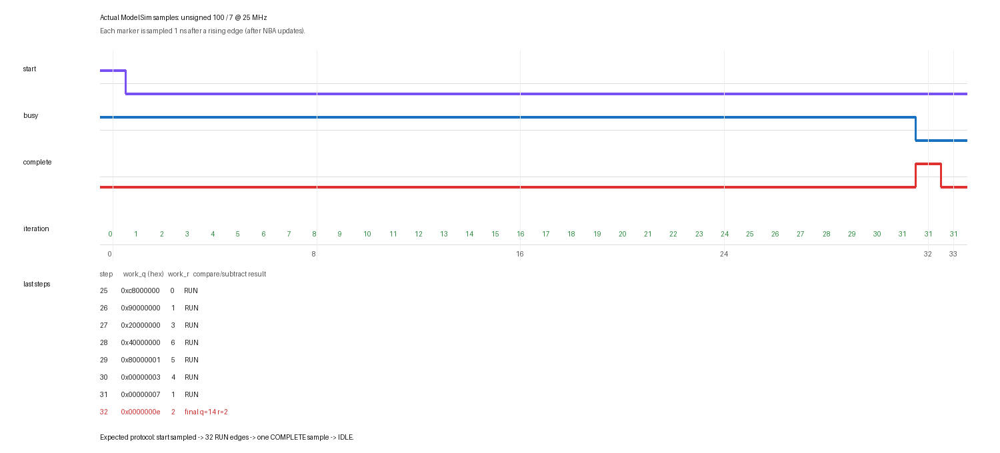

# 从除法器入门数字 IC 设计：波形、时序、网表与 lint 实战

**实验日期：** 2026-09-10

**实验对象：** `src/core/radix2_divider.sv`，默认 `DW=32`

**实际工具：** ModelSim SE-64 2019.2、Vivado 2019.2、Verilator 5.032

**边界：** 本实验没有修改生产 RTL，没有生成或下载板 bitstream，也不是 P0
功耗结论、整 SoC 时序签核或 ASIC signoff。

这是一条适合初学者反复练习的顺序：

```text
先写清接口契约
  -> RTL 仿真和断言
  -> 看关键波形并定位第一个错误周期
  -> 综合并看资源
  -> 布局布线后做 STA
  -> 从时序路径反查网表和 RTL
  -> 跑 lint、分类、最小修正、回归
```

## 1. 先不用工具：把 RTL 翻译成时序契约

先打开 [`radix2_divider.sv`](../src/core/radix2_divider.sv)，只回答下面五个问题。

1. **什么时候接收请求？** `DIV_IDLE` 且某个上升沿采到 `start_i=1`。
2. **计算多久？** 进入 `DIV_RUN` 后，每个上升沿产生一位商，共 32 次。
3. **什么时候结果有效？** `state_q==DIV_COMPLETE` 时 `complete_o=1`，持续一拍；
   同一拍 `busy_o=0`，`quotient_o/remainder_o` 有效。
4. **怎么取消？** `kill_i` 在时钟上升沿同步采样，并且优先于状态机和
   `start_i`；它清空状态和结果，不得产生迟到的 `complete_o`。
5. **复位是什么形式？** `rst_ni` 是异步低有效，因为敏感表是
   `@(posedge clk_i or negedge rst_ni)`。本实验验证了仿真复位行为，但没有证明
   板级复位释放的 recovery/removal 或同步器安全性。

一轮 restoring division 的组合逻辑在第 59～66 行：把部分余数和工作商左移，
若移位后的余数不小于除数，就减掉除数并把新商最低位置 1。寄存器只保存这一
轮结果，所以“算法需要 32 轮”不等于“组合路径有 32 级迭代”。这是理解微架构
最关键的一步。

对于无符号 `100 / 7`，预期是 `quotient=14`、`remainder=2`。对于有符号
`-100 / 7`，RISC-V 的结果是 `-14`、`-2`；余数符号跟被除数相同。

## 2. 先跑已有回归：确认起点没有坏

从仓库根目录执行：

```powershell
python tools/divider_lab/run_sim.py --mode original
```

它用固定种子 `20260909` 编译生产 RTL 与现有
[`tb_radix2_divider.sv`](../sim/tb/tb_radix2_divider.sv)，实际结果是：

```text
[DIVIDER-TB] RESULT: PASS cases=42
Errors: 0, Warnings: 0
```

42 个完成操作包含正负数组合、0 被除数、除零、`INT_MIN/-1`、最大无符号数、
32 个定种子随机输入和 kill 后恢复。这里的“42”不是覆盖率百分比；它只证明
这些具体观测点通过。

运行入口不会只看进程是否退出。它同时要求精确 PASS 标记、拒绝
`Error/Fatal/Failure`，并记录源码 SHA256。原因是 ModelSim 遇到 `$finish` 和
`$fatal` 都可能走 `onbreak`；只检查退出码会制造假绿灯。

## 3. 跑聚焦实验并看波形

```powershell
python tools/divider_lab/run_sim.py --mode green
```

聚焦 testbench 是 [`tb_divider_lab.sv`](../tools/divider_lab/tb_divider_lab.sv)。
它在下降沿驱动输入，在上升沿后 `#1ns` 采样，避免 testbench 与 DUT 在同一
仿真时间槽抢读写。`always_ff` 的非阻塞赋值在 NBA 区更新；如果在上升沿立即
读取，常会看到上一拍，这不是 DUT 延迟错误，而是 testbench race。

实际生成三个文件：

- `build/divider_lab/sim/green/divider.wlf`：ModelSim 原生波形，适合交互调试；
- `build/divider_lab/sim/green/divider.vcd`：开放文本波形，方便脚本或其他查看器；
- `build/divider_lab/sim/green/trace.jsonl`：每行一个采样点，便于自动审查。

脚本验证 JSONL 恰好有 213 个采样，五个正常操作各有一个 complete，第一例
最终商余数为 14/2。下面这张图由这些真实采样生成，不是示意截图：



第一例关键采样如下：

| step | 状态 | `iteration_q` | `quotient_work_q` | `remainder_work_q` | 输出 |
| ---: | --- | ---: | ---: | ---: | --- |
| 0 | RUN，已接收 | 0 | 100 | 0 | 仍为 0/0 |
| 25 | RUN | 25 | `0xc8000000` | 0 | 仍为 0/0 |
| 28 | RUN | 28 | `0x40000000` | 6 | 仍为 0/0 |
| 29 | RUN | 29 | `0x80000001` | 5 | 仍为 0/0 |
| 30 | RUN | 30 | `0x00000003` | 4 | 仍为 0/0 |
| 31 | RUN | 31 | `0x00000007` | 1 | 仍为 0/0 |
| 32 | COMPLETE | 31 | `0x0000000e` | 2 | 14/2，有效一拍 |
| 33 | IDLE | 31 | `0x0000000e` | 2 | complete 已撤销 |

前二十多拍余数看起来长期为零并不表示“不工作”：32 位寄存器中，数值 100 的
高位本来就是 0。靠近低位进入计算时，部分余数才明显变化。因此判断算法要看
`iteration_q`、工作商和工作余数的组合，不能只盯一个信号。

在 ModelSim GUI 中重看：

```powershell
Set-Location build/divider_lab/sim/green
vsim -view divider.wlf
```

在 Transcript 输入：

```tcl
do ../../../tools/divider_lab/wave.do
```

优先看 `rst_n/start/kill/busy/complete`，再看 `state_q/iteration_q`，最后才看宽
数据总线。调试顺序应是“协议是否成立 -> 哪一轮先偏离 -> 那一轮的比较/减法
输入是什么”，而不是从几百根数据位中漫游。

## 4. 怎样从波形判断问题

本实验带有一个故意错误的 oracle：把 `100/7` 的期望商从 14 改成 13。执行：

```powershell
python tools/divider_lab/run_sim.py --mode negative
```

该命令有意返回非零，日志必须精确出现：

```text
LAB_RESULT_MISMATCH case=1 expected_q=0000000d actual_q=0000000e
expected_r=00000002 actual_r=00000002
```

这里余数正确、商只差 1，而且内部最后值也为 14，所以第一怀疑应是 scoreboard/
期望模型，而不是除法 datapath。若内部值在第 29 步首次偏离，则应回查该拍的
`shifted_remainder >= divisor_q` 和减法；若 32 拍内部值正确但输出下一拍才变，
则检查输出寄存和 `complete` 对齐；若 kill 后再次出现 complete，则检查状态机
取消和陈旧状态清理。这就是“找到第一个错误周期”，比只看最终红字更有价值。

kill 专项还同时令 `kill=1,start=1`，实际观察到 kill 获胜，并连续守护 34 拍
没有孤儿 completion。它验证的是一个明确优先级合同，不只是“中途拉过 kill”。

## 5. 用 Vivado 看综合后是什么电路

执行完整实验：

```powershell
& 'D:\vivado\Vivado\2019.2\bin\vivado.bat' `
  -mode batch -source tools/divider_lab/vivado_lab.tcl `
  -log build/divider_lab/vivado/run.log `
  -journal build/divider_lab/vivado/run.jou
```

脚本针对 `xc7z010clg400-1`、`DW=32` 做 OOC 综合、优化、放置和布线。XDC 使用
40 ns 时钟（25 MHz）、0.10 ns setup uncertainty、0.05 ns hold uncertainty，
并给接口一个**教学用** input/output delay。它不是板卡 XDC。

实际 routed 资源是：

| 资源 | 数量 | 怎么理解 |
| --- | ---: | --- |
| Slice LUT | 355 | 比较、减法、选择与控制组合逻辑 |
| Flip-flop | 171 | 状态、除数、工作商/余数、计数、符号和结果 |
| CARRY4 | 45 | FPGA 快速进位链，实现比较、减法和补码加一 |
| latch | 0 | 本模块没有综合出锁存器 |
| DSP / BRAM | 0 / 0 | 迭代整数除法没有用乘法器或存储块 |

RTL 表面声明的状态总位数相加是 172，但综合网表只有 171 个触发器。原因之一正是
`remainder_work_q[32]` 从未被下一轮读取，Vivado 可以删掉这位。这是“RTL 对照
网表”的典型现象：综合保持行为，不保证一行 RTL 对应一个门或寄存器。

## 6. STA：读懂 setup、hold 和约束

最坏内部寄存器到寄存器 setup 路径实测如下：

```text
startpoint : quotient_work_q_reg[31]/C
endpoint   : quotient_o_reg[29]/D
requirement: 40.000 ns
data delay : 9.352 ns = logic 4.079 ns + route 5.273 ns
logic level: 16 = 13 CARRY4 + LUT1 + LUT4 + LUT5
setup slack: +30.402 ns (MET)
```

setup 的直观公式是 `slack = required time - arrival time`。正数表示数据在截止时间
前到达；负数表示超时。这里路线延迟占 56.4%，所以它不仅是 RTL 组合深度问题，
布局位置和互连也贡献了大半延迟。

为什么路径不是“部分余数比较器”？最坏路径从工作商进入最终商，经过较长的
进位链，主要对应有符号结果的取反加一和最终选择。RTL 第 121～124 行表达这个
动作；Vivado 对共享/内联逻辑给出的 `LINE_NUMBER` 多数落在 `magnitude()` 的第
49 行。这说明源行属性是线索，不是完整因果关系，要和 cell 名、路径拓扑、RTL
语义共同判断。

同一条已经布局布线的路径只把时钟要求改成 5 ns（200 MHz），没有重跑实现：

```text
data delay : 9.352 ns（完全不变）
requirement: 5.000 ns
setup slack: -4.598 ns (VIOLATED)
```

这清楚地区分了“电路有多慢”和“目标要求多严”。WNS 不是电路固有常数；换目标
周期，slack 就会变化。5 ns 例子只用于学习约束敏感性，不能作为重新实现后的
200 MHz 极限频率，因为 place/route 没有针对 5 ns 重新优化。

内部最坏 hold 路径为 `quotient_work_q_reg[4] -> quotient_o_reg[5]`，数据延迟
0.294 ns，hold slack `+0.107 ns`，内部寄存器路径通过。可是整份 OOC 报告的
global WHS 是 `-0.579 ns`，103 个接口端点失败。两者不矛盾：OOC 数据端口没有
真实 `HD.PARTPIN_LOCS`，接口 min delay 也是教学假设，工具明确警告边界路由不
完整。因此可以说“在这些条件下内部 reg-to-reg setup/hold 通过”，不能说“板上
所有时序通过”。复位路径还被 false-path 排除，reset release 安全也没有证明。

## 7. 从时序路径反查网表和 RTL

先打开实际 routed checkpoint：

```powershell
& 'D:\vivado\Vivado\2019.2\bin\vivado.bat' `
  -mode gui -source tools/divider_lab/open_vivado_lab.tcl
```

GUI 中打开 `divider_worst_path`，选中路径后右键 Schematic。Tcl Console 可以逐步
执行：

```tcl
set p [get_timing_paths -delay_type max \
  -from [all_registers] -to [all_registers] -max_paths 1]
report_property $p
get_property STARTPOINT_PIN $p
get_property ENDPOINT_PIN $p
get_pins -of_objects $p
get_cells -of_objects [get_pins -of_objects $p]
report_property [get_cells {quotient_work_q_reg[31]}]
```

实际映射报告显示：

- `quotient_work_q_reg[31]` 是 `FDCE`，位于 `SLICE_X13Y48`，源文件属性指向
  `radix2_divider.sv:74`；
- 终点 `quotient_o_reg[29]` 是 `FDCE`，源行属性指向第 80 行；
- 中间有命名为 `quotient_o_reg[...]_i_...` 的 LUT 和 13 级 CARRY4；
- `remainder_work_q_reg[32]` 不存在于综合后 sequential-cell 清单。

`FDCE` 是带 clock enable 和异步 clear 的 D 触发器。网表名仍带 RTL 基名，是
因为综合保留了一部分可追踪性；组合逻辑会被常量传播、共享、重命名和打包，
不能要求一一对应。正确方法是：从 timing start/end 确认寄存器边界，沿路径看
LUT/CARRY 类型，再用 FILE_NAME/LINE_NUMBER 和 RTL 语义交叉验证。

第一次实验恰好还抓到一个流程脚本问题：Vivado 2019.2 没有 timing path 的
`TIMING_POINTS` 属性。布局布线和 DCP 已成功，但后处理仍返回失败。修正为
`get_pins -of_objects $p` 后全流程才 PASS。工具跑完不是实验完成；所有预期报告
和门禁都生成才算完成。

## 8. “推进 lint”具体是在做什么

执行本机 WSL 中的 Verilator：

```powershell
wsl -d Ubuntu --exec python3 `
  /mnt/d/Rsicv-soc-worktrees/phase2-act4-cleanup/tools/divider_lab/lint_lab.py
```

原始生产 RTL 的实际 baseline 是 RED，两个报警：

```text
WIDTHEXPAND  radix2_divider.sv:115
  iteration_q 是 6 位，DW-1 是 32 位 int，比较时发生隐式扩展

UNUSEDSIGNAL radix2_divider.sv:34
  remainder_work_q[32] 没有被读取
```

处理 lint 不能用“见警告就关掉”的办法，而是逐条做四件事：

1. 写明需求和期望硬件；
2. 判断它是真 bug、表达不清，还是有理由的例外；
3. 做最小修改或最窄 waiver；
4. 重跑 lint、功能回归，必要时再做综合/时序/等价性检查。

位宽项在 `build/` 中生成的教学副本改成：

```systemverilog
if (iteration_q == COUNT_W'(DW-1)) begin
```

这样明确把比较常量转换到计数器宽度。实际 WIDTHEXPAND 消失，只剩 unused。
该副本随后跑现有 42-case 协议回归：

```powershell
python tools/divider_lab/run_lint_candidate_sim.py
```

实际结果 `candidate_42_case_sim: PASS`。这不是形式等价性证明，因此尚未修改生产
RTL。unused 项只对生成副本中的特定信号做局部 waiver，并记录“组合临时余数
仍需 33 位，寄存的第 33 位不参与下一轮”的理由；它没有全局关闭该规则。

为了确认 lint 门禁真的能发现一类错误，实验还放了一个没有接入 SoC 的坏例子：

```systemverilog
always_comb begin
  if (enable_i)
    sample_o = data_i; // enable=0 时未赋值，推断 latch
end
```

Verilator 实际报 `LATCH` 并返回 1。加入默认 `sample_o='0` 后实际无警告、返回 0。
这就是 RED/GREEN：先证明检查器能抓住目标错误，再证明修正消除了同一个错误。
完整报警、waiver 和八项结果见
[`lint_lab.md`](../tools/divider_lab/lint_lab.md)。

“lint 推进”作为项目工作，就是从一个模块建立可重复 baseline，逐项解释和收敛，
把命令接入可失败的回归，再扩展到相邻模块。它能在没有 UVM 的阶段帮助你练习
SystemVerilog 位宽、符号、组合赋值、状态机和可综合语义；但 lint 不能替代仿真、
CDC/RDC、形式验证和 STA。

## 9. 你现在应该怎样亲手练一遍

建议按下面顺序操作，每步都写下“预期”和“实际”，不要一次把所有命令跑完：

1. 在纸上写出 IDLE/RUN/COMPLETE 和 start/kill 优先级。
2. 跑 `--mode green`，只看协议五个信号，手数 32 拍。
3. 展开 step 25～32，手算余数和商的最后八次变化。
4. 跑 `--mode negative`，解释为什么这是 oracle 错，不是 DUT 错。
5. 打开 routed DCP，找到 13 个 CARRY4 的最坏 setup 路径。
6. 对照 40 ns 与 5 ns 报告，亲自计算 slack 正负。
7. 跑原始 lint，分别解释两个 warning；再看生成副本和 latch RED/GREEN。
8. 自己新增一个边界用例，例如 `1/1` 或 `0xffffffff/1`，先故意写错期望值，
   确认 checker 会失败，再修正。

完成这组练习后，你已经得到一段可在简历中如实表达的数字设计经历：设计/审查
kill-safe 多周期 RTL 协议；用断言和定种子回归验证 32-cycle latency、corner case
与 recovery；用 Vivado routed STA 定位真实 carry-chain critical path；建立 lint
baseline、完成 warning triage 和 RED/GREEN 门禁。不要把 OOC 教学约束写成板级
signoff，也不要把“lint clean”写成功能正确。

可复现实验脚本在 [`tools/divider_lab`](../tools/divider_lab/)，实际结果与限制在
[`divider-design-lab/results.md`](plans/divider-design-lab/results.md)。
本机生成的完整证据包括
[`Vivado 摘要`](../build/divider_lab/vivado/lab_summary.txt)、
[`40 ns 最坏 setup 路径`](../build/divider_lab/vivado/reg2reg_setup_routed_40ns.rpt)、
[`RTL/网表映射`](../build/divider_lab/vivado/rtl_netlist_mapping.rpt)、
[`仿真摘要`](../build/divider_lab/sim/summary.json)和
[`lint 摘要`](../build/divider_lab/lint/summary.json)；这些大/生成文件受 `.gitignore`
管理，需要时可由脚本重建。
