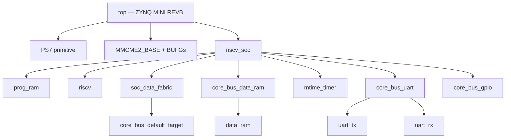
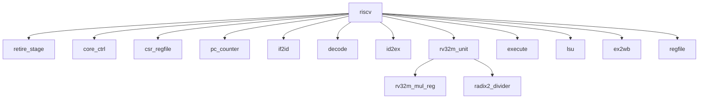
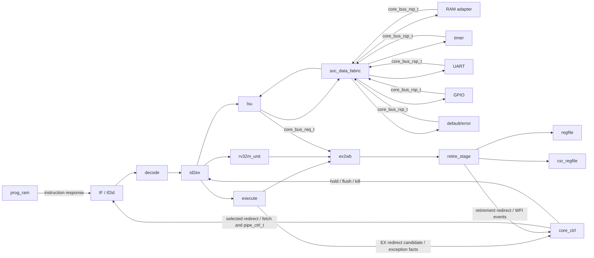

# Current Module Dependency View

**Scope:** synthesizable RTL on `codex/phase2-act4-cleanup`  
**Verified from:** RTL instantiations and `sim/filelist_rtl.f`  
**Last updated:** 2026-09-13

This document distinguishes structural ownership from runtime data flow. An
arrow in a hierarchy diagram means "instantiates"; it does not imply that all
data travels in that direction.

## 1. FPGA and SoC hierarchy

`riscv_soc` is the integration boundary. The CPU sees one instruction-memory
connection and one typed, single-outstanding data bus. RAM and MMIO targets do
not connect directly to pipeline stages.

## 2. CPU hierarchy

The important replaceable boundary is `rv32m_unit`: decode issues a typed
`rv32m_req_t`, and the unit returns `rv32m_rsp_t` plus busy/complete behavior.
The current multiplier backend is the AR-030 registered blocking design. It
runs PARTIAL/REDUCE/COMBINE/RESP while `rv32m_unit` holds the owning ID/EX
packet; the divider remains the independent iterative backend.

## 3. Runtime data and control dependencies

`retire_stage` is the sole owner of final architectural RF/CSR effects, trap
selection, MRET/WFI, retirement redirects, and commit. `execute` produces only
younger branch/jump candidates. `core_ctrl` owns candidate priority and all
pipeline stall/flush/kill movement. `lsu` owns data-request state; the fabric
owns address decoding and response ownership.

## 4. Shared compile-time dependencies

| Dependency | Consumers | Purpose |
|---|---|---|
| `riscv_pkg` | Core, bus adapters/fabric, timer, UART, GPIO, SoC | Pipeline packets, bus packets, enums, CSR/trap/commit and RV32M contracts |
| `soc_mem_map_pkg` | `riscv_soc` and integration verification/software tooling | Generated address map and target ranges |
| `sim/filelist_rtl.f` | Lint and RTL-only compilation | Canonical ordered list of synthesizable sources |
| `sim/filelist.f` | Main Questa compilation | RTL list plus core/SoC and focused testbenches |

Packages are compile dependencies, not instantiated hardware. They must appear
before consuming modules in every simulator and synthesis source list.

## 5. Replaceable boundaries

| Boundary | Stable contract | What can be replaced locally | Required proof |
|---|---|---|---|
| RV32M engine | `rv32m_req_t` / `rv32m_rsp_t`, busy, kill | Multiplier or divider implementation | ISA cases, kill protocol, latency/backpressure, timing |
| Data target | `core_bus_req_t` / `core_bus_rsp_t` valid/ready | RAM adapter or MMIO peripheral | Decode, exactly-once response, wait states, error behavior |
| Physical RAM | Address/data/write-enable template | FPGA BRAM-compatible implementation | Read latency, byte writes, inference report |
| Pipeline registers | `fetch_pkt_t`, `id_ex_pkt_t`, `ex_wb_pkt_t` | Internal stage implementation | Bubble/flush semantics and packet timing |
| Retirement | Packet + typed CSR command/redirect/commit contracts | Internal trap/CSR selection logic | Precise exceptions, ordering, architectural commit |

Adding or removing a peripheral still requires editing `riscv_soc` and the
generated memory map because the current fabric has fixed target ports. A
generic target array would reduce integration edits, but should be introduced
only with a parameterized decode/response-owner test suite; the existing typed
bus already provides the necessary leaf-module abstraction.

## 6. Verification entry points

- `tb_riscv_core` instantiates `riscv` with program/data memory models and
  checks architectural commit behavior.
- `tb_riscv_soc` instantiates `riscv_soc` and is the firmware/regression top.
- Focused testbenches instantiate one boundary directly: LSU, divider, RV32M,
  retire/CSR, fabric, timer, UART, GPIO, decode, and fetch timing.
- `fpga/zynq_mini_revb/top.sv` is the exact-board synthesis hierarchy above
  `riscv_soc`; the 25 MHz and 100 MHz profiles share this hierarchy.

The registered multiplier removes multiplication from the 100 MHz worst path.
After AR-031 control consolidation, the exact current 95/100 MHz routes pass at
WNS +0.078/+0.098 ns. The new worst path is operand -> branch/redirect -> ID/EX
enable; it is the next control-path scaling boundary.
