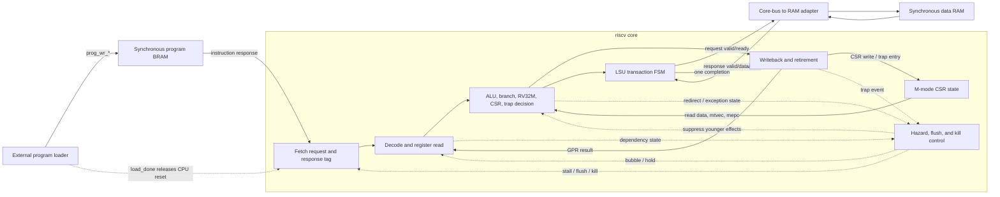
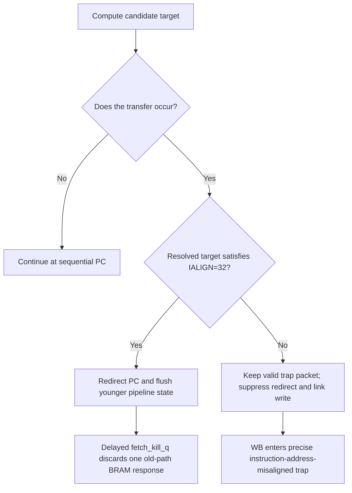
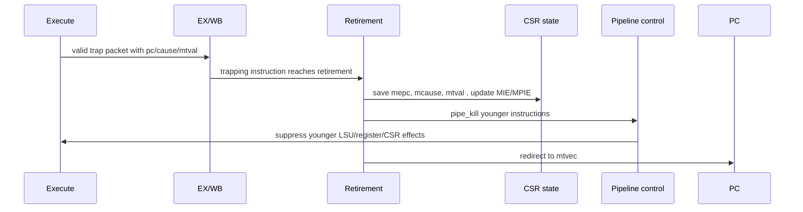

# RISC-V SoC Project Knowledge Base

**Document type:** Living study guide

**Audience:** New contributors and learners

**Last updated:** 2026-07-29

**Current reference:** `codex/architecture-review-roadmap`, post AR-013
regression-gate verification with AR-009 memory-map proposal under review

> Update this document whenever a change alters a module boundary, pipeline
> timing, packet field, architectural behavior, memory map, verification
> workflow, or current project milestone. Historical reasons and tradeoffs
> belong in
> [`ARCHITECTURE_DESIGN_AND_DECISIONS.md`](ARCHITECTURE_DESIGN_AND_DECISIONS.md).

## 1. What this project is

This repository implements a small custom RISC-V processor and early SoC in
SystemVerilog. The processor currently supports:

- RV32I integer instructions;
- the RV32M multiply/divide extension;
- a minimal machine-mode CSR and synchronous-exception implementation;
- precise traps for the currently implemented exception classes;
- synchronous instruction and data Block RAM;
- an architectural commit interface for verification.

The first practical system milestone is:

> Run preemptive FreeRTOS on this custom RV32IM core in the programmable logic
> of a Zynq XC7Z010 device.

The FreeRTOS milestone is intentionally smaller than the original Linux goal.
It does not require S-mode, an MMU, OpenSBI, DDR, caches, atomics, AXI, or a
PLIC. Those features remain possible future work, but they should not distort
the minimal architecture needed for the first working system.

## 2. Current status at a glance

### Implemented

- RV32IM decode and execution.
- Packed pipeline packets.
- Canonical, side-effect-free pipeline bubbles.
- Register file with same-cycle WB-to-ID bypass.
- One-cycle synchronous instruction BRAM.
- Single-outstanding, wait-state-capable CPU data bus.
- Clocked LSU request/response transaction state machine.
- Synchronous data RAM outside the CPU behind a core-bus adapter.
- EX/WB-owned raw/aligned memory response data and error status.
- Precise load/store access-fault completion.
- M-mode CSR instructions, WARL behavior, trap entry, and `mret`.
- Precise illegal-instruction, ECALL, EBREAK, instruction-misalignment, and
  load/store-misalignment traps.
- Ordered architectural commit records.
- ModelSim directed regression and test manifest with native-exit,
  PASS-marker, fatal-marker, and error-count result gates.
- ELF/image conversion and ACT4 integration adapters.
- Current directed smoke baseline: 22/22 passing after AR-013, with 4/4 Python
  utilities and the focused regression-result negative test passing.

### Not implemented yet

- SoC address decoder and default error target.
- Machine timer and interrupt input.
- Implemented UART, GPIO, or other peripherals.
- Firmware startup/linker/driver stack.
- FreeRTOS port integration.
- Board top, constraints, timing closure, and physical FPGA result.

### Phase numbers and AR numbers are different axes

Phases are ordered execution gates; AR numbers are stable review-finding IDs.
Therefore, Phase 0A can be complete while AR-008 through AR-012 remain open.
The current mapping is:

| Work | Planning meaning |
|---|---|
| AR-001, AR-002, AR-005, AR-006, AR-007 | Phase 0A work, implemented and verified |
| AR-003, AR-004 | Phase 2 sub-gates completed early; the decoder/default-target work is still open |
| AR-009 | Phase 1 memory-map proposal, currently under review |
| AR-008 | Future Phase 3 interrupt-boundary work |
| AR-010 | Ongoing verification-depth work across phases |
| AR-011 | Early FPGA feasibility plus later timing closure |
| AR-012 | Cleanup performed as interfaces stabilize |
| AR-013 | Regression infrastructure fix, implemented and verified |

The authoritative phase checklist is [`TODO.md`](../TODO.md); the detailed
finding status is in
[`ARCHITECTURE_REVIEW_AND_ACTION_PLAN.md`](ARCHITECTURE_REVIEW_AND_ACTION_PLAN.md).
The overall review and FreeRTOS roadmap remain open.

## 3. Recommended learning order

Read and experiment in this order:

1. **Instruction flow:** `pc_counter` → `prog_ram` → `if2id`.
2. **Decode and operands:** `decode`, `regfile`, `id2ex`.
3. **Execution:** `execute`, ALU, branches, jumps, and RV32M.
4. **Memory:** `lsu`, `data_ram`, and load/store alignment.
5. **Retirement:** `ex2wb`, `wb_stage`, and `commit_o`.
6. **Control:** `core_ctrl`, hazards, stalls, flushes, and kills.
7. **Privilege behavior:** `csr_regfile`, trap entry, and `mret`.
8. **Verification:** `tohost`, commit assertions, regressions, and ACT4.
9. **Future SoC work:** memory map, bus protocol, timer, peripherals, firmware,
   and FPGA integration.

Do not begin by memorizing every signal. First understand:

- what information belongs to one instruction;
- where that information is registered;
- when an instruction is allowed to cause an architectural side effect;
- how the design keeps a response paired with the request that produced it.

## 4. System-level picture



The current SoC is still mostly a core plus memories. `riscv.sv` now exposes a
small request/response data bus; `riscv_soc.sv` connects it to data RAM through
`core_bus_data_ram.sv`. Phase 2 still needs address decode, a default error
target, and peripherals.

## 5. Repository map

| Path | Purpose |
|---|---|
| `src/core/riscv.sv` | CPU integration, redirect/trap arbitration, external data bus, and commit wiring |
| `src/core/riscv_pkg.sv` | ISA constants, enums, packet definitions, trap causes |
| `src/core/decode.sv` | Instruction fields, immediates, operands, and control generation |
| `src/core/execute.sv` | ALU, branches/jumps, RV32M, CSR operations, trap metadata |
| `src/core/core_ctrl.sv` | RAW hazards, LSU wait, stalls, flushes, delayed fetch kill |
| `src/core/lsu.sv` | Effective address, alignment, store lanes, transaction FSM, load extension |
| `src/core/csr_regfile.sv` | M-mode CSR state, legality, WARL, counters, trap entry |
| `src/core/regfile.sv` | 32 integer registers, x0 behavior, WB-to-read bypass |
| `src/core/if2id.sv` | Fetch-to-decode pipeline register |
| `src/core/id2ex.sv` | Decode-to-execute pipeline register |
| `src/core/ex2wb.sv` | Execute-to-writeback pipeline register |
| `src/core/wb_stage.sv` | Final GPR result selection and side-effect suppression |
| `src/mem/prog_ram.sv` | One-cycle synchronous instruction/program BRAM |
| `src/mem/data_ram.sv` | Synchronous byte-writeable data RAM |
| `src/bus/core_bus_data_ram.sv` | CPU-local bus to synchronous RAM adapter |
| `src/riscv_soc.sv` | Program loader, memories, RAM adapter, and CPU wrapper |
| `sim/tb/tb_riscv_core.sv` | Main testbench and architectural checks |
| `sim/regress/` | Manifest-driven ModelSim runner and image conversion |
| `verif/act4/` | Official architectural-test integration metadata |
| `testdata/` | Directed assembly tests and generated memory images |
| `doc/` | Architecture reviews, decisions, evidence, and learning notes |

`src/bus` now contains the RAM adapter. `src/periph`, `src/common`, and some SoC
testbench files remain placeholders; their existence does not mean those
features are implemented.

## 6. The real pipeline

It is useful to call this a five-stage-style in-order core, but the actual
registered structure matters more than the textbook name:

```text
fetch request
    |
program BRAM response + registered request PC/valid
    |
IF/ID register
    |
decode + register-file reads
    |
ID/EX register
    |
execute and LSU request generation
    |
LSU REQUEST/RESPONSE wait while ID/EX is held
    |
one LSU completion / complete EX-WB memory result
    |
EX/WB register
    |
writeback and architectural commit
```

There is no explicit EX/MEM register and no MEM/WB register. The LSU holds the
memory instruction in EX until a response completes, then lets it enter EX/WB
once. At that completion boundary, EX/WB captures the request metadata, raw
response, aligned load value, and response-error status as one instruction-owned
result.

### 6.1 Instruction fetch timing

A fetch is accepted at a rising edge when `instr_ren_o` is high.

| Time | Event |
|---|---|
| Before edge N | `instr_addr_o=A` and `instr_ren_o=1` |
| Rising edge N | `prog_ram` captures address A; the core captures PC tag A |
| After edge N | RAM output is `mem[A]`; PC tag is A |
| Rising edge N+1 | IF/ID may capture `{valid, A, mem[A]}` |

The PC tag and RAM response must advance or hold together. If fetch stalls,
`instr_ren_o` is low, so both the RAM response and its metadata hold.

### 6.2 Pipeline packets

Pipeline packets let the design move one instruction's related information as
one typed value.

| Packet | Main contents | Registered by |
|---|---|---|
| `fetch_pkt_t` | `valid`, `pc`, `instr` | `if2id` |
| `id_ex_pkt_t` | operands, immediate, destination, ALU/branch/memory/CSR intent | `id2ex` |
| `ex_wb_pkt_t` | execution result, memory metadata, trap record, CSR result | `ex2wb` |
| `commit_pkt_t` | final architectural register, memory, and trap effects | top-level observation only |

An invalid registered packet is always a canonical all-zero bubble. A bubble is
not a NOP instruction: it is the absence of an instruction.

### 6.3 Valid, bubble, faulting, and killed are different

- **Valid normal instruction:** may retire and produce its permitted effects.
- **Bubble:** `valid=0`; must have no side-effect controls.
- **Faulting instruction:** remains `valid=1` so it can report a trap, but its
  normal register/memory/redirect effects are suppressed.
- **Killed younger instruction:** converted to a bubble because an older event
  has made it architecturally nonexistent.

This distinction is central to precise exceptions.

## 7. Walkthrough of a normal instruction

Consider:

```asm
add x5, x6, x7
```

1. `pc_counter` presents the instruction address.
2. `prog_ram` returns the instruction one cycle after request acceptance.
3. `if2id` registers its PC and instruction bits.
4. `decode` identifies `rs1=x6`, `rs2=x7`, and `rd=x5`.
5. `regfile` supplies the two source values.
6. `decode` creates an `id_ex_pkt_t` with:
   - `use_rs1=1`, `use_rs2=1`;
   - `rf.we=1`, `rf.addr=5`;
   - `alu_op=ALU_ADD`;
   - `wb_sel=WB_ALU`.
7. `id2ex` registers that packet.
8. `execute` adds the operands and builds an `ex_wb_pkt_t`.
9. `ex2wb` registers the result.
10. `wb_stage` selects the ALU value and enables the x5 write.
11. `regfile` writes x5 on the rising edge.
12. `commit_o` reports the instruction, PC, destination, and result in order.

## 8. Data hazards

The current core has no general EX/MEM forwarding network. It uses:

- one RAW hazard bubble when the consumer is in ID and producer is in EX;
- register-file write-first bypass when the producer reaches WB.

The hazard condition is conceptually:

```text
ID is valid
AND EX is valid
AND EX will write rd != x0
AND ID actually uses a matching rs1 or rs2
```

Response:

1. hold PC;
2. hold IF/ID;
3. flush ID/EX to insert one bubble;
4. allow the producer to advance to WB;
5. use WB-to-ID bypass for the consumer's operand;
6. release the consumer on the next cycle.

`use_rs1` and `use_rs2` matter because instruction bit fields can resemble
register addresses even when the instruction does not use those operands.

## 9. Branch, jump, redirect, and stale fetch behavior

Branches, JAL, JALR, and MRET resolve in EX.



Important details:

- A not-taken branch does not observe or fault on its encoded target.
- JALR clears target bit zero before checking alignment.
- Trap redirect has priority over an EX redirect.
- One-cycle synchronous program memory permits one old-path response after a
  redirect, so one delayed kill is required.

## 10. Loads and stores

### 10.1 Address and alignment

The LSU computes:

```text
effective address = rs1 value + immediate
```

Alignment rules:

| Access | Legal offsets |
|---|---|
| Byte | 0, 1, 2, 3 |
| Halfword | 0 or 2 |
| Word | 0 only |

A misaligned request does not reach RAM. It becomes a valid load/store
misalignment trap packet.

### 10.2 Little-endian store lanes

The request `wstrb` field selects which bytes change:

| Operation | Offset | Strobe |
|---|---:|---|
| SB | 0/1/2/3 | one corresponding bit |
| SH | 0 | `0011` |
| SH | 2 | `1100` |
| SW | 0 | `1111` |

Store data is shifted into the selected byte lanes.

### 10.3 Transaction and load completion

The LSU captures a valid aligned EX memory operation, holds its request until
the target accepts it, then waits for a response:

```text
IDLE -> REQUEST -> RESPONSE -> COMPLETE -> IDLE
```

PC, IF/ID, and ID/EX stall during REQUEST and RESPONSE. EX/WB receives a
canonical bubble during the wait. COMPLETE lasts one cycle and authorizes the
memory instruction to enter EX/WB exactly once.

For a load, the LSU captures the full response word, then uses its saved access
size, unsigned flag, and byte offset to select and sign- or zero-extend the
result for WB.

During COMPLETE, the raw response, aligned load value, and error status move
from the LSU's transaction registers into the same EX/WB packet as the request
metadata. WB and the commit interface consume only that packet.

An error response completes as a valid precise trap: cause 5 for a load or 7
for a store, `mtval` equal to the attempted address, and no GPR write. The
commit record preserves request metadata but reports failed load data as zero.

### 10.4 Implemented single-outstanding core bus

AR-003 implements this CPU-local data bus:

```text
request:  valid, ready, byte address, write, size, write data, write strobes
response: valid, full-word read data, error
```

Only one request may be outstanding. Both loads and stores receive one
response. The LSU always accepts the expected response, so this milestone does
not need `rsp_ready`. AXI and APB remain adapter protocols outside the CPU; the
LSU does not inherit their channels, IDs, bursts, or setup phases.

The LSU owns the request registers and transaction state. `core_ctrl` consumes
only abstract busy state and does not duplicate bus protocol logic.

`core_bus_data_ram.sv` is the first target adapter. It can independently delay
request acceptance and response delivery, and then translates an accepted
request to the synchronous RAM controls.

Vivado 2019.2 out-of-context synthesis retains four program-memory and four
data-memory `RAMB36E1` cells. This confirms the new module boundary is
synthesizable; it does not replace later board timing closure.

Detailed rationale, RED/GREEN evidence, performance consequences, and reusable
principles are in
[`AR003_WAIT_STATE_SAFE_LSU.md`](AR003_WAIT_STATE_SAFE_LSU.md).

## 11. CSR and trap model

The current privilege model is machine mode only.

### 11.1 CSR instruction path

1. Decode determines CSR operation and architectural write intent.
2. EX checks implemented address, privilege, and read-only encoding.
3. EX computes the final read-modify-write value.
4. WB writes the CSR only when the packet is valid and non-trapping.
5. A younger same-address CSR operation receives the older WARL-filtered value
   through WB-to-EX bypass.

Do not infer write intent from whether source data equals zero. CSR write intent
comes from the encoded source-register/immediate field and operation type.

### 11.2 WARL

WARL means software can write any value, but the implementation stores and
returns only a supported legal value.

Examples:

- `mstatus` retains only MIE/MPIE and fixed MPP=M.
- `mie` retains only MTIE.
- `mtvec` and `mepc` are forced to four-byte alignment.
- `misa` and delegation CSRs expose fixed supported values.

### 11.3 Precise synchronous trap sequence



Older instructions may complete. The faulting instruction reports the trap but
cannot perform its normal side effect. Younger instructions must disappear.

## 12. Architectural commit interface

`commit_o` is the stable observation record for each valid retired instruction.
It includes:

- monotonically increasing order;
- PC and instruction;
- destination-register address/data/write enable;
- memory address, masks, read data, and write data;
- trap flag, cause, and trap value.

A trapping instruction is reported as:

```text
valid = 1
trap  = 1
rd_we = 0
```

This interface supports regression checking, trace comparison, future
differential testing, and debugging without relying on fragile internal signal
names.

## 13. Verification workflow

### 13.1 Main commands

From PowerShell:

```powershell
Set-Location D:\Rsicv-soc\sim\regress
Set-ExecutionPolicy -Scope Process -ExecutionPolicy Bypass
./run_regression.ps1 -Tag smoke
./test_regression_result.ps1
python -m unittest test_elf_to_mem.py test_import_act4.py
```

For the original single testbench:

```powershell
Set-Location D:\Rsicv-soc\sim
vsim -do run.do
```

### 13.2 Result reporting

Tests finish by committing a store to the configured `tohost` address:

- value `1`: PASS;
- another nonzero value: test-specific failure code.

`halt_o` is not the completion mechanism.

The regression runner classifies a test as PASS only when the native simulator
exit is zero, the architectural PASS marker is present, no fatal marker is
present, and ModelSim reports zero errors. The focused AR-013 infrastructure
test supplies a PASS-looking transcript with a nonzero simulator exit and
proves that it is rejected.

### 13.3 Debug from architecture inward

Use this order:

1. Read the first failing assembly check and its failure code.
2. Inspect `commit_o` for the first incorrect architectural result.
3. Decide whether the error began in fetch, decode, EX, memory, CSR, or
   retirement.
4. Inspect packet validity and PC/instruction pairing at that boundary.
5. Inspect control signals only after locating the failing instruction.
6. Turn the failure into a focused regression before changing RTL.
7. Run the focused test, then the full smoke suite and utility tests.

Recommended waveform groups:

- `if2id_pkt_out`, `id2ex_pkt_out`, `ex2wb_pkt_out`;
- `pc_stall`, `ifid_stall`, `idex_flush`, `pipe_kill`;
- `ex_redirect_en`, `ex_redirect_pc`, `wb_trap_event`;
- `data_req_valid_o`, `data_req_ready_i`, `data_req_o`;
- `data_rsp_valid_i`, `data_rsp_i`, `lsu_busy`, `lsu_complete`;
- `wb_rf_wen_safe`, `wb_rf_waddr`, `wb_rf_wdata`;
- CSR address/read/write/effective values;
- `commit_o`.

## 14. Design invariants worth memorizing

1. Every architectural side effect requires a valid owner.
2. Every invalid registered packet has one canonical representation.
3. A faulting instruction is valid; a killed instruction is a bubble.
4. Metadata moves with the request or result that gives it meaning.
5. A redirect flush count comes from the number of outstanding responses.
6. The resolved value is validated before its side effect is enabled.
7. WARL-filtered architectural values, not raw operands, are forwarded.
8. Simulation behavior and FPGA resource inference are separate verification
   obligations.
9. Every accepted future bus request must receive exactly one completion.
10. A failure is not fixed until its regression remains in the suite.
11. A completed result's data, status, and identity must cross pipeline
    boundaries together.

## 15. Current architecture risks and open questions

| Topic | Current risk or question | Planned stage |
|---|---|---|
| Blocking LSU performance | Correct but the front end waits for every memory response | Measure before adding a MEM stage/cache |
| Memory topology | Split instruction/data regions are proposed for review; capacity and tooling consequences remain open | Phase 1 / AR-009 |
| Unmapped access faults | Precise access-fault traps exist, but the SoC has no centralized decoder/default error target | Phase 2 |
| Interrupt boundary | Correct resume PC and outstanding transaction deferral | Phase 3 / AR-008 |
| Timer | No `mtime`, `mtimecmp`, or hardware MTIP | Phase 3 |
| RV32M timing | Combinational divide may fail FPGA timing | Early synthesis / AR-011 |
| Retirement ownership | CSR/trap/commit logic remains distributed | Cleanup / AR-012 |
| Peripherals | UART/GPIO/timer files are placeholders | Phases 3–4 |

## 16. Practical study exercises

### Exercise 1: Follow one ADD

Run one test with trace enabled. Write down the ADD instruction's PC, source
values, ID/EX controls, ALU result, EX/WB destination, and commit record.

### Exercise 2: Observe one RAW bubble

Use two dependent arithmetic instructions. Identify:

- the comparison that raises `hazard_stall`;
- the held IF/ID packet;
- the canonical ID/EX bubble;
- the WB-to-register-read bypass;
- the consumer's eventual correct commit.

### Exercise 3: Follow a taken branch

Mark the branch request, target calculation, redirect edge, flushed younger
packets, stale program-memory response, and first target instruction.

### Exercise 4: Follow a trap

Use ECALL or a misaligned target. Record:

- the faulting instruction's PC;
- `mcause`, `mepc`, and `mtval`;
- which younger instruction was in EX;
- why that younger instruction could not update GPR/CSR/memory;
- the first instruction fetched from `mtvec`.

### Exercise 5: Check load byte lanes

Place four known bytes in a word. Execute LB/LBU/LH/LHU at legal offsets and
compare RAM data, `load_offset`, extracted value, and committed result.

## 17. Where to read next

- [Architecture design and decisions](ARCHITECTURE_DESIGN_AND_DECISIONS.md)
- [Architecture review and action plan](ARCHITECTURE_REVIEW_AND_ACTION_PLAN.md)
- [Verification framework](../docs/verification_framework.md)
- [Memory-map and bus design guide](MEMORY_MAP_CONTRACT_DESIGN_GUIDE.md)
- [AR-009 architectural memory-map proposal](AR009_ARCHITECTURAL_MEMORY_MAP.md)
- [AR-001 precise CSR squash](AR001_PRECISE_CSR_SQUASH_FIX.md)
- [AR-002 canonical bubbles](AR002_CANONICAL_PIPELINE_BUBBLES.md)
- [AR-005 synchronous instruction BRAM](AR005_SYNCHRONOUS_INSTRUCTION_BRAM.md)
- [AR-006 control-flow misalignment](AR006_CONTROL_FLOW_MISALIGNMENT.md)
- [AR-007 CSR contract](AR007_CSR_LEGALITY_WARL_AND_HAZARDS.md)
- [AR-013 regression exit-status gate](AR013_REGRESSION_EXIT_STATUS_GATE.md)
- [ACT4 integration](../verif/act4/README.md)
- [Project roadmap](../TODO.md)

## 18. Living-document update checklist

When the project changes, update the relevant sections before calling the work
complete:

- [ ] Current status and milestone.
- [ ] System and timing diagrams.
- [ ] Repository/module map.
- [ ] Packet fields and ownership.
- [ ] Instruction, memory, trap, or interrupt flow.
- [ ] Build and regression commands.
- [ ] Current verification result.
- [ ] Risks and open questions.
- [ ] Learning exercises when a new concept is introduced.
- [ ] Cross-link to the detailed architecture decision entry.
