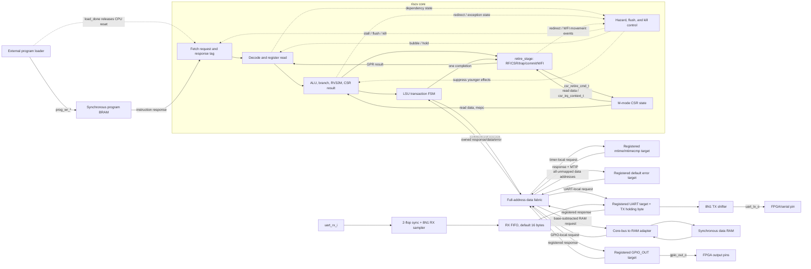
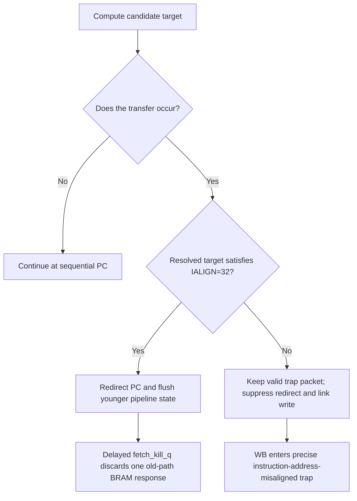
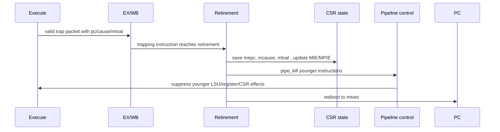

# RISC-V SoC Project Knowledge Base

**Document type:** Living study guide

**Audience:** New contributors and learners

**Last updated:** 2026-08-15

**Current reference:** `codex/phase2-act4-cleanup`. Phases 1–4 are complete.
Phase 5 is complete in ModelSim and Vivado OOC synthesis. AR-024 adds the Bo
Chen Jing Xin ZYNQ MINI `20240221/REVB` top, schematic-derived XDC, 50-to-25 MHz
MMCM/reset wrapper, and routed bitstreams for all three bare-metal programs.
Physical-board execution, speed-grade identification, and FreeRTOS remain open.

> Update this document whenever a change alters a module boundary, pipeline
> timing, packet field, architectural behavior, memory map, verification
> workflow, or current project milestone. Historical reasons and tradeoffs
> belong in
> [`ARCHITECTURE_DESIGN_AND_DECISIONS.md`](ARCHITECTURE_DESIGN_AND_DECISIONS.md).

## 1. What this project is

This repository implements a small custom RISC-V processor and early SoC in
SystemVerilog. The processor currently supports:

- RV32I integer instructions;
- the RV32M multiply/divide extension;
- machine-mode CSR, synchronous-exception, and machine-timer-interrupt support;
- precise traps for the currently implemented exception classes;
- synchronous instruction and data Block RAM;
- an architectural commit interface for verification.

The first practical system milestone is:

> Run preemptive FreeRTOS on this custom RV32IM core in the programmable logic
> of a Zynq XC7Z010 device.

The FreeRTOS milestone is intentionally smaller than the original Linux goal.
It does not require S-mode, an MMU, OpenSBI, DDR, caches, atomics, AXI, or a
PLIC. Those features remain possible future work, but they should not distort
the minimal architecture needed for the first working system.

## 2. Current status at a glance

### Implemented

- RV32IM decode and execution.
- Radix-2 iterative DIV/DIVU/REM/REMU with EX backpressure and kill support;
  multiplication remains combinational.
- Packed pipeline packets.
- Canonical, side-effect-free pipeline bubbles.
- Register file with same-cycle WB-to-ID bypass.
- One-cycle synchronous instruction BRAM.
- Single-outstanding, wait-state-capable CPU data bus.
- Clocked LSU request/response transaction state machine.
- Synchronous data RAM outside the CPU behind a core-bus adapter.
- Centralized full-address data decode, base-subtracted RAM requests,
  registered response ownership, and a one-cycle default error target.
- EX/WB-owned raw/aligned memory response data and error status.
- Precise load/store access-fault completion.
- Precise instruction-access-fault completion for out-of-range program fetches.
- M-mode CSR instructions, WARL behavior, trap entry, and `mret`.
- Retirement-owned RF/CSR/trap/commit commands with post-retirement interrupt
  eligibility and separate asynchronous `trap_entry_t` observation.
- A CLINT-compatible 64-bit `mtime`/`mtimecmp` target and hardware MTIP.
- One-time WFI retirement followed by logical wait and precise interrupt wake.
- Timer/UART/GPIO/RAM/default full-address decode with registered response ownership.
- Parameterized polling UART TX with one queued byte plus one active byte,
  `TX_READY`/`TX_BUSY`, registered invalid-access errors, and 8N1 output.
- Parameterized polling UART RX with two-flop input synchronization, midpoint
  8N1 sampling, a default 16-byte FIFO, nonblocking empty reads, and sticky
  overrun/framing errors.
- A 32-bit memory-mapped GPIO output register with parameterized physical
  width/reset value, byte-lane merge, readback, and registered access errors.
- Precise illegal-instruction, ECALL, EBREAK, instruction-misalignment, and
  load/store-misalignment traps.
- Ordered architectural commit records.
- ModelSim directed regression and test manifest with native-exit,
  PASS-marker, fatal-marker, and error-count result gates.
- ELF/image conversion and ACT4 integration adapters.
- Dependency-free machine-readable SoC map validation and deterministic
  cross-language generation for the accepted configuration; the data-fabric
  RTL now consumes its SystemVerilog constants.
- Accepted Phase 1 core-to-SoC ownership, memory-map, bus, error, software, and
  verification-environment contract.
- Generated 16 KiB/64 KiB RAM experiment profiles and paired Vivado 2019.2
  out-of-context utilization and post-synthesis internal timing evidence on
  provisional `xc7z010clg400-1`.
- Current directed smoke baseline: 22/22 passing after AR-013, with 4/4 Python
  utilities and the focused regression-result negative test passing.
- Separate AR-018 `tb_riscv_soc` contract manifest: all three data-path runs and
  the instruction-access-fault run are GREEN.
- Official ACT4 baseline: 39/39 RV32I and 8/8 RV32M tests passing.
- Split-region ELF conversion with generated map geometry, independent local
  images, rejection tests, and optional ELF-tail `.bss` poison.
- Reset-to-C startup with ABI-safe `sp`/`gp`, direct `mtvec`, active `.bss`
  clearing, a split linker policy, and explicit failure paths.
- Minimal CSR, UART, GPIO, timer, and `tohost` firmware drivers plus C UART,
  timer-polled GPIO, and full-context timer-interrupt applications.
- Phase 5 regression: 4/4 passing, including ten independently observed
  timer interrupts and exact serial/GPIO scoreboards.
- Vivado firmware INIT gate: 32 RAMB36E1 cells split 16 program/16 data, with
  nonzero INIT properties in both image-loaded banks.
- Exact ZYNQ MINI REVB boundary: K17 50 MHz clock, M20 active-low reset,
  T12/U12/V12/W13 LEDs, and external 3.3 V UART on U15/W15.
- Primitive MMCM/BUFG 25 MHz clock generation, four-cycle lock-qualified reset
  release, and a retained unused PS7 hard macro for Zynq configuration.
- Routed Vivado 2019.2 builds for `hello`, `timer_gpio`, and `timer_irq`: all
  have 0 DRC errors, TNS 0.000 ns, at least +22.093 ns WNS, initialized 16+16
  BRAMs, and generated bitstreams.

### Not implemented yet

- GPIO input/direction/interrupt registers and other additional peripherals;
  polling UART TX/RX and output GPIO are implemented, while UART interrupts/
  PLIC are deferred.
- FreeRTOS port integration.
- Physical FPGA JTAG, UART, LED, timer, and reset observations; the top,
  constraints, 25 MHz timing closure, and bitstreams are implemented.
- Positive identification of the package speed grade; local builds use
  conservative `xc7z010clg400-1`.

The implementation contract and ordered verification gates for the first item
are defined in the
[Phase 5 startup/runtime guide](../docs/phase5-startup-runtime-guide.md).

### Phase numbers and AR numbers are different axes

Phases are ordered execution gates; AR numbers are stable review-finding IDs.
Therefore, Phase completion and AR cleanup status must be read independently.
The current mapping is:

| Work | Planning meaning |
|---|---|
| AR-001, AR-002, AR-005, AR-006, AR-007 | Phase 0A work, implemented and verified |
| AR-003, AR-004 | Phase 2 transaction/result sub-gates, implemented and verified |
| AR-009 | Phase 1 split 64 KiB map accepted; data RTL partially adopted in Phase 2 |
| AR-008 | Phase 3 precise timer interrupt/WFI/timer target, implemented and verified |
| AR-010 | Ongoing verification-depth work across phases |
| AR-011 | Early FPGA feasibility plus later timing closure |
| AR-012 | Retirement owner/control-port cleanup implemented; `halt_o`/README cleanup remains |
| AR-013 | Regression infrastructure fix, implemented and verified |
| AR-023 | Phase 5 split-image runtime and bare-metal applications, verified in simulation/OOC; physical board pending |
| AR-014 | Accepted-map generation infrastructure, implemented and verified |
| AR-015 | Paired 16 KiB/64 KiB utilization/timing evidence, implemented and verified |
| AR-016 | Core-to-SoC environment contract accepted; Phase 1 complete |
| AR-017 | Radix-2 iterative divider, implemented and verified; physical closure remains Phase 7 |
| AR-018 | SoC contract tests: data and instruction access-fault cases GREEN; closed |
| AR-019 | Centralized data decoder/default target implemented and verified |
| AR-020 | Minimal polling UART TX implemented and verified through OOC synthesis |
| AR-021 | Polling UART RX and parameterized default 16-byte FIFO implemented and verified through OOC synthesis |
| AR-022 | Memory-mapped output GPIO implemented and verified through OOC synthesis |

The authoritative phase checklist is [`TODO.md`](../TODO.md); the detailed
finding status is in
[`ARCHITECTURE_REVIEW_AND_ACTION_PLAN.md`](ARCHITECTURE_REVIEW_AND_ACTION_PLAN.md).
The overall review and FreeRTOS roadmap remain open.

### Configuration source versus RTL parameters

These mechanisms are complementary:

- `riscv_soc` parameters tell Vivado how to elaborate one hardware instance;
- [`config/soc_map.json`](../config/soc_map.json) describes the accepted
  hardware/software address-map contract;
- [`tools/gen_soc_map.py`](../tools/gen_soc_map.py) validates that contract and
  generates consumer-specific syntax;
- generated files must never be edited independently.

The current source is `accepted`: it freezes the split 64 KiB ABI while current
RTL decoding, RAM defaults, and directed test addresses remain unchanged. See
[`AR014_MACHINE_READABLE_SOC_MAP.md`](AR014_MACHINE_READABLE_SOC_MAP.md) and
[`config/README.md`](../config/README.md) for the complete relationship.

The AR-015 baseline found that two 16 KiB banks use 8/60 RAMB36 tiles (13.33%),
while two 64 KiB banks use 32/60 (53.33%) on the provisional part. Its
single-cycle divider produced an identical 87.102 ns/305-level path for both
profiles and failed 50 MHz with WNS -67.124 ns and 25 MHz with WNS -47.124 ns.

AR-017 replaced only DIV/DIVU/REM/REMU with a 32-iteration restoring Radix-2
unit. LUT use fell to 3,504 for the 16 KiB profile and 3,542 for 64 KiB;
registers became 2,601, while RAMB36 and DSP counts stayed unchanged. Refreshed
OOC post-synthesis STA gives WNS +7.373 ns at 50 MHz and +27.373 ns at 25 MHz,
with a 12.605 ns/19-level multiply-high path now dominant for both profiles.
Board clock location, placement, routing, I/O timing, and physical closure
remain unmeasured. See
[`AR015_RAM_CAPACITY_UTILIZATION_COMPARISON.md`](AR015_RAM_CAPACITY_UTILIZATION_COMPARISON.md)
for the RED baseline and
[`AR017_RADIX2_ITERATIVE_DIVIDER.md`](AR017_RADIX2_ITERATIVE_DIVIDER.md) for the
GREEN optimization.

## 3. Recommended learning order

Read and experiment in this order:

1. **Instruction flow:** `pc_counter` → `prog_ram` → `if2id`.
2. **Decode and operands:** `decode`, `regfile`, `id2ex`.
3. **Execution:** `execute`, ALU, branches, jumps, and RV32M.
4. **Memory:** `lsu`, `data_ram`, and load/store alignment.
5. **Retirement:** `ex2wb`, `retire_stage`, semantic commands, and observations.
6. **Control:** `core_ctrl`, hazards, stalls, flushes, and kills.
7. **Privilege behavior:** `csr_regfile`, trap entry, and `mret`.
8. **Verification:** `tohost`, commit assertions, regressions, and ACT4.
9. **Future SoC work:** memory map, bus protocol, timer, peripherals, firmware,
   and FPGA integration.

Do not begin by memorizing every signal. First understand:

- what information belongs to one instruction;
- where that information is registered;
- when an instruction is allowed to cause an architectural side effect;
- how the design keeps a response paired with the request that produced it.

## 4. System-level picture



`riscv.sv` exposes a small request/response data bus; `riscv_soc.sv` routes it
through `soc_data_fabric.sv` to the timer, UART, GPIO, RAM adapter, or
registered default target. Polling UART TX/RX and output GPIO are implemented.

## 5. Repository map

| Path | Purpose |
|---|---|
| `src/core/riscv.sv` | CPU composition, execute/retirement redirect selection, and external data bus |
| `src/core/riscv_pkg.sv` | ISA constants, enums, packet definitions, trap causes |
| `src/core/decode.sv` | Instruction fields, immediates, operands, and control generation |
| `src/core/execute.sv` | ALU, branches/jumps, multiply/completed-divide selection, CSR operations, trap metadata |
| `src/core/radix2_divider.sv` | Iterative DIV/DIVU/REM/REMU arithmetic, completion, and kill handling |
| `src/core/core_ctrl.sv` | RAW hazards, LSU/divider EX wait, stalls, flushes, delayed fetch kill |
| `src/core/retire_stage.sv` | Final RF/CSR commands, exception/IRQ choice, WFI state, redirect and commit observations |
| `src/core/lsu.sv` | Effective address, alignment, store lanes, transaction FSM, load extension |
| `src/core/csr_regfile.sv` | M-mode CSR state, legality, WARL preview, MTIP composition, ordered retirement update |
| `src/core/regfile.sv` | 32 integer registers, x0 behavior, WB-to-read bypass |
| `src/core/if2id.sv` | Fetch-to-decode pipeline register |
| `src/core/id2ex.sv` | Decode-to-execute pipeline register |
| `src/core/ex2wb.sv` | Execute-to-writeback pipeline register |
| `src/mem/prog_ram.sv` | One-cycle synchronous instruction/program BRAM |
| `src/mem/data_ram.sv` | Synchronous byte-writeable data RAM |
| `src/bus/core_bus_data_ram.sv` | CPU-local bus to synchronous RAM adapter |
| `src/bus/soc_data_fabric.sv` | Full-address timer/UART/GPIO/RAM/default decode, local translation, registered response owner |
| `src/bus/core_bus_default_target.sv` | Registered zero-data error response with no write side effect |
| `src/periph/mtime_timer.sv` | Registered RV32 `mtime`/`mtimecmp` bus target and level-sensitive MTIP |
| `src/periph/core_bus_uart.sv` | Registered UART MMIO target, TX holding stage, parameterized RX FIFO, and sticky errors |
| `src/periph/uart_tx.sv` | Parameterized byte-handshake 8N1 serial shifter |
| `src/periph/uart_rx.sv` | Two-flop input synchronization and midpoint-sampling 8N1 receiver |
| `src/periph/core_bus_gpio.sv` | Registered output GPIO target, partial-write merge, readback, and errors |
| `src/riscv_soc.sv` | Program loader, memories, data fabric/targets, and CPU wrapper |
| `sim/tb/tb_riscv_core.sv` | Main testbench and architectural checks |
| `sim/regress/` | Manifest-driven ModelSim runner and image conversion |
| `verif/act4/` | Official architectural-test integration metadata |
| `testdata/` | Directed assembly tests and generated memory images |
| `doc/` | Architecture reviews, decisions, evidence, and learning notes |
| `doc/SEMANTIC_SIGNAL_SPEC.md` | Normative signal ownership, timing, naming, and packing rules |

`src/bus` contains the fabric, default target, and RAM adapter. Empty future
module placeholders were removed: a planned timer, UART, or GPIO appears in
the source tree only when its phase defines and implements a real interface.

## 6. The real pipeline

It is useful to call this a five-stage-style in-order core, but the actual
registered structure matters more than the textbook name:

```text
fetch request
    |
program BRAM response + registered request PC/valid
    |
IF/ID register
    |
decode + register-file reads
    |
ID/EX register
    |
execute and LSU request generation
    |
LSU REQUEST/RESPONSE wait while ID/EX is held
    |
one LSU completion / complete EX-WB memory result
    |
EX/WB register
    |
writeback and architectural commit
```

There is no explicit EX/MEM register and no MEM/WB register. The LSU holds the
memory instruction in EX until a response completes, then lets it enter EX/WB
once. At that completion boundary, EX/WB captures the request metadata, raw
response, aligned load value, and response-error status as one instruction-owned
result.

### 6.1 Instruction fetch timing

A fetch is accepted at a rising edge when `instr_ren_o` is high.

| Time | Event |
|---|---|
| Before edge N | `instr_addr_o=A` and `instr_ren_o=1` |
| Rising edge N | `prog_ram` captures address A; the core captures PC tag A |
| After edge N | RAM returns data plus `fetch_error_o`; PC tag is A |
| Rising edge N+1 | IF/ID may capture `{valid, error, A, instr}` |

The PC tag, instruction word, and error status must advance or hold together.
If fetch stalls, `instr_ren_o` is low, so the response and its metadata hold.
For an out-of-range address, the word is only replacement data; `error=1` is
the authoritative fact. It travels with the PC and becomes cause 1 with
`mepc=mtval=PC`. The normal register, CSR, redirect, LSU, and divider effects
of that packet are suppressed.

### 6.2 Pipeline packets

Pipeline packets let the design move one instruction's related information as
one typed value.

| Packet | Main contents | Registered by |
|---|---|---|
| `fetch_pkt_t` | `valid`, `error`, `pc`, `instr` | `if2id` |
| `id_ex_pkt_t` | operands, immediate, destination, ALU/branch/memory/CSR intent | `id2ex` |
| `ex_wb_pkt_t` | result, memory/trap metadata, resolved `next_pc`, CSR/MRET/WFI semantics | `ex2wb` |
| `rf_write_cmd_t` | selected GPR retirement effect | `retire_stage` to `regfile` |
| `csr_retire_cmd_t` | CSR write plus independent trap/MRET/instret events | `retire_stage` to `csr_regfile` |
| `csr_irq_context_t` | effective mstatus/mie/mip/mtvec preview | `csr_regfile` to `retire_stage` |
| `commit_pkt_t` | final instruction register, memory, and synchronous-trap observation | verification only |
| `trap_entry_t` | synchronous or asynchronous architectural trap-entry observation | verification only |

An invalid registered packet is always a canonical all-zero bubble. A bubble is
not a NOP instruction: it is the absence of an instruction.

### 6.3 Valid, bubble, faulting, and killed are different

- **Valid normal instruction:** may retire and produce its permitted effects.
- **Bubble:** `valid=0`; must have no side-effect controls.
- **Faulting instruction:** remains `valid=1` so it can report a trap, but its
  normal register/memory/redirect effects are suppressed.
- **Killed younger instruction:** converted to a bubble because an older event
  has made it architecturally nonexistent.

This distinction is central to precise exceptions.

## 7. Walkthrough of a normal instruction

Consider:

```asm
add x5, x6, x7
```

1. `pc_counter` presents the instruction address.
2. `prog_ram` returns the instruction one cycle after request acceptance.
3. `if2id` registers its PC and instruction bits.
4. `decode` identifies `rs1=x6`, `rs2=x7`, and `rd=x5`.
5. `regfile` supplies the two source values.
6. `decode` creates an `id_ex_pkt_t` with:
   - `use_rs1=1`, `use_rs2=1`;
   - `rf.we=1`, `rf.addr=5`;
   - `alu_op=ALU_ADD`;
   - `wb_sel=WB_ALU`.
7. `id2ex` registers that packet.
8. `execute` adds the operands and builds an `ex_wb_pkt_t`.
9. `ex2wb` registers the result.
10. `retire_stage` selects the ALU value and emits `rf_write_cmd_t`.
11. `regfile` writes x5 on the rising edge.
12. `commit_o` reports the instruction, PC, destination, and result in order.

## 8. Data hazards

The current core has no general EX/MEM forwarding network. It uses:

- one RAW hazard bubble when the consumer is in ID and producer is in EX;
- register-file write-first bypass when the producer reaches WB.

The hazard condition is conceptually:

```text
ID is valid
AND EX is valid
AND EX will write rd != x0
AND ID actually uses a matching rs1 or rs2
```

Response:

1. hold PC;
2. hold IF/ID;
3. flush ID/EX to insert one bubble;
4. allow the producer to advance to WB;
5. use WB-to-ID bypass for the consumer's operand;
6. release the consumer on the next cycle.

`use_rs1` and `use_rs2` matter because instruction bit fields can resemble
register addresses even when the instruction does not use those operands.

## 9. Branch, jump, redirect, and stale fetch behavior

Branches, JAL, JALR, and MRET resolve in EX.



Important details:

- A not-taken branch does not observe or fault on its encoded target.
- JALR clears target bit zero before checking alignment.
- Trap redirect has priority over an EX redirect.
- One-cycle synchronous program memory permits one old-path response after a
  redirect, so one delayed kill is required.

## 10. Loads and stores

### 10.1 Address and alignment

The LSU computes:

```text
effective address = rs1 value + immediate
```

Alignment rules:

| Access | Legal offsets |
|---|---|
| Byte | 0, 1, 2, 3 |
| Halfword | 0 or 2 |
| Word | 0 only |

A misaligned request does not reach RAM. It becomes a valid load/store
misalignment trap packet.

### 10.2 Little-endian store lanes

The request `wstrb` field selects which bytes change:

| Operation | Offset | Strobe |
|---|---:|---|
| SB | 0/1/2/3 | one corresponding bit |
| SH | 0 | `0011` |
| SH | 2 | `1100` |
| SW | 0 | `1111` |

Store data is shifted into the selected byte lanes.

### 10.3 Transaction and load completion

The LSU captures a valid aligned EX memory operation, holds its request until
the target accepts it, then waits for a response:

```text
IDLE -> REQUEST -> RESPONSE -> COMPLETE -> IDLE
```

PC, IF/ID, and ID/EX stall during REQUEST and RESPONSE. EX/WB receives a
canonical bubble during the wait. COMPLETE lasts one cycle and authorizes the
memory instruction to enter EX/WB exactly once.

For a load, the LSU captures the full response word, then uses its saved access
size, unsigned flag, and byte offset to select and sign- or zero-extend the
result for WB.

During COMPLETE, the raw response, aligned load value, and error status move
from the LSU's transaction registers into the same EX/WB packet as the request
metadata. WB and the commit interface consume only that packet.

An error response completes as a valid precise trap: cause 5 for a load or 7
for a store, `mtval` equal to the attempted address, and no GPR write. The
commit record preserves request metadata but reports failed load data as zero.

### 10.4 Implemented single-outstanding core bus

AR-003 implements this CPU-local data bus:

```text
request:  valid, ready, byte address, write, size, write data, write strobes
response: valid, full-word read data, error
```

Only one request may be outstanding. Both loads and stores receive one
response. The LSU always accepts the expected response, so this milestone does
not need `rsp_ready`. AXI and APB remain adapter protocols outside the CPU; the
LSU does not inherit their channels, IDs, bursts, or setup phases.

The LSU owns the request registers and transaction state. `core_ctrl` consumes
only abstract busy state and does not duplicate bus protocol logic.

`core_bus_data_ram.sv` is the first target adapter. It can independently delay
request acceptance and response delivery, and then translates an accepted
request to the synchronous RAM controls.

The original Vivado 2019.2 OOC check retained four program-memory and four
data-memory `RAMB36E1` cells. Detailed AR-003 rationale and evidence are in
[`AR003_WAIT_STATE_SAFE_LSU.md`](AR003_WAIT_STATE_SAFE_LSU.md).

### 10.5 Implemented centralized data fabric

AR-019 inserted `soc_data_fabric` between the LSU bus and targets. AR-008
extended it with the timer window, AR-020 added UART, and AR-022 adds GPIO. It compares the complete architectural
address, subtracts the selected target base only in that target-facing copy,
and records timer, UART, GPIO, RAM, or default ownership until the response arrives. It
never re-decodes a changed live address while a transaction is outstanding.

The implemented timer window selects `mtime_timer`; the UART window selects
`core_bus_uart`; the GPIO window selects `core_bus_gpio`; the data-RAM window
selects the RAM adapter; every other
address selects `core_bus_default_target`. The
default target returns zero data with `error=1` during the cycle after
acceptance and owns no writable state. The original architectural address
remains in the LSU/commit packet for correct `mtval` and debug output.

Focused boundary, back-pressure, owner-stability, cross-target, invalid-load,
and invalid-store tests pass. Instruction fetch uses a separate fixed-latency
interface whose paired `fetch_error_o` now produces precise cause-1 traps.

The accepted 64 KiB Vivado OOC check retains 32 `RAMB36E1` cells and the
fabric/default-target hierarchy. Detailed decisions and evidence are in
[`AR019_CENTRALIZED_DATA_FABRIC.md`](AR019_CENTRALIZED_DATA_FABRIC.md). This
still does not replace exact-board routed timing closure.

### 10.6 Minimal polling UART TX

AR-020 implements the first observable character-output path:

```text
CPU MMIO -> fabric -> core_bus_uart holding byte -> uart_tx shifter -> uart_tx_o
```

`TXDATA` is at `0x1000_0000`; `STATUS` is at `0x1000_0004` with
`TX_READY` in bit 0 and `TX_BUSY` in bit 1. Only aligned full-strobe word
writes to TXDATA and aligned word reads from STATUS are legal. Invalid accesses
receive a registered error without enqueuing a byte.

The holding register decouples CPU transaction timing from the ten-bit serial
frame. When the shifter is idle, `valid && ready` transfers the queued byte.
The slot can accept a replacement in that same cycle, so ready means “can
transfer now,” not simply “the full register is clear.” A full legal TXDATA
write is backpressured rather than failed or dropped.

The shifter emits idle high, one low start bit, eight LSB-first data bits, and
one high stop bit. The default 25 MHz / 115200 configuration uses a rounded
integer divider. Final baud accuracy must use the actual board clock. See
[`AR020_MINIMAL_POLLING_UART_TX.md`](AR020_MINIMAL_POLLING_UART_TX.md) and the
[`Phase 4 UART guide`](../docs/phase4-uart-guide.md).

### 10.7 Polling UART RX and the 16-byte FIFO

AR-021 completes the bidirectional polling path:

```text
uart_rx_i -> 2-flop synchronizer -> 8N1 sampler -> RX FIFO -> CPU MMIO
```

`RXDATA` is at local offset `0x08`; a nonempty aligned word read returns and
pops the oldest byte. An empty read returns zero without stalling or popping.
`RXERROR` at `0x0C` exposes sticky overrun and framing-error state and clears
selected bits through write-one-to-clear. `STATUS` adds RX valid/full,
overrun/framing, and the FIFO count while preserving TX bits 0 and 1.

The FIFO defaults to 16 bytes through `UART_RX_FIFO_DEPTH`. Explicit pointer
wrapping supports non-power-of-two depths from 1 to 255. When full, the newest
arrival is dropped, the already queued order is preserved, and overrun becomes
sticky. A bad stop bit sets framing error and is not enqueued. A new hardware
error wins over a same-cycle software clear.

This design separates four meanings that should not be collapsed into one
module: asynchronous synchronization, serial framing, temporary byte storage,
and architectural MMIO policy. It also makes overload behavior explicit;
adding storage without defining which data is lost is not a complete FIFO
contract. See
[`AR021_POLLING_UART_RX_FIFO.md`](AR021_POLLING_UART_RX_FIFO.md).

### 10.8 Memory-mapped output GPIO

AR-022 adds a small persistent output path:

```text
CPU MMIO -> fabric -> core_bus_gpio GPIO_OUT -> gpio_out_o
```

`GPIO_OUT` is a 32-bit R/W register at `0x1000_1000`; the target sees local
offset `0x00`. Its low `GPIO_WIDTH` bits reach the SoC output, with a default
width of eight and reset value zero. Legal byte, aligned halfword, and aligned
word writes merge selected lanes. Reads return the containing word, allowing
the LSU to perform its normal byte/halfword extraction. Invalid offsets,
alignment, or strobes return a registered error with no output change.

GPIO is the fabric's fifth response owner, so the owner enum is three bits.
The owner is captured when the request transfers and selects the later
response; the fabric never re-decodes the live address during an outstanding
transaction. Focused target/fabric tests, firmware readback, an independent
pin-transition scoreboard, and OOC hierarchy retention are GREEN. See
[`AR022_MEMORY_MAPPED_GPIO_OUTPUT.md`](AR022_MEMORY_MAPPED_GPIO_OUTPUT.md) and
the [`Phase 4 GPIO guide`](../docs/phase4-gpio-guide.md).

## 11. CSR and trap model

The current privilege model is machine mode only.

### 11.1 CSR instruction path

1. Decode determines CSR operation and architectural write intent.
2. EX checks implemented address, privilege, and read-only encoding.
3. EX computes the final read-modify-write value.
4. Retirement emits a raw CSR preview only when the packet is valid and not a
   synchronous trap.
5. `csr_regfile` applies WARL and returns the effective interrupt context.
6. Retirement emits one clocked command that may contain both the CSR write and
   an asynchronous trap entry.
7. A younger same-address CSR operation receives the older WARL-filtered value
   through WB-to-EX bypass.

Do not infer write intent from whether source data equals zero. CSR write intent
comes from the encoded source-register/immediate field and operation type.

### 11.2 WARL

WARL means software can write any value, but the implementation stores and
returns only a supported legal value.

Examples:

- `mstatus` retains only MIE/MPIE and fixed MPP=M.
- `mie` retains only MTIE.
- `mtvec` and `mepc` are forced to four-byte alignment.
- `misa` and delegation CSRs expose fixed supported values.

### 11.3 Precise synchronous trap sequence



Older instructions may complete. The faulting instruction reports the trap but
cannot perform its normal side effect. Younger instructions must disappear.

### 11.4 Precise machine-timer interrupt and WFI

An interrupt is selected at retirement, after the current normal instruction's
effects. Eligibility uses the post-retirement `csr_irq_context_t`:

```text
mstatus.MIE && mie.MTIE && mip.MTIP
```

The interrupt saves `ex_wb_pkt_t.next_pc`, not the retiring instruction PC. A
synchronous exception has priority. MRET excludes a same-boundary interrupt,
and `irq_defer_i` waits for an LSU/divider owner to complete.

WFI retires once, saves `next_pc`, kills younger packets, and leaves only a
logical wait record. WFI wake creates `trap_entry_t` without another
instruction commit or `minstret` increment. See
[`AR008_PRECISE_MACHINE_TIMER_INTERRUPTS.md`](AR008_PRECISE_MACHINE_TIMER_INTERRUPTS.md).

### 11.5 Timer registers

The timer target receives local offsets from the fabric:

| Offset | Meaning |
|---:|---|
| `0x4000/0x4004` | `mtimecmp` low/high |
| `0xBFF8/0xBFFC` | `mtime` low/high |

MTIP is the level `mtime >= mtimecmp`. RV32 software replaces `mtimecmp` with
the safe low-all-ones, high, low sequence. Only aligned word accesses are
implemented in this milestone.

## 12. Architectural commit interface

`commit_o` is the stable observation record for each valid retired instruction.
It includes:

- monotonically increasing order;
- PC and instruction;
- destination-register address/data/write enable;
- memory address, masks, read data, and write data;
- trap flag, cause, and trap value.

A trapping instruction is reported as:

```text
valid = 1
trap  = 1
rd_we = 0
```

An interrupt after a normal instruction does not set that instruction's commit
`trap` bit. The separate `trap_entry_t` observation reports asynchronous entry.
This keeps commit trace semantics truthful and supports regression checking,
future differential testing, and debugging without fragile internal names.

## 13. Verification workflow

### 13.1 Main commands

From PowerShell:

```powershell
Set-Location D:\Rsicv-soc-worktrees\phase2-act4-cleanup\sim\regress
Set-ExecutionPolicy -Scope Process -ExecutionPolicy Bypass
./run_regression.ps1 -Tag smoke
./run_regression.ps1 -Manifest ./phase3_tests.json -Test soc_timer_wfi
./run_regression.ps1 -Manifest ./phase3_tests.json -Test soc_timer_10k
./run_regression.ps1 -Manifest ./phase4_tests.json -Test soc_uart_hello
./run_regression.ps1 -Manifest ./phase4_tests.json -Test soc_uart_echo
./run_regression.ps1 -Manifest ./phase4_tests.json -Test soc_gpio_out
./run_regression.ps1 -Manifest ./phase5_tests.json -Tag phase5
./test_regression_result.ps1
python -m unittest test_elf_to_mem.py test_import_act4.py
```

From the repository root, validate generated SoC-map consumers with:

```powershell
python tools/gen_soc_map.py --check
python -m unittest tools/test_gen_soc_map.py
```

For the original single testbench:

```powershell
Set-Location D:\Rsicv-soc-worktrees\phase2-act4-cleanup\sim
vsim -do run.do
vsim -c -do run_retire_stage.do
vsim -c -do run_csr_retire_order.do
vsim -c -do run_mtime_timer.do
vsim -c -do run_soc_data_fabric.do
vsim -c -do run_uart_tx.do
vsim -c -do run_uart_rx.do
vsim -c -do run_core_bus_uart.do
vsim -c -do run_core_bus_uart_rx.do
vsim -c -do run_core_bus_gpio.do
```

The current out-of-context synthesis check consumes the retirement, timer,
UART, and GPIO source list:

```powershell
Set-Location D:\Rsicv-soc-worktrees\phase2-act4-cleanup\sim\synth
& 'D:\vivado\Vivado\2019.2\bin\vivado.bat' `
  -mode batch -source .\check_riscv_soc_ar003.tcl
```

The verified result is 0 errors, 0 critical warnings, 32 retained BRAM cells,
2 synthesized LSU-state cells, 389 UART-hierarchy objects, and 20
GPIO-hierarchy objects. This is an OOC structural result, not exact-board
timing closure.

Phase 5 also has a dedicated initialization check using the exact firmware
images produced by the bare-metal build:

```powershell
Set-Location D:\Rsicv-soc-worktrees\phase2-act4-cleanup\sim\synth
& 'D:\vivado\Vivado\2019.2\bin\vivado.bat' `
  -mode batch -source .\check_phase5_firmware_init.tcl
```

That check retains 16 program and 16 data `RAMB36E1` cells and finds nonzero
initialization properties in both banks. It proves that Vivado consumes both
images through the synthesizable top-level parameters; it does not prove the
provisional part matches the final board or replace implementation/timing and
pin-level testing.

### 13.2 Result reporting

Tests finish by committing a store to the configured `tohost` address:

- value `1`: PASS;
- another nonzero value: test-specific failure code.

`halt_o` is not the completion mechanism.

The regression runner classifies a test as PASS only when the native simulator
exit is zero, the architectural PASS marker is present, no fatal marker is
present, and ModelSim reports zero errors. The focused AR-013 infrastructure
test supplies a PASS-looking transcript with a nonzero simulator exit and
proves that it is rejected.

### 13.3 Debug from architecture inward

Use this order:

1. Read the first failing assembly check and its failure code.
2. Inspect `commit_o` for the first incorrect architectural result.
3. Decide whether the error began in fetch, decode, EX, memory, CSR, or
   retirement.
4. Inspect packet validity and PC/instruction pairing at that boundary.
5. Inspect control signals only after locating the failing instruction.
6. Turn the failure into a focused regression before changing RTL.
7. Run the focused test, then the full smoke suite and utility tests.

Recommended waveform groups:

- `if2id_pkt_out`, `id2ex_pkt_out`, `ex2wb_pkt_out`;
- `pc_stall`, `ifid_stall`, `idex_flush`, `pipe_kill`;
- `ex_redirect_en`, `ex_redirect_pc`, `wb_trap_event`;
- `data_req_valid_o`, `data_req_ready_i`, `data_req_o`;
- `data_rsp_valid_i`, `data_rsp_i`, `lsu_busy`, `lsu_complete`;
- `div_start`, `div_busy`, `div_complete`, `div_wait`, `div_quotient`,
  `div_remainder`;
- `wb_rf_wen_safe`, `wb_rf_waddr`, `wb_rf_wdata`;
- CSR address/read/write/effective values;
- `commit_o`.

## 14. Design invariants worth memorizing

1. Every architectural side effect requires a valid owner.
2. Every invalid registered packet has one canonical representation.
3. A faulting instruction is valid; a killed instruction is a bubble.
4. Metadata moves with the request or result that gives it meaning.
5. A redirect flush count comes from the number of outstanding responses.
6. The resolved value is validated before its side effect is enabled.
7. WARL-filtered architectural values, not raw operands, are forwarded.
8. Simulation behavior and FPGA resource inference are separate verification
   obligations.
9. Every accepted future bus request must receive exactly one completion.
10. A failure is not fixed until its regression remains in the suite.
11. A completed result's data, status, and identity must cross pipeline
    boundaries together.
12. A post-retirement interrupt preserves the retiring instruction's normal
    effects and saves its resolved `next_pc`.
13. Hardware-pending levels and one-cycle trap-entry events are different
    contracts.
14. WFI is a one-time retirement plus logical state, never a repeatedly valid
    pipeline instruction.

## 15. Current architecture risks and open questions

| Topic | Current risk or question | Planned stage |
|---|---|---|
| Blocking LSU performance | Correct but the front end waits for every memory response | Measure before adding a MEM stage/cache |
| Memory-map implementation | Timer/UART/GPIO/RAM/default decode, 64 KiB RTL defaults, and fetch errors are implemented; future consumers must continue using generated constants | Continuous / AR-009/AR-014/AR-019/AR-022 |
| Unmapped access faults | Data load/store and out-of-range instruction fetches trap precisely; redirect/stall edge cases need broader directed coverage | Continuous verification / AR-018 |
| Interrupt boundary | Implemented and verified; broader randomized boundary coverage remains useful | Continuous verification / AR-008/AR-010 |
| Timer | Implemented word-access timer and polling/interrupt firmware APIs; exact-board 25 MHz profiles exist, but physical oscillator/application timing remains | Phase 7 / AR-024 |
| RV32M timing | Exact-board 25 MHz routing passes with at least +22.093 ns WNS; 50 MHz exact-board closure and multiply-high optimization remain optional | Phase 7 / AR-011/AR-017/AR-024 |
| Retirement ownership | `retire_stage` is the owner; obsolete `halt_o` and broader README cleanup remain | Cleanup / AR-012 |
| Peripherals | Timer, polling UART TX/RX, output GPIO, and their Phase 5 drivers are implemented; UART interrupts/PLIC and hardware validation remain open | Phases 6-7 |
| UART RX capacity | The 16-byte default FIFO tolerates bounded polling latency but sustained traffic can still overrun | Firmware must monitor errors; revisit interrupts/DMA only after board baseline |
| Clock gating | Logical WFI is verified, but no safe FPGA clock gating is implemented | Phase 7 after board clock design |
| Reset-to-BRAM control | Reset deassertion is synchronized, but Vivado `REQP-1839` warns that asynchronously reset control registers feed data-BRAM address/control logic | Physical reset test, then synchronous-reset cleanup if required / AR-024 |

## 16. Practical study exercises

### Exercise 1: Follow one ADD

Run one test with trace enabled. Write down the ADD instruction's PC, source
values, ID/EX controls, ALU result, EX/WB destination, and commit record.

### Exercise 2: Observe one RAW bubble

Use two dependent arithmetic instructions. Identify:

- the comparison that raises `hazard_stall`;
- the held IF/ID packet;
- the canonical ID/EX bubble;
- the WB-to-register-read bypass;
- the consumer's eventual correct commit.

### Exercise 3: Follow a taken branch

Mark the branch request, target calculation, redirect edge, flushed younger
packets, stale program-memory response, and first target instruction.

### Exercise 4: Follow a trap

Use ECALL or a misaligned target. Record:

- the faulting instruction's PC;
- `mcause`, `mepc`, and `mtval`;
- which younger instruction was in EX;
- why that younger instruction could not update GPR/CSR/memory;
- the first instruction fetched from `mtvec`.

### Exercise 5: Check load byte lanes

Place four known bytes in a word. Execute LB/LBU/LH/LHU at legal offsets and
compare RAM data, `load_offset`, extracted value, and committed result.

## 17. Where to read next

- [Architecture design and decisions](ARCHITECTURE_DESIGN_AND_DECISIONS.md)
- [Architecture review and action plan](ARCHITECTURE_REVIEW_AND_ACTION_PLAN.md)
- [Verification framework](../docs/verification_framework.md)
- [Memory-map and bus design guide](MEMORY_MAP_CONTRACT_DESIGN_GUIDE.md)
- [AR-009 accepted architectural memory map](AR009_ARCHITECTURAL_MEMORY_MAP.md)
- [AR-016 core-to-SoC environment contract](AR016_CORE_TO_SOC_ENVIRONMENT_CONTRACT.md)
- [AR-001 precise CSR squash](AR001_PRECISE_CSR_SQUASH_FIX.md)
- [AR-002 canonical bubbles](AR002_CANONICAL_PIPELINE_BUBBLES.md)
- [AR-005 synchronous instruction BRAM](AR005_SYNCHRONOUS_INSTRUCTION_BRAM.md)
- [AR-006 control-flow misalignment](AR006_CONTROL_FLOW_MISALIGNMENT.md)
- [AR-007 CSR contract](AR007_CSR_LEGALITY_WARL_AND_HAZARDS.md)
- [AR-008 precise machine-timer interrupts](AR008_PRECISE_MACHINE_TIMER_INTERRUPTS.md)
- [Semantic signal specification](SEMANTIC_SIGNAL_SPEC.md)
- [AR-013 regression exit-status gate](AR013_REGRESSION_EXIT_STATUS_GATE.md)
- [AR-014 machine-readable SoC map](AR014_MACHINE_READABLE_SOC_MAP.md)
- [AR-015 RAM-capacity utilization and timing comparison](AR015_RAM_CAPACITY_UTILIZATION_COMPARISON.md)
- [AR-016 core-to-SoC environment contract](AR016_CORE_TO_SOC_ENVIRONMENT_CONTRACT.md)
- [AR-017 Radix-2 iterative divider](AR017_RADIX2_ITERATIVE_DIVIDER.md)
- [AR-018 SoC fabric RED tests](AR018_SOC_FABRIC_RED_TESTS.md)
- [AR-019 centralized data fabric](AR019_CENTRALIZED_DATA_FABRIC.md)
- [AR-020 minimal polling UART TX](AR020_MINIMAL_POLLING_UART_TX.md)
- [AR-021 polling UART RX and parameterized FIFO](AR021_POLLING_UART_RX_FIFO.md)
- [AR-022 memory-mapped GPIO output](AR022_MEMORY_MAPPED_GPIO_OUTPUT.md)
- [AR-023 Phase 5 bare-metal runtime](AR023_PHASE5_BARE_METAL_RUNTIME.md)
- [AR-024 ZYNQ MINI REVB FPGA integration](AR024_ZYNQ_MINI_REVB_FPGA_INTEGRATION.md)
- [Phase 4 UART implementation guide](../docs/phase4-uart-guide.md)
- [Phase 4 GPIO implementation guide](../docs/phase4-gpio-guide.md)
- [Phase 5 startup/runtime implementation guide](../docs/phase5-startup-runtime-guide.md)
- [ZYNQ MINI REVB build and wiring guide](../fpga/zynq_mini_revb/README.md)
- [ACT4 integration](../verif/act4/README.md)
- [Project roadmap](../TODO.md)

## 18. Living-document update checklist

When the project changes, update the relevant sections before calling the work
complete:

- [ ] Current status and milestone.
- [ ] System and timing diagrams.
- [ ] Repository/module map.
- [ ] Packet fields and ownership.
- [ ] Instruction, memory, trap, or interrupt flow.
- [ ] Build and regression commands.
- [ ] Current verification result.
- [ ] Risks and open questions.
- [ ] Learning exercises when a new concept is introduced.
- [ ] Cross-link to the detailed architecture decision entry.
