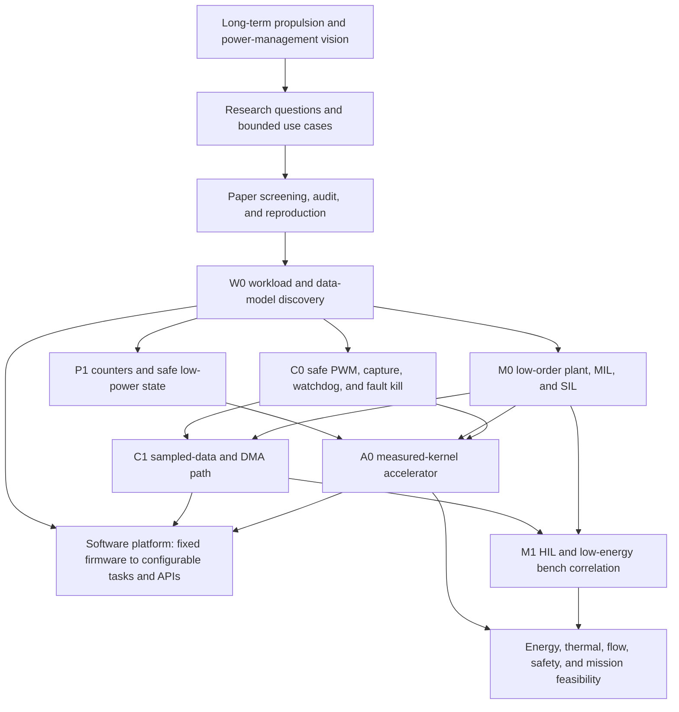
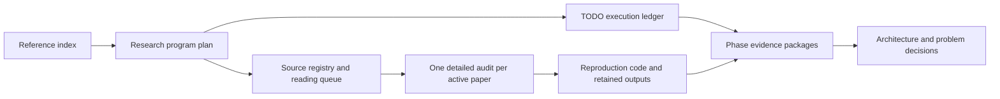
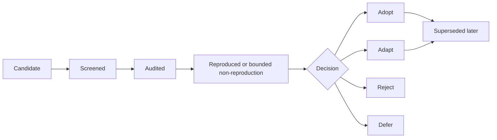

# Research Program Plan

**Document type:** central research map, literature decision register, and
workload-discovery plan

**Status:** Accepted planning baseline; it records no reproduced paper result,
implemented accelerator, validated plant, or propulsion feasibility claim

**Last updated:** 2026-09-26

## 1. Possible development path

The program grows from a measurable control workload, not from a preselected
accelerator block:

This ordering deliberately separates four questions:

1. **Is the physical concept plausible?** Energy, mass flow, pressure ratio,
   thermal limits, momentum/thrust, ionization efficiency, and mission range.
2. **What must the controller do?** States, inputs, outputs, sample periods,
   deadlines, safe states, disturbances, and failure consequences.
3. **What does software actually spend time and energy doing?** Measured
   instructions, memory traffic, branches, arithmetic kernels, and data motion.
4. **What deserves hardware?** Only a repeated, bounded hotspot whose
   end-to-end speed or energy benefit exceeds its area, transfer, software, and
   verification cost.

The repository remains an experimental control-SoC foundation. This plan does
not make the conceptual propulsion system a demonstrated design.

### Software delivery and platform evolution

The present and near-term system should normally compile C/assembly/FreeRTOS
tasks ahead of time and place one firmware image in program memory or flash.
Real-time control does not require an interactive compiler; predictable code,
configuration, logging, and update/recovery are more valuable first.

A defensible evolution is:

1. **fixed experimental firmware** — one statically linked image and known
   tasks;
2. **configurable controller** — the safety kernel/driver layer remains fixed,
   while limits, schedules, calibration, model parameters, and small ML weights
   are separately versioned data;
3. **updateable task platform** — stable HAL/driver and accelerator APIs,
   signed/versioned task images, capability/resource declarations, and host
   build/deployment tools;
4. **optional isolated or dynamic execution** — U-mode/PMP, loader, bytecode or
   another sandbox only when untrusted/multiple-user tasks and field updates
   justify the memory, verification, and recovery cost;
5. **optional compiler integration** — intrinsics, libraries, or offload passes
   only after A0/A1 exposes a stable programmable contract used by several
   workloads.

An MMIO accelerator initially needs a C driver and golden model, not a custom
compiler. A custom ISA or programmable vector/NPU path may later justify
compiler work, but that is a product/runtime decision, not a prerequisite for
W0.

### Decision and uncertainty contract

Every active research or engineering phase has one primary **decision
question**. Implementation, simulation, measurement, paper reproduction, and
customer discovery produce evidence for that decision; completing a module is
not itself the decision.

Phase results record two independent conclusions:

- **evidence verdict:** `PASS`, `FAIL`, or `PARTIAL` says whether the declared
  experiment and oracle were completed;
- **decision outcome:** `GO`, `PIVOT`, `DEFER`, or `NO-GO` says what the program
  should do with the evidence.

A well-executed experiment may be `PASS / NO-GO` when it credibly falsifies an
accelerator, propulsion, algorithm, or product hypothesis. That is retained
research evidence, not an incomplete phase.

Research claims use stable IDs and the lifecycle `Proposed -> Active ->
Supported`, `Refuted`, `Inconclusive`, `Deferred`, or `Superseded`. Product
hypotheses use `Unvalidated -> Testing -> Supported` or `Refuted`, `Deferred`,
or `Superseded`. These states express evidence, not confidence by repetition.

Minor wording, threshold, or operating-envelope refinement keeps the stable ID
and adds a dated revision. A change to the claimed mechanism, population,
system boundary, or falsification test creates a new ID; the old claim is
marked `Superseded` or `Refuted` and links to the successor. Evidence is never
silently reassigned to a materially different claim.

Keep at most one primary and two supporting research claims `Active`. New
ideas remain in [`notes/inbox/`](../notes/inbox/) until screened. A stopped
phase retains its last valid evidence, failure classification, reusable
artifacts, successor, and explicit re-entry condition.

### Program research-claim register

These are hypotheses to test, not accepted project facts:

| ID | Falsifiable claim | Principal test / falsifier | State | Evidence dependency | Next decision |
| --- | --- | --- | --- | --- | --- |
| `RES-H1` | At least two accepted power/control workloads expose a repeated bounded domain primitive after reasonable software/layout optimization | W0 profiles must show the same bounded operation; refute or narrow if hotspots disappear or remain workload-specific | Proposed | W0.1–W0.5 | W0.6 common-kernel decision |
| `RES-H2` | A deadline- and fault-aware accelerator can reduce end-to-end execution energy or worst observed latency without degrading the declared control oracle | Refute if transfer/software overhead removes the gain, numeric error violates the oracle, or safe recovery is unbounded | Proposed | `RES-H1`, P1, C0, stable M0/W0 workload | A0 GO/PIVOT/NO-GO |
| `PROP-H1` | A mechanically compressed, ionization-assisted electric-propulsion chain has a bounded operating region with net system benefit after energy, heat, mass-flow, momentum, and carried-mass costs | Refute or defer if conservative parameter ranges cannot close the balances or the advantage disappears after system costs | Proposed | M0 sensitivity study, later M1 evidence | Physical-concept feasibility decision |

### Product-hypothesis register

Product hypotheses do not become requirements until customer/adoption evidence
exists. Keep them here while unvalidated; create a separate product-discovery
record only when the first interview, trial, cost comparison, or purchase
signal is retained.

| ID | User/problem hypothesis | Value and adoption test | State | Next evidence |
| --- | --- | --- | --- | --- |
| `PROD-H1` | Small power-control or propulsion research teams have a recurring integration/verification problem that a deterministic control platform solves better than separate MCU/DSP/FPGA tooling | Measure present workflow time/cost, required interfaces, acceptable migration effort, and willingness to trial | Unvalidated | Bounded workload plus initial problem interviews |
| `PROD-H2` | Bounded execution, explicit safe fallback, and reusable EMS kernels are valuable enough to justify an accelerator/IP/platform rather than optimized software alone | Compare end-to-end benefit, engineering/verification cost, deployment friction, and a real user's acceptance criterion | Unvalidated | W0/P1/C0 evidence before A0 product claims |

Research value and product value are assessed separately. A scientifically
useful negative result may prevent product waste; a valuable integration
feature may be a product differentiator without being a publishable novelty.

## 2. The plan is the hub, not the evidence warehouse

The documents have distinct ownership so that the plan stays readable as the
paper corpus and implementation evidence grow:

| Artifact | Owns | Does not own |
| --- | --- | --- |
| This plan | Research questions, taxonomy, dependencies, gates, and concise paper decisions | Detailed reproduction logs or implementation proof |
| [`TODO.md`](../TODO.md) | Authoritative checkbox status and immediate engineering action | Full scientific argument |
| [`plans/<phase-id>/`](plans/README.md) | Requirements, architecture, verification plan, and actual phase results | General literature library |
| [`research/SOURCE_REGISTRY.md`](research/SOURCE_REGISTRY.md) | Exact source identity, provenance, reading priority, access notes, and current review state | Proof that a claim is correct or reproduced |
| [`research/PAPER_AUDIT_TEMPLATE.md`](research/PAPER_AUDIT_TEMPLATE.md) | Claim-by-claim paper audit and reproduction record | Program-wide priority |
| [`REFERENCE_INDEX.md`](REFERENCE_INDEX.md) | Standards, tools, mature projects, and reuse constraints | Whether a scientific claim reproduced locally |
| `doc/ar/AR*.md` | Focused problem, options, decision, and RED/GREEN evidence | Candidate-paper backlog |

When a paper becomes active, copy the audit template to
`doc/research/papers/<paper-id>-<short-name>.md`. Create that directory and a
reproduction directory only when the first real paper is selected; do not add
empty future trees. A suggested working location is
`research/reproductions/<paper-id>/`, with large generated data ignored and
only compact results, hashes, commands, environments, and failing seeds kept.

Original PDFs normally remain in the researcher's lawful personal library.
The repository records the citation, DOI/URL, access date, version, license,
and content hash when available. Do not commit a paper, dataset, model, or
third-party implementation without compatible redistribution rights and an
entry in [`THIRD_PARTY_NOTICES.md`](../THIRD_PARTY_NOTICES.md).

### Obsidian and graph tools

No graph application or plugin is required. Standard Markdown links and the
Mermaid diagrams above work as the durable source of truth and are reviewable
in Git. Obsidian can optionally open the repository as a vault and derive a
graph directly from the same links; it should be treated as a personal viewer,
not a required build dependency. Add a plugin only if a later, specific query
cannot be served by links, tables, `rg`, or generated reports.

## 3. Scalable source registry and lifecycle

The [source registry](research/SOURCE_REGISTRY.md) stores compact identity,
provenance, priority, and state for every queued source. This central plan
stores only decisions that affect program direction. A detailed audit stores
the equations, assumptions, reproduction commands, actual outputs, and the
reason for adoption or rejection. This prevents hundreds of sources from
turning the central plan into an unreadable notebook.

Use stable IDs by research family:

- `EMS-nnn` — energy and power-management algorithms;
- `EST-nnn` — state estimation, observers, and sensor fusion;
- `CTRL-nnn` — real-time and constrained control;
- `ACC-nnn` — hardware acceleration and memory/data movement;
- `DS-nnn` — data structures, runtimes, and language/compiler behavior;
- `MODEL-nnn` — plant, component, and numerical-model references that are not
  naturally owned by one algorithm family;
- `PROP-nnn` — compressor, flow, plasma/ionization, electric propulsion, and
  system feasibility;
- `SAFE-nnn` — fault handling, assurance, and verification.

The lifecycle is:

`Reproduced` means the declared experiment and acceptance oracle were run and
actual output was retained. It does not mean every conclusion in a paper is
true. A bounded non-reproduction is also useful evidence when missing data,
ambiguous equations, licensing, hardware, or contradictory results are
recorded explicitly.

### Paper decision register

The starter reading queue and exact citations are in the
[source registry](research/SOURCE_REGISTRY.md). No scientific paper has passed
this repository's audit yet. Add a decision row here only after an audit
produces a program-level decision; do not use an approximate title or an AI
summary as the source record.

| ID | Family | Citation / link | Claim under test | State | Decision | Adopted artifact / detailed audit |
| --- | --- | --- | --- | --- | --- | --- |
| — | — | [Starter sources registered; no audited paper yet](research/SOURCE_REGISTRY.md) | — | Backlog | — | Copy the [audit template](research/PAPER_AUDIT_TEMPLATE.md) when close review starts |

The first search backlog is organized by questions rather than prestige:

| Family | First question | Comparison required |
| --- | --- | --- |
| EMS | Which rule-based, optimization-based, predictive, adaptive, and learning-based methods fit a small deterministic controller? | Quality, compute, memory, model dependence, constraint handling, and failure behavior |
| EST | Which SOC/SOH, bus-state, thermal, speed, pressure, or flow estimators are needed by the chosen plant? | Accuracy versus execution time, numeric robustness, and observability |
| CTRL | Which sample rates and deadlines follow from the electrical, mechanical, and fluid time constants? | Stability/constraint result plus WCET and jitter |
| DS | Which containers and access patterns remain after bounded embedded implementation? | Static array/ring buffer/indexed pool versus heap list/map alternatives |
| ACC | Which kernels recur across at least two accepted workloads? | CPU versus accelerator including data transfer, driver, area, and energy |
| PROP | Does the compressor/ionization/electric-thrust chain close energy, heat, mass-flow, and momentum balances? | Conservative baselines and sensitivity ranges before detailed CFD/plasma work |

Venue reputation is a filter, not proof. A result from Nature, Science, IEEE,
or any other venue still needs equation, unit, assumption, baseline, data,
statistics, and reproduction review before it affects architecture.

## 4. W0 — the first research and architecture step

`W0` means **workload and data-model discovery**. It does not implement an
accelerator. Its purpose is to turn “accelerate data structures or power
management algorithms” into a measured specification for A0.

### 4.1 Why data structures alone are not yet the target

Source-level arrays, dictionaries, linked lists, structs, and tagged unions are
software abstractions. After compilation, hardware sees address generation,
loads/stores, comparisons, branches, allocation, synchronization, and
arithmetic. The same dictionary can be a hash table, tree, sorted array, or
perfect lookup table; their hardware costs differ radically.

Hard real-time control also tends to avoid unbounded heap allocation and
pointer-heavy containers because fragmentation, cache/memory irregularity, and
variable traversal length complicate WCET. Typical bounded alternatives are
fixed arrays, ring buffers, bit sets, queues, object pools, lookup tables, and
small dense or sparse matrices. Therefore W0 profiles **operations and access
patterns**, while retaining their source-level meaning. A linked-list engine is
eligible only if accepted workloads repeatedly traverse or mutate bounded lists
and software layout changes do not remove the hotspot.

### 4.2 A bounded initial system, despite uncertain propulsion requirements

The conceptual propulsion system does not yet provide trustworthy flight-level
requirements. Start with a replaceable surrogate problem:

- one DC bus;
- battery plus optional supercapacitor/source model;
- inverter/motor/compressor load with bounded demand;
- current, voltage, speed, pressure/flow, and temperature signals;
- commands, limits, faults, and safe-state transitions;
- configurable electrical, mechanical, and fluid time constants.

This is not a claim about the final thruster. It is a low-cost way to discover
interfaces, units, data movement, algorithm structure, and deadline ranges. M0
owns the evolving plant; W0 owns the comparable software workloads.

### 4.3 Work packages

| Work package | Output | Completion evidence |
| --- | --- | --- |
| W0.1 use-case envelope | Signals, units, operating ranges, control periods, deadlines, safe states, and uncertainty ranges | Versioned requirement table; unknown values are ranges, not invented constants |
| W0.2 algorithm taxonomy | Rule/state-machine, PI/PID, observer/filter, optimization/MPC, scheduling, and optional small-ML candidates | One-page comparison per family and selected baselines |
| W0.3 benchmark corpus | Deterministic scenarios and portable reference implementations | Fixed inputs/seeds, expected functional/control oracle, build commands, and hashes |
| W0.4 common data model | Shared domain types and access-pattern inventory | Types used by at least two workloads, with ownership, bounds, units, and lifetime |
| W0.5 CPU characterization | Timing and event profiles on the present RV32IM SoC | Cycles, instructions, memory operations, branches, stalls, footprint, and run-to-run variation |
| W0.6 hotspot/accelerator gate | Ranked kernel candidates and go/no-go decision | End-to-end model includes movement, MMIO/driver, area, energy, verification, and failure recovery |

Begin the corpus with three deliberately different but comparable methods:

1. a rule/state-machine or PI power-split baseline;
2. a small constrained optimizer or MPC/QP iteration;
3. a state estimator or small fault classifier only if M0 signals justify it.

Use a high-level model for exploration and a bounded C implementation for the
firmware/SoC measurement. The same scenario, units, numeric tolerance, and
acceptance oracle must be shared. Python output is a reference, not a substitute
for measuring compiled target code.

The initial relationship between algorithm families and potential machine
work is:

| Algorithm family | Common operations/data | Possible measured kernel | Main reason not to preselect hardware |
| --- | --- | --- | --- |
| Rules, state machines, fault logic | bit fields, tables, comparisons, branches, event queues | lookup, bit/state transition, bounded priority selection | Control flow and safety semantics may dominate rather than arithmetic |
| PI/PID, filters, observers | history windows, state vectors, coefficients | MAC, FIR, matrix-vector, clamp/saturation | Small problems may already meet deadlines cheaply on the CPU |
| MPC/QP/optimization | matrices, constraints, working vectors | matrix-vector, reduction, projection, solver iteration | Solver convergence, precision, and data movement can dominate |
| Scheduling/resource allocation | task descriptors, queues, heaps or indexed pools | bounded queue/priority operations | Better static scheduling or layout may remove the need for hardware |
| Small ML/fault classification | tensors/feature windows, weights | dense/sparse MAC, activation, quantization | Model quality, updateability, and memory cost must be proved first |

### 4.4 Common data model candidates

Start from domain meaning rather than general-purpose containers:

- `sample` — timestamp, value, unit/scaling, validity, and quality flags;
- `state_vector` — bounded numeric state with declared format and covariance or
  confidence where applicable;
- `history_window` — fixed ring buffer with sample period and valid count;
- `limit_set` — min/max/rate/thermal/electrical constraints;
- `command` — target, mode, validity interval, and sequence;
- `fault_event` — source, severity, timestamp, latch/clear policy;
- `task_descriptor` — period, deadline, priority, WCET observation, and state;
- bounded vectors/matrices and indexed pools when an accepted algorithm needs
  them.

Only after implementations exist should W0 extract common kernels such as
dot-product/matrix-vector, reduction, clamp/saturation, interpolation/LUT,
FIR/window processing, queue/ring operations, bit-field/state transitions, or
small neural inference.

### 4.5 Measurement and the meaning of WCET

WCET is **worst-case execution time**: the maximum time a task can take under a
declared hardware, software, input, and interference model. A maximum observed
time is not automatically a proven WCET; initially report it as an observed
high-water mark and state the coverage limits.

For each workload record:

- target clock, toolchain and flags, code/data size, input/seed, and hash;
- total cycles and retired instructions;
- loads/stores, branches, multiply/divide, stalls/waits, and bus transactions
  when counters or traces make them observable;
- per-task observed execution distribution and high-water mark;
- deadline, period, jitter, and total single-core utilization;
- control/estimation quality, constraint violations, stability/fault outcome;
- activity/power/energy estimate under the same P0 identity;
- accelerator transfer, setup, synchronization, and recovery overhead.

Clock sufficiency is a deadline question. At minimum, every task must complete
before its deadline and the scheduled set must retain declared safety margin.
For a simple periodic estimate, examine `sum(WCET_i / period_i)` together with
interrupt, bus, blocking, and wake overhead. A higher MHz number does not prove
schedulability, and a lower one is not inadequate if deadlines and energy goals
are met with margin.

### 4.6 W0 exit gate before A0 specification

Do not select an accelerator until all of the following are true:

1. at least one C0/M0-relevant end-to-end workload is stable and reproducible;
2. at least two accepted algorithms or tasks expose the same bounded kernel,
   or one safety/energy-critical workload justifies a deliberately narrow unit;
3. the hotspot is repeatable under representative inputs and is not removed by
   a simpler data layout, compiler option, or software algorithm;
4. numeric accuracy, control behavior, fault handling, and bounded completion
   are specified;
5. CPU/accelerator comparison includes all movement and software overhead;
6. the estimated FPGA area, timing, active power, verification effort, and API
   fit the current platform.

Candidate thresholds such as “more than 30% of cycles” may be used as an early
screen, but they are not universal truth. A smaller hotspot can still matter to
a hard deadline; a larger one can still be a bad accelerator if data movement
dominates.

## 5. Parallel work and dependencies

These activities can overlap without pretending their evidence is complete:

| Track | Can start now | Needs from other tracks | Must not claim yet |
| --- | --- | --- | --- |
| W0 research/corpus | Taxonomy, paper audits, surrogate scenarios, C reference kernels | M0 signal/range refinement; P1 counters improve later profiles | Chosen accelerator or final flight workload |
| M0 model | Low-order bus, motor/inverter, shaft/compressor/flow dynamics and faults | W0 comparison scenarios; later bench parameters | Validated propulsion physics |
| C0 requirements | Safe state, fault latency, PWM/capture/watchdog contract | M0 time constants and actuator envelope | Safe high-energy actuation |
| P1 | Counter/event and wake-safe-state design after verified P0 | W0 identifies the most useful events | Physical energy saving without measurement |
| U0 | Passive retirement monitor/scoreboard through the existing licensed path | Stable commit/trap contracts | Control or plant validation |

For one person, the recommended active width is two main lanes: **W0 plus M0**.
Use their results to refine C0 requirements. Treat P1 and U0 as bounded
supporting slices rather than simultaneously trying to implement every track.
C0 and M0 remain the first propulsion-relevant engineering wave. C1 waits for
their sample/interrupt needs, and A0 waits for P1 plus stable C0/M0 profiling.

## 6. Benchmark ladder and CoreMark decision

CoreMark is useful, but it is neither the first blocker nor the accelerator
selection workload. It measures a generic embedded CPU/compiler combination;
it does not represent sensor timing, fault response, MPC matrices, estimator
state, data movement, or energy-management quality.

Use a four-level ladder:

| Level | Purpose | Examples |
| --- | --- | --- |
| L0 architectural microbenchmarks | Explain the machine | ALU/MUL/DIV latency, branch/RAW behavior, RAM load/store, CSR, interrupt, context switch, MMIO |
| L1 portable generic benchmark | Compare compiler/core baselines | CoreMark, only with exact version, legal terms, flags, memory placement, iterations, clock, score and CoreMark/MHz |
| L2 domain kernels | Find reusable hotspots | ring buffer, indexed pool, reduction, LUT, FIR, fixed matrix-vector, QP iteration, tiny inference |
| L3 end-to-end tasks | Decide product relevance | periodic EMS/controller/estimator/fault-manager tasks connected to M0 scenarios |

Run L0 first because it explains this core's unusual costs, including stalls and
multi-cycle operations. CoreMark can then be added as a recognizable secondary
baseline, provided its source/license/provenance is reviewed before anything is
committed. Architecture decisions must be based primarily on L2 and L3. Report
raw score and normalized results together; CoreMark/MHz helps comparison but
does not include deadlines, I/O, memory-system differences, or energy.

## 7. Research decision rules

A paper may influence implementation only when its registry row links to an
audit that states:

1. the exact claim being tested and its relevance to a TODO/phase requirement;
2. equations, units, assumptions, operating envelope, data provenance, and
   baseline fairness;
3. what was reproduced, adapted, or impossible to reproduce;
4. actual commands, environment, outputs, error metrics, and limitations;
5. the local decision: adopt, adapt, reject, defer, or supersede;
6. the exact artifact affected—requirement, model, algorithm, data type,
   benchmark, RTL block, software API, or no artifact.

An adopted algorithm is not automatically an adopted hardware block. The
algorithm must first enter W0/M0 software experiments; only measured W0/P1
evidence can promote a common kernel into A0.

## 8. Immediate next research actions

### W0-D1 — bound the first surrogate use case

**Status:** `Planned / NOT RUN`

**Execution brief:**
[`research/W0_D1_EXECUTION_BRIEF.md`](research/W0_D1_EXECUTION_BRIEF.md) defines
the bounded reading questions, candidate system boundary, tables, baseline
contracts, scenarios, oracles, classification review, and decision record.

**Decision question:** Is one replaceable battery–DC-bus–motor/compressor
surrogate bounded well enough to generate deterministic scenarios and compare
the same rule/PI workload in a high-level model and bounded C?

**Linked hypotheses:** `RES-H1` (enabling evidence) and `PROD-H1` (problem
relevance remains unvalidated). This step does not test `RES-H2` or establish
propulsion feasibility.

**Required outputs:**

1. a signal table with direction, unit, sign, scaling, provisional range,
   source, and unknown/assumed/measured status;
2. control-period and deadline ranges, timing rationale, safe state, fault
   response, and uncertainty bounds;
3. at least nominal demand-change, limit/overload, and sensor/actuator-fault
   deterministic scenarios;
4. a rule/PI baseline contract with inputs, outputs, constraints, and oracle,
   but no claimed performance result;
5. a GO/PIVOT/DEFER/NO-GO decision on whether implementation can start.
6. an anticipated data classification and repository-safe evidence boundary;
   unknown classification blocks commit/upload rather than blocking analysis.

**Outcome rules:** `GO` opens
`doc/plans/w0-workload-discovery/` when implementation begins. `PIVOT` narrows
the motor/compressor to a simpler bounded electrical/mechanical load if its
unknowns dominate. `DEFER` records which source, parameter, or expert input is
missing. `NO-GO` is valid only if no bounded control-relevant surrogate can be
defined without inventing the conclusion.

1. Execute `W0-D1`; do not select an accelerator or create an empty phase tree.
2. Select one review or representative paper from each of EMS, estimation, and
   accelerator/data-movement research; create exact audit files from the
   template rather than summarizing them only in chat.
3. Implement the same first rule/PI baseline in a high-level reference and
   bounded C, with deterministic vectors and a shared oracle.
4. Start M0 with the minimum model needed to generate those vectors; keep
   parameter uncertainty explicit.
5. Measure L0 and the first L3 workload on the current SoC. Add CoreMark later
   as L1, not as the gate for this step.
6. Open a `doc/plans/w0-workload-discovery/` evidence package when the first
   workload implementation actually starts, then trace W0 requirement IDs into
   its tests and results.
