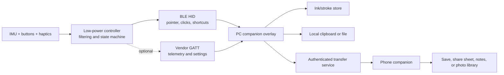

# Air-Pointer Handwriting and Annotation Device: Research Report

**Research date:** 2026-08-16

**Project stage:** concept and feasibility assessment

**Proposed form:** marker-style, Bluetooth-connected handheld controller for
reclined or otherwise mouse-inconvenient PC use

## Executive summary

The concept is technically plausible, but the most credible first product is
not a free-space handwriting recognizer. It is a **relative air pointer and
annotation controller** with explicit buttons for drawing, erasing, clicking,
and capturing or sharing. A PC companion application should render the ink,
capture it, place it on the local clipboard, and coordinate transfer to a phone.

Holding a button while drawing solves much of the hardest intent-recognition
problem. The system no longer has to infer whether every ordinary hand movement
is a character: button-down starts a stroke, button-up ends it, and an erase
button selects erase mode. Handwriting recognition is only needed if the user
wants ink converted to text. Gesture recognition is only needed if the product
later replaces explicit buttons with learned commands.

The industry already validates parts of this idea. [TapXR](https://www.tapwithus.com/tapxr-2/)
provides wearable Bluetooth AirMouse control and programmable actions;
[Logitech Spotlight 2](https://news.logitech.com/press-releases/news-details/2026/Captivate-Your-Audience-with-the-New-Logitech-Spotlight-2-Advanced-Presenter-Featuring-Haptics-and-Digital-Highlighting/default.aspx)
combines motion control with software-defined highlighting; and
[Neo Smartpen](https://shop.neosmartpen.com/pages/product-service) and
[Livescribe](https://us.livescribe.com/products/livepen) digitize and share
handwriting. Desktop overlays such as [PenSlide](https://penslide.com/) and
[Ace Overlay](https://ace-overlay.com/) show that drawing over arbitrary
windows and copying the result are already feasible in software. In the source
set reviewed for this report, however, no single product documents the exact
combination of reclined air pointing, momentary draw/erase control,
arbitrary-window capture, and deliberate cross-platform phone delivery.

That is a possible product opening, not proof of a market. The concept overlaps
substantially with existing air mice, presentation remotes, smart pens, and OS
inking tools. It should proceed only if user tests show that the reclined-use
workflow is materially more comfortable and faster than a trackpad, handheld
trackball, presentation remote, or phone-as-mouse application.

The repository's current 25 MHz RV32IM SoC and official FreeRTOS port are useful
for firmware, scheduling, filtering, and small-model experiments. They are not
yet a complete product platform: the documented design lacks the Bluetooth
radio/stack integration, an IMU interface, nonvolatile storage, low-power and
battery subsystems, secure update path, and several reliability peripherals a
wireless consumer device requires. The FPGA board is best treated as an
algorithm and firmware prototype, not the final pen electronics.

## 1. Product definition

### 1.1 Intended workflow

The core use case is a person operating a PC while lying down, reclining, or in
another posture where a desk mouse is inconvenient. The handheld device should:

1. move the PC cursor using wrist or hand rotation;
2. send ordinary left/right click actions;
3. draw while a dedicated control is held;
4. erase while another control is held;
5. capture the annotation or selected screen region;
6. copy it locally or send it to a phone companion for an explicit save, share,
   or paste action.

The phrase “handwriting device” can describe three different technical goals.
They should not be conflated:

| Goal | Required intelligence | Recommended priority |
|---|---|---|
| Draw visible ink | Track a relative pointer between button-down and button-up | MVP |
| Recognize command gestures | Classify a small vocabulary such as circle, undo, or copy | Later option |
| Convert handwriting to text | Segment and recognize characters, words, or lines | Separate research feature |

The first goal does **not** require recognizing characters. It requires stable
pointing, reliable mode control, and a good overlay application.

### 1.2 Recommended control model

Use an explicit state machine rather than continuously interpreting motion:

| State | Entry | Motion behavior | Exit |
|---|---|---|---|
| Idle | No control held | Ignore motion or enter low-power sampling | Wake/move threshold |
| Pointer | Pointer enabled | Relative cursor movement | Clutch/recenter or idle |
| Draw | Hold Draw | Emit pointer path and ink stroke | Release Draw |
| Erase | Hold Erase | Erase intersected strokes or pixels | Release Erase |
| Command | Dedicated press/chord | Capture, undo, copy, or share | Confirmation/timeout |

A two-button prototype can map tap/hold/chord combinations, for example tap for
left/right click, hold for draw/erase, and a long chord for capture. A production
study should compare that with a third dedicated capture/share button. Chords
save space but increase memory burden and accidental activation risk.

Haptic or audible feedback should confirm mode entry, recentering, capture, and
failed transfers. Feedback is especially important when the user's arm or
device is outside the center of vision.

## 2. Current state of the industry

### 2.1 Adjacent product categories

| Category | Representative evidence | What it proves | Remaining gap for this concept |
|---|---|---|---|
| Wearable air mouse/input | [TapXR overview](https://www.tapwithus.com/tapxr-2/), [quick-start guide](https://www.tapwithus.com/quick-start-guide/tapxr/), and [AirMouse commands](https://support.tapwithus.com/hc/en-us/articles/360036944033-What-Commands-Can-I-Do-With-AirMouse) | Bluetooth HID, motion pointing, haptics, macros, and programmable controls are commercially understandable | Its documented experience is a wearable keyboard/controller, not an end-to-end arbitrary-window ink capture and phone-delivery workflow |
| Presentation remote | [Logitech Spotlight 2 announcement](https://news.logitech.com/press-releases/news-details/2026/Captivate-Your-Audience-with-the-New-Logitech-Spotlight-2-Advanced-Presenter-Featuring-Haptics-and-Digital-Highlighting/default.aspx) and [original Spotlight manual](https://www.logitech.com/assets/65053/2/spotlight-presentation-remote.pdf) | Motion control plus desktop software can implement highlighting, haptics, and configurable actions | Optimized for presentations rather than persistent freehand annotation across everyday applications |
| Optical smart pen | [Neo Smartpen R1](https://shop.neosmartpen.com/products/neo-smartpen-r1), [Neo technology](https://shop.neosmartpen.com/pages/technology), and [Livescribe LivePen](https://us.livescribe.com/products/livepen) | Users value digitization, transcription, sync, and sharing | These products obtain stable coordinates from coded paper and an optical sensor, not unconstrained free-space motion |
| Desktop annotation overlay | [PenSlide](https://penslide.com/) and [Ace Overlay](https://ace-overlay.com/) | Arbitrary-window ink, screenshots, and clipboard actions can be implemented on the host | They do not solve comfortable reclined physical input or cross-device hardware control |
| OS pen/ink ecosystem | [Windows Ink walkthrough](https://learn.microsoft.com/en-us/windows/apps/develop/input/ink-walkthrough) | Host APIs can draw, erase, recognize, and persist ink, including basic mouse-driven ink | A true integrated pen expects a richer absolute digitizer input device |

TapXR is the closest functional comparator. Its documentation describes
Bluetooth HID, AirMouse behavior, programmable maps, and developer access to
[raw tapping and IMU data](https://www.tapwithus.com/how-tapxr-works-meta/).
Its [multi-pair instructions](https://support.tapwithus.com/hc/en-us/articles/28271954063515-How-Can-I-Setup-Multi-Pair-on-My-Tap-to-Swap-Between-Paired-Devices-Easily)
describe switching among up to three previously paired devices. Stored bonds
and rapid host switching should not be interpreted as simultaneous delivery to
two hosts.

### 2.2 Competitive conclusion

The idea is not “a mouse with two extra buttons”; its potentially distinctive
value is a workflow:

> comfortably point while reclined → deliberately enter ink mode → annotate any
> visible content → capture the useful region → explicitly deliver it to the
> desired PC or phone destination.

Each individual function exists elsewhere. Differentiation must come from the
quality of the combined workflow, especially comfort, low false activation,
fast recentering, and one-action capture/share. Patents, freedom-to-operate, and
a quantitative market-size analysis are outside this technical review and would
require separate professional work.

### 2.3 Candidate markets to test

Do not begin with a broad “replacement for the mouse” claim. Test narrower
segments where the posture or workflow creates a visible problem:

- bed/sofa PC use for reading, reviewing, and lightweight editing;
- teaching, remote presentations, and screen explanation;
- reviewers who frequently circle, mark, capture, and forward visual material;
- accessibility-adjacent use where a conventional mouse is inconvenient, while
  avoiding medical claims until usability and safety have been evaluated;
- spatial-computing or large-display control where a desk surface is absent.

The primary business question is whether users will carry and charge a separate
device when trackpads, handheld trackballs, phone remotes, and existing air mice
already exist. That question should be tested before custom silicon or tooling.

## 3. Technical principles

### 3.1 Why an IMU is not an absolute pen

An IMU measures angular velocity and linear acceleration. Orientation filters
can combine gyroscope, accelerometer, and sometimes magnetometer data, but an
unconstrained position estimate requires acceleration to be integrated twice.
Small sensor bias, gravity-subtraction error, and orientation error then grow
into large position drift. The [x-io position-tracking explanation](https://x-io.co.uk/oscillatory-motion-tracking-with-x-IMU/)
shows why useful inertial position tracking normally depends on application
constraints such as periodic motion or known zero-velocity events. The
[Madgwick filter report](https://x-io.co.uk/downloads/madgwick_internal_report.pdf)
also describes the effects of motion acceleration and magnetic distortion on
orientation estimation.

The practical MVP should map wrist orientation or angular rate to **relative
cursor velocity**, then provide a clutch/recenter action. It should not attempt
to reconstruct the pen tip's absolute 3-D position and project that onto the
screen.

This distinction also appears in platform requirements. Microsoft's
[required HID pen collections](https://learn.microsoft.com/en-us/windows-hardware/design/component-guidelines/required-hid-top-level-collections)
expect an integrated pen to report reliable absolute X/Y coordinates, tip and
in-range state, with optional pressure, tilt, and eraser data. An IMU wand should
initially enumerate as a mouse and consumer-control device through
[Bluetooth HID over GATT](https://www.bluetooth.com/specifications/specs/hid-over-gatt-profile-hogp/),
using the [USB HID usage tables](https://www.usb.org/hid) as the report-usage
reference.

### 3.2 Recommended pointer pipeline

```text
calibrated IMU samples
        ↓
orientation / angular-rate estimate
        ↓
stationary detection + bias update
        ↓
dead zone + tremor suppression
        ↓
gain curve / pointer acceleration
        ↓
clutch, recenter, draw, or erase state
        ↓
BLE HID relative mouse reports
        ↓
PC overlay records cursor-space strokes
```

The pointer needs both filtering and a carefully tuned nonlinear gain curve.
Heavy smoothing reduces jitter but adds lag; high gain reaches distant targets
quickly but amplifies tremor. The correct balance is an HCI result, not just a
signal-processing result.

### 3.3 What handwriting or gesture recognition would require

If text recognition or button-free commands are later added, the research
pipeline becomes:

1. collect synchronized accelerometer, gyroscope, orientation, button state,
   user, posture, session, and intended-label data;
2. calibrate and transform samples into a consistent device/body frame;
3. segment strokes explicitly from buttons, or solve continuous gesture
   spotting if buttons are removed;
4. normalize duration, orientation, scale, and sampling irregularity without
   deleting discriminative motion;
5. train a sequence classifier or recognizer;
6. calibrate confidence and reject unknown/non-command movements;
7. test on users and sessions excluded from training;
8. compress and profile the accepted model on the embedded target.

The negative dataset is as important as the labeled characters. It must include
ordinary pointing, repositioning, resting, scratching, clicking, picking the
device up, changing posture, and interrupted strokes. Otherwise an apparently
accurate classifier can still produce unacceptable false commands in daily use.

## 4. Research state of air writing

Published results show that inertial air-writing recognition is possible under
defined protocols, but scores should not be compared as if they measured the
same task. Alphabet size, segmentation, user-dependent versus unseen-user
splits, motion constraints, language correction, and laboratory versus natural
use all change the result.

| Study | Scope and useful result | Product lesson |
|---|---|---|
| [Yanay and Shmueli, *Air-writing recognition using smart-bands*](https://www.sciencedirect.com/science/article/pii/S1574119220300602) | 21,450 recordings from 55 subjects over 26 uppercase letters; reports separate user-dependent and user-independent results and gains from word correction | Unseen-user performance is materially harder; language context can help text but not arbitrary command gestures |
| [Amma, Georgi, and Schultz, *Airwriting: Hands-Free Mobile Text Input...*](https://doi.org/10.1109/ISWC.2012.21) | Treats continuous spotting and recognition together | Automatic start/stop detection is a real subsystem; button gating is a valuable simplification |
| [*Towards an IMU-based Pen Online Handwriting Recognizer*](https://arxiv.org/abs/2105.12434) | CNN/BiLSTM/CTC approach for continuous inertial pen input | Sequence recognition can avoid explicit character cuts, but this work concerns an instrumented pen on a writing surface rather than unconstrained air pointing |
| [Deep-learning air-writing evaluation](https://www.mdpi.com/1424-8220/21/24/8407) | Evaluates preprocessing/interpolation and recognition across several public datasets | Dataset and preprocessing choices can dominate reported accuracy; reproduce on the intended device and posture |
| [RingRT](https://link.springer.com/article/10.1007/s42486-025-00209-9) | Large ring-based character dataset with user-independent and real-world evaluation | Form factor and uncontrolled-use evaluation matter; laboratory scores alone are not a product gate |
| [Writer-independent IMU handwriting](https://arxiv.org/abs/2502.20954) | Studies variable-length, writer-independent recognition with convolutional and recurrent modeling | Hold out people and sessions, not random samples from the same recordings |
| [SurfMyoAiR](https://arxiv.org/abs/2210.17185) | Explores surface EMG for air-writing recognition | Muscle sensing is an alternative modality but adds electrodes, placement sensitivity, and user variability |
| [Ultrasonic air-writing](https://pmc.ncbi.nlm.nih.gov/articles/PMC8537432/) | Uses acoustic ranging rather than inertial dead reckoning | An external spatial reference can improve trajectory observability at the cost of infrastructure |
| [Google Soli overview](https://www.research.google/blog/soli-radar-based-perception-and-interaction-in-pixel-4/) | Demonstrates radar signal processing for presence and small gesture classes | Radar is useful for bounded gestures but changes cost, RF design, and inference complexity |

The most important conclusion is not which published model has the highest
headline accuracy. It is that an everyday device must recognize **when not to
act**, across unseen people, postures, sessions, and incidental movements.

## 5. Recommended system architecture



### 5.1 Device responsibilities

- sample and calibrate the IMU;
- maintain pointer/draw/erase/command state;
- apply low-latency orientation filtering and pointer mapping;
- emit standard HID mouse/button/shortcut reports;
- provide haptic/status feedback;
- expose explicit, authenticated configuration and diagnostics;
- manage pairing, sleep, battery, fault recovery, and safe firmware update.

Keep screen capture and application-specific clipboard logic off the device.
That reduces firmware complexity and keeps OS permissions visible to the user.

### 5.2 PC companion responsibilities

- global overlay window and per-monitor coordinate handling;
- stroke smoothing, colors, width, undo, and erasing;
- screenshot/region capture and transparent ink export;
- local clipboard insertion in PNG plus an editable vector/stroke format;
- target-app shortcuts only when the user explicitly invokes them;
- device configuration, calibration, logging, and firmware updates;
- encrypted handoff to the phone companion.

Windows Ink can support mouse-based basic inking as described in Microsoft's
[inking walkthrough](https://learn.microsoft.com/en-us/windows/apps/develop/input/ink-walkthrough),
but a cross-application overlay and capture workflow will still need companion
software.

### 5.3 Phone transfer responsibilities

Dual Bluetooth connections alone do not create a shared clipboard. HID reports
represent input controls, not arbitrary annotated images. Existing systems
illustrate the extra layer:

- [Apple Universal Clipboard](https://support.apple.com/en-gb/102430) requires
  nearby devices, the same Apple Account, Bluetooth, Wi-Fi, and Handoff.
- [Microsoft Phone Link](https://support.microsoft.com/en-us/windows/apps/phonelink/what-s-new-and-announcements-for-the-phone-link)
  provides cross-device features only through supported devices and companion
  software; see its [requirements and setup](https://support.microsoft.com/en-us/windows/apps/phonelink/phone-link-requirements-and-setup).
- Android limits background clipboard access as part of its
  [privacy behavior](https://developer.android.com/about/versions/10/privacy/changes),
  while Apple's [UIPasteboard documentation](https://developer.apple.com/documentation/uikit/uipasteboard)
  describes platform pasteboard access behavior.

The recommended transfer is an explicit “send annotation” command. The PC app
packages a PNG and optional editable stroke document, sends it over a mutually
authenticated local-network or cloud channel, and notifies the phone app. The
phone then presents save/share/paste destinations using OS-approved UI. An
offline BLE data service could be explored for small objects, but it is a custom
application protocol, not HID or automatic clipboard access.

## 6. Fit with the current RISC-V/FreeRTOS project

The local platform is documented in the repository [README](../README.md),
[project knowledge base](../doc/PROJECT_KNOWLEDGE_BASE.md),
[FreeRTOS architecture record](../doc/AR025_OFFICIAL_FREERTOS_RISCV_PORT.md), and
[FPGA board guide](../fpga/zynq_mini_revb/README.md).

### 6.1 Capabilities available now

- custom in-order RV32IM core operating conservatively at 25 MHz on the target;
- machine-mode traps, CSRs, precise machine-timer interrupts, and `mret`;
- split 64 KiB instruction and 64 KiB data BRAM;
- polling UART TX/RX and memory-mapped output GPIO;
- reset-to-C runtime and firmware build/image pipeline;
- pinned official FreeRTOS Kernel V11.3.0 RISC-V GCC port;
- verified simulation of ticks, preemption, queues, context preservation, UART
  heartbeat, and GPIO activity;
- a routed FPGA FreeRTOS bitstream, while physical FreeRTOS execution remains an
  open board-validation item in the repository roadmap.

This is enough to prototype the task structure and computation:

- high-rate sample-ingestion task;
- sensor-fusion/filter task;
- button/state-machine task;
- HID packet production logic using a temporary external radio interface;
- telemetry/logger task;
- small fixed-point or quantized gesture models after profiling.

### 6.2 Product-critical gaps

| Gap in the documented platform | Why the device needs it | Prototype response |
|---|---|---|
| No integrated BLE controller/radio/qualified antenna path | HID transport, pairing, phone/PC control | Use an external certified BLE module or development board first |
| No documented SPI/I2C controller | Most practical IMUs use SPI or I2C | Add a minimal verified controller or bridge through an external MCU |
| No product power subsystem | Battery operation needs charging, regulation, sleep/wake, and fuel monitoring | Measure algorithms on FPGA, then migrate to a low-power board |
| No documented nonvolatile configuration/firmware storage | Pairing keys, calibration, settings, update images | Add external flash/NVM and a defined boot/update design |
| No documented secure boot/update or device identity | Wireless update and annotation transfer create security obligations | Threat-model before connectivity; use authenticated, rollback-safe updates |
| Polling-only peripheral baseline | Continuous sensors/radio benefit from interrupts or DMA | Keep polling for initial functional tests; add bounded-latency interrupt paths after profiling |
| Physical FreeRTOS FPGA run still open | Simulation and routing do not prove board runtime | Complete the existing UART and FreeRTOS hardware checklist before relying on board measurements |

### 6.3 Hardware conclusion

The core can serve as the **experimental computing foundation**, especially for
learning RISC-V, FreeRTOS, drivers, filtering, and accelerator ideas. It is not
yet a competitive single-chip foundation for a battery-powered Bluetooth pen.
For the fastest product research, pair the FPGA with a commercial BLE/IMU board,
or build the first end-to-end prototype entirely on a low-power wireless MCU and
port the validated workload back to this core later. This avoids confusing SoC
peripheral bring-up with product-demand validation.

## 7. Key technical challenges

| Priority | Challenge | Why it is difficult | Evidence needed to retire risk |
|---|---|---|---|
| P0 | Stable, low-fatigue relative pointing | Filtering, gain, posture, recentering, tremor, and display geometry interact | Target-selection and tracing tests versus trackpad/air-mouse baselines across reclined postures |
| P0 | Accidental-action prevention | Ordinary movement resembles gestures; global shortcuts can be destructive | False activations per hour in realistic non-command sessions; safe confidence/reject policy |
| P0 | Overlay and capture compatibility | Multiple monitors, DPI scaling, protected/full-screen content, and OS permissions vary | Compatibility matrix and graceful fallback on supported OS versions |
| P0 | Ergonomics and fatigue | Static arm elevation, extension, device mass, and repeated strokes cause fatigue | Perceived exertion, task endurance, posture video, and recovery measurements |
| P1 | User/session generalization | Sensor placement, handedness, speed, posture, and personal writing styles shift data | Participant-held-out and session-held-out results, not random-sample splits |
| P1 | Latency versus stability | Smoothing removes jitter but creates visible lag and overshoot | End-to-end motion-to-photon latency plus objective jitter/overshoot curves |
| P1 | Cross-device transfer | Permissions, identity, discovery, data formats, and offline behavior differ by OS | Explicit authenticated transfer succeeds reliably without silent clipboard access |
| P1 | Power and thermal budget | Continuous IMU, radio, haptics, and inference compete for battery | Measured average/peak current by state and realistic battery-life tests |
| P2 | Text recognition quality | Continuous words need segmentation, language modeling, corrections, and privacy decisions | Unseen-user word/character error rate with a clear correction UX |
| P2 | Manufacturability and calibration | Sensor axes, mechanical tolerances, button feel, antenna placement, and per-unit bias affect behavior | Pilot-build calibration yield, RF testing, drop/wear tests, and production test time |

Fatigue deserves early measurement. The CHI paper
[Consumed Endurance](https://doi.org/10.1145/2556288.2557130) formalized a
biomechanical measure for mid-air interaction, and the later
[NICER model](https://doi.org/10.1145/3658230) incorporates cumulative fatigue
and recovery. The product should favor a bent, supported arm, small angular
movements, clutching, and short ink bursts rather than large shoulder-drawn
letters.

## 8. Recommended research pathways

### Work package 0 — Problem and market validation

Build no custom electronics yet. Interview people who actually use a PC from a
bed/sofa or frequently annotate and forward screen content. Observe their
present workflow, alternatives, frequency, and willingness to keep another
charged device. A practical discovery sample is 12–20 varied participants; it
is a planning heuristic, not a statistical proof.

**Proceed if:** the problem is frequent, existing alternatives are measurably
awkward, and at least one narrow segment values the full point–annotate–send
workflow.

**Stop or reposition if:** users mainly want ordinary cursor control or are
satisfied with a trackpad/phone remote.

### Work package 1 — Instrumented pointer prototype

Use an off-the-shelf BLE IMU development board in a 3D-printed marker enclosure.
Log raw sensors, orientation, buttons, timestamps, battery current, and host
cursor motion. Implement clutch/recenter, nonlinear gain, dead zones, and
haptic mode feedback. Do not add character recognition.

**Proceed if:** reclined users can select targets and trace short paths with
acceptable latency, error, recenter frequency, and fatigue relative to two
alternative controllers.

### Work package 2 — PC overlay and capture workflow

Implement draw/erase states, transparent overlay, undo, region capture, local
clipboard, and export. Test per-monitor DPI, multiple displays, common browsers,
documents, video, presentation mode, and full-screen limitations. Store raw
strokes separately from pixels so annotations remain editable.

**Proceed if:** a user can mark and copy useful content faster and with fewer
errors than their existing screenshot-plus-drawing workflow.

### Work package 3 — Explicit phone handoff

Prototype authenticated PC and phone companions. Begin with PNG plus metadata
and a clear “send to phone” action. Let the phone display an approval
notification and invoke its share sheet/save flow. Measure connection setup,
delivery latency, failure recovery, privacy comprehension, and destination
success.

**Proceed if:** transfer is reliable and genuinely reduces workflow steps.
Avoid silent clipboard synchronization as the default.

### Work package 4 — Small command vocabulary

Only after the button-driven workflow works, study 3–8 optional gestures such
as undo, redo, capture, and send. Keep a physical or software fallback. Collect
large amounts of non-command motion and use a confidence threshold plus an
“unknown” class.

**Proceed if:** realistic false actions are near zero and command latency beats
the button/menu alternative. Accuracy on a balanced, pre-segmented test set is
not sufficient.

### Work package 5 — Optional handwriting-to-text

Decide whether text conversion is actually a user need. If it is, first use
explicit button boundaries and host-side recognition. Compare per-character,
word-level sequence, and existing OS/cloud recognition under the project's
privacy requirements. Move inference onto the device only if latency, privacy,
offline use, or cost justifies it.

### Work package 6 — Custom-core and product-hardware migration

Once the UX and workload are stable, specify sample rate, compute, memory,
radio throughput, interrupt rate, storage, security, and power from measurements.
Then decide whether extending the custom RV32IM SoC is strategically valuable.
Add and verify the IMU bus, radio interface, interrupts, NVM/boot, watchdog,
power states, and secure update path in that order of demonstrated need.

## 9. Experimental design and success metrics

### 9.1 Dataset design

Record:

- at least two sessions per participant on different days;
- handedness, device grip, posture, recline angle, screen size/distance, and
  whether the arm is supported;
- intentional strokes and long periods of ordinary non-command use;
- pickup/putdown, button transitions, recentering, interruptions, and errors;
- raw accelerometer/gyroscope data, calibrated orientation, device timestamps,
  host timestamps, cursor path, and ground-truth intent;
- multiple physical device units once hardware exists.

Partition evaluation by participant and session. Do not allow recordings from a
test participant or test session to leak into training through random windowing.

### 9.2 Core metrics

| Area | Metrics |
|---|---|
| Pointer | target acquisition time, miss rate, path efficiency, overshoot, jitter, recenter count, Fitts-law throughput where appropriate |
| Ink | trace deviation, dropped/broken strokes, unintended joins, erase precision, undo count |
| Intent | false activations per hour, missed commands, unknown rejection, accidental capture/share events |
| Recognition | participant-held-out character/word error, command precision/recall, confidence calibration, correction time |
| System | sensor-to-HID latency, motion-to-photon latency, packet loss, reconnect time, CPU/RAM, average and peak current |
| Workflow | time and actions from “notice content” to “available on phone,” transfer failure rate, destination success |
| Human factors | Borg CR10 perceived exertion, NASA-TLX or a selected workload instrument, comfort, arm support, session endurance, next-day discomfort report |

### 9.3 Comparison conditions

At minimum compare the prototype with:

- the user's normal trackpad or mouse;
- one existing air-mouse/presentation-controller class device;
- a phone remote or handheld trackball where relevant;
- button-gated versus learned gesture commands;
- arm supported versus unsupported and several recline positions.

Use within-participant counterbalanced trials for early comparisons. Later
claims need a preregistered protocol, adequate sample size determined from the
intended effect, and confidence intervals—not only a single accuracy value.

## 10. Insights consolidated from our discussion

1. **Buttons change the research problem.** Holding Draw or Erase supplies
   intent and segmentation, so the device can render ink without recognizing
   characters.
2. **Annotation and transcription are separate products.** Drawing circles and
   marks is a pointer/overlay task; converting writing to text is a sequence-
   recognition task with a much larger dataset and correction burden.
3. **An IMU is best used as a relative controller.** Orientation and angular
   velocity can drive a cursor, but double-integrated free-space position drifts.
4. **The companion application is part of the product.** Arbitrary-window ink,
   screenshot capture, clipboard placement, and phone delivery cannot be
   supplied by HID firmware alone.
5. **Dual pairing is not a data-transfer architecture.** It may mean stored
   bonds and host switching; rich objects require an authenticated application
   protocol or an existing OS ecosystem.
6. **Recognition must model “nothing.”** Normal hand movement and posture
   changes are the dominant real-world negative class.
7. **Comfort may be harder than classification.** A high recognition score does
   not compensate for fatigue, recentering, lag, or an awkward grip.
8. **The current core is useful but incomplete.** It can run FreeRTOS, filters,
   and modest embedded inference experiments, but product peripherals, power,
   wireless security, and physical FreeRTOS validation remain.
9. **The market claim must be narrow and tested.** Existing products cover most
   component features; the hypothesis is that the integrated reclined
   annotation-and-transfer workflow is better enough to justify another device.

## 11. Recommended decision

Proceed with a low-cost, button-gated pointer prototype and PC overlay. Do not
begin with custom silicon, unconstrained 3-D trajectory reconstruction, or a
full handwriting-recognition model. The next decisive experiment is a reclined
targeting/annotation study comparing the prototype with a trackpad and an
existing handheld controller.

The project earns the next investment only if it demonstrates all three:

- clear ergonomic or workflow advantage for a defined user segment;
- sufficiently stable pointing with low recenter and false-action rates;
- a capture-to-phone flow that users value beyond ordinary screenshots.

If those gates pass, add command gestures and custom-core integration in small,
measured steps. If they fail, the work can still yield a useful presentation or
accessibility controller, an IMU/FreeRTOS research platform, or a desktop
annotation application without forcing the original product thesis.

## 12. Reference catalog

### Products and adjacent software

- [TapXR product overview](https://www.tapwithus.com/tapxr-2/)
- [TapXR product listing](https://shop.tapwithus.com/products/tapxr-wrist-worn-keyboard-airmouse-controller-for-vr-ar-mr-tablets-pc-laptops-smartwatch-smartphones-tvs-projectors)
- [TapXR quick-start guide](https://www.tapwithus.com/quick-start-guide/tapxr/)
- [TapXR AirMouse commands](https://support.tapwithus.com/hc/en-us/articles/360036944033-What-Commands-Can-I-Do-With-AirMouse)
- [TapXR multi-pair instructions](https://support.tapwithus.com/hc/en-us/articles/28271954063515-How-Can-I-Setup-Multi-Pair-on-My-Tap-to-Swap-Between-Paired-Devices-Easily)
- [TapXR operation and raw-data access](https://www.tapwithus.com/how-tapxr-works-meta/)
- [Tap BLE API documentation](https://www.tapwithus.com/wp-content/uploads/2018/08/TapBLEAPIdocumentation_1_0_0_20180408-1.pdf)
- [TapXR for tablet artists](https://www.tapwithus.com/tapxr-for-tablet-artists/)
- [Logitech Spotlight 2 announcement](https://news.logitech.com/press-releases/news-details/2026/Captivate-Your-Audience-with-the-New-Logitech-Spotlight-2-Advanced-Presenter-Featuring-Haptics-and-Digital-Highlighting/default.aspx)
- [Original Logitech Spotlight manual](https://www.logitech.com/assets/65053/2/spotlight-presentation-remote.pdf)
- [Neo Smartpen R1](https://shop.neosmartpen.com/products/neo-smartpen-r1)
- [Neo Smartpen product/service explanation](https://shop.neosmartpen.com/pages/product-service)
- [Neo Smartpen technology](https://shop.neosmartpen.com/pages/technology)
- [Livescribe LivePen](https://us.livescribe.com/products/livepen)
- [Livescribe app](https://us.livescribe.com/pages/livepen-app)
- [PenSlide screen annotation](https://penslide.com/)
- [Ace Overlay screen annotation](https://ace-overlay.com/)

### Standards and operating-system integration

- [Bluetooth HID over GATT Profile](https://www.bluetooth.com/specifications/specs/hid-over-gatt-profile-hogp/)
- [Bluetooth Generic Attribute Profile](https://www.bluetooth.com/wp-content/uploads/Files/Specification/HTML/Core-61/out/en/host/generic-attribute-profile--gatt-.html)
- [USB HID usage tables](https://www.usb.org/hid)
- [Microsoft required HID top-level collections](https://learn.microsoft.com/en-us/windows-hardware/design/component-guidelines/required-hid-top-level-collections)
- [Microsoft Windows Ink walkthrough](https://learn.microsoft.com/en-us/windows/apps/develop/input/ink-walkthrough)
- [Microsoft pen and stylus interactions](https://learn.microsoft.com/en-au/windows/apps/develop/input/pen-and-stylus-interactions)
- [Microsoft Phone Link features](https://support.microsoft.com/en-us/windows/apps/phonelink/what-s-new-and-announcements-for-the-phone-link)
- [Microsoft Phone Link supported devices](https://support.microsoft.com/en-US/Windows/Apps/PhoneLink/supported-devices-for-phone-link-experiences)
- [Microsoft Phone Link requirements](https://support.microsoft.com/en-us/windows/apps/phonelink/phone-link-requirements-and-setup)
- [Apple Universal Clipboard](https://support.apple.com/en-gb/102430)
- [Apple UIPasteboard](https://developer.apple.com/documentation/uikit/uipasteboard)
- [Android clipboard privacy changes](https://developer.android.com/about/versions/10/privacy/changes)
- [Android secure clipboard handling](https://developer.android.com/privacy-and-security/risks/secure-clipboard-handling)

### Sensing, recognition, and ergonomics research

- [Madgwick, *An efficient orientation filter for inertial and inertial/magnetic sensor arrays*](https://x-io.co.uk/downloads/madgwick_internal_report.pdf)
- [x-io explanation of inertial position tracking and drift](https://x-io.co.uk/oscillatory-motion-tracking-with-x-IMU/)
- [Yanay and Shmueli, *Air-writing recognition using smart-bands*](https://www.sciencedirect.com/science/article/pii/S1574119220300602)
- [Amma, Georgi, and Schultz, *Airwriting: Hands-Free Mobile Text Input by Spotting and Continuous Recognition of 3D-Space Handwriting with Inertial Sensors*](https://doi.org/10.1109/ISWC.2012.21)
- [*Towards an IMU-based Pen Online Handwriting Recognizer*](https://arxiv.org/abs/2105.12434)
- [Sensors air-writing recognition and interpolation study](https://www.mdpi.com/1424-8220/21/24/8407)
- [RingRT air-writing dataset and recognition study](https://link.springer.com/article/10.1007/s42486-025-00209-9)
- [Writer-independent IMU handwriting recognition](https://arxiv.org/abs/2502.20954)
- [Real-time inertial character recognition study](https://onlinelibrary.wiley.com/doi/10.1155/2022/8507706)
- [Uni-stroke air-writing recognition study](https://pmc.ncbi.nlm.nih.gov/articles/PMC9416756/)
- [SurfMyoAiR surface-EMG air-writing](https://arxiv.org/abs/2210.17185)
- [Ultrasonic air-writing recognition](https://pmc.ncbi.nlm.nih.gov/articles/PMC8537432/)
- [Google Soli radar interaction](https://www.research.google/blog/soli-radar-based-perception-and-interaction-in-pixel-4/)
- [Recent review/comparison of air-writing sensing approaches](https://pmc.ncbi.nlm.nih.gov/articles/PMC13256321/)
- [Hincapié-Ramos et al., *Consumed Endurance*](https://doi.org/10.1145/2556288.2557130)
- [Li et al., *NICER: A New and Improved Consumed Endurance and Recovery Metric*](https://doi.org/10.1145/3658230)

### Repository material

- [Project README](../README.md)
- [FreeRTOS and SoC roadmap](../TODO.md)
- [Project knowledge base](../doc/PROJECT_KNOWLEDGE_BASE.md)
- [Official FreeRTOS RISC-V port architecture record](../doc/AR025_OFFICIAL_FREERTOS_RISCV_PORT.md)
- [FreeRTOS demo application](../sw/apps/freertos_demo/main.c)
- [FreeRTOS configuration](../sw/apps/freertos_demo/FreeRTOSConfig.h)
- [ZYNQ MINI REVB FPGA guide](../fpga/zynq_mini_revb/README.md)
- [Vendored FreeRTOS provenance](../third_party/FreeRTOS-Kernel/UPSTREAM.md)

## 13. Scope and evidence notes

- Product and platform statements are based on the linked official pages as
  reviewed on the research date. Features, availability, and compatibility can
  change.
- The competitor review is directional, not an exhaustive global patent,
  pricing, sales, or market-size study.
- Research accuracy figures are intentionally not ranked because experimental
  protocols differ. Any product claim must be reproduced on the proposed form
  factor, target users, postures, and realistic negative activity.
- The hardware-fit section describes what is documented in this repository; it
  does not imply that every unlisted peripheral is impossible to add.
