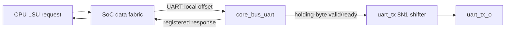

# Phase 4 Minimal UART TX Guide

The first Phase 4 peripheral is a polling, transmit-only UART. It is complete
through RTL simulation and out-of-context synthesis. GPIO and physical FPGA
validation remain separate gates.

## Architecture



`core_bus_uart` and `uart_tx` are deliberately separate. The bus target owns
the MMIO contract and one queued byte. The shifter owns the byte currently
being serialized. A byte changes owners only on `valid && ready`.

## Register contract

| Address | Access | Meaning |
|---|---|---|
| `0x1000_0000` (`TXDATA`) | aligned word write, strobes `1111` | Queue `wdata[7:0]` |
| `0x1000_0004` (`STATUS`) | aligned word read | bit 0 `TX_READY`, bit 1 `TX_BUSY` |

`TX_READY=1` means a TXDATA write can be accepted now, including a cycle where
the queued byte simultaneously moves into the shifter. `TX_BUSY=1` means at
least one byte is queued or active. Invalid accesses receive a registered bus
error and cause no serial side effect.

## Software flow

```c
while ((UART_STATUS & 1u) == 0u) { }
UART_TXDATA = byte;
```

Polling is the intended first driver. Hardware backpressure still prevents a
write at the boundary from being lost. Firmware that must know the final stop
bit has left the pin waits until `(UART_STATUS & 2u) == 0`.

## Serial flow

One accepted byte becomes ten fixed-duration bits:

```text
idle=1 -> start=0 -> data[0] ... data[7] -> stop=1 -> idle=1
```

The default is 25 MHz / 115200 baud. The divider rounds to the nearest integer
clock count, so final baud error must be calculated from the actual board
clock, not a guessed nominal clock.

## Verification commands

```powershell
cd D:\Rsicv-soc-worktrees\phase2-act4-cleanup\sim
vsim -c -do run_uart_tx.do
vsim -c -do run_core_bus_uart.do
vsim -c -do run_soc_data_fabric.do

cd .\regress
Set-ExecutionPolicy -Scope Process -ExecutionPolicy Bypass
.\run_regression.ps1 -Manifest .\phase4_tests.json -Test soc_uart_hello
```

The end-to-end test runs polling firmware and decodes `uart_tx_o` as a real
8N1 receiver would. It expects `Hello, UART!\r\n`.

## Do I need the FPGA board now?

No for RTL, firmware, regression, or OOC synthesis. Yes for the final physical
gate. Before creating a board top or XDC, record:

- exact board name and full FPGA part/package/speed grade;
- actual PL clock source/frequency;
- reset source, polarity, and whether it is asynchronous;
- UART TX package pin and I/O bank voltage/IOSTANDARD;
- whether the board includes USB-UART and which connector/COM port it uses.

With those facts, the remaining work is a board wrapper, reset conditioning,
constraints, BRAM firmware initialization, implementation/timing closure,
bitstream programming, and terminal capture.

For the complete decision record and verification evidence, see
[`AR020_MINIMAL_POLLING_UART_TX.md`](../doc/AR020_MINIMAL_POLLING_UART_TX.md).
