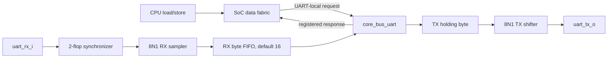

# Phase 4 Polling UART Guide

Phase 4 now provides a bidirectional polling UART: one queued TX byte plus the
active TX frame, and a parameterized RX FIFO whose default depth is 16 bytes.
Interrupt-driven UART service is intentionally deferred; the current slice is
small enough to understand, synthesize, and validate end to end before adding
a PLIC.

## Data path and ownership



The split is intentional:

- `uart_tx.sv` and `uart_rx.sv` own bit timing and serial framing.
- `core_bus_uart.sv` owns buffering, sticky errors, software-visible status,
  and exactly-once MMIO side effects.
- `soc_data_fabric.sv` owns full-address decode, local-address translation,
  and registered response ownership.

This keeps electrical transport separate from architectural policy. It also
makes the shifters testable without a CPU or bus.

## Configuration

The UART base address is generated from `config/soc_map.json` and is currently
`0x1000_0000`. The default SoC parameters are:

- `UART_CLK_FREQ_HZ = 50_000_000`
- `UART_BAUD_RATE = 115_200`
- `UART_RX_FIFO_DEPTH = 16`

The baud divider is rounded to the nearest whole input-clock count. Both TX and
RX require at least four clocks per bit. Change the clock parameter when the
board clock changes; a baud rate constant without the matching clock is not a
complete UART configuration.

## Register map

All accesses are aligned 32-bit operations. The fabric subtracts the UART base
before presenting these local offsets to the target.

| Address | Name | Access | Description |
|---:|---|---|---|
| `UART_BASE + 0x00` | `TXDATA` | W | Enqueue `wdata[7:0]`; a legal write waits while the TX holding stage is full |
| `UART_BASE + 0x04` | `STATUS` | R | TX/RX state and RX count |
| `UART_BASE + 0x08` | `RXDATA` | R | Return and pop oldest RX byte; return zero if empty |
| `UART_BASE + 0x0C` | `RXERROR` | R/W1C | Bit 0 overrun, bit 1 framing error |

`STATUS` fields:

| Bit(s) | Name | Software meaning |
|---:|---|---|
| 0 | `TX_READY` | A TXDATA write can be accepted |
| 1 | `TX_BUSY` | A byte is queued or a frame is active |
| 2 | `RX_VALID` | RXDATA contains at least one byte |
| 3 | `RX_FULL` | FIFO has reached the configured depth |
| 4 | `RX_OVERRUN` | Sticky indication that a newest byte was dropped |
| 5 | `RX_FRAME_ERROR` | Sticky indication of an invalid stop bit |
| 15:8 | `RX_COUNT` | Number of queued bytes |

Invalid offsets, directions, sizes, and write strobes produce a registered bus
error with no state change.

## Polling software

Minimal transmit:

```c
while ((UART_STATUS & (1u << 0)) == 0u) { }
UART_TXDATA = byte;
```

Minimal receive:

```c
while ((UART_STATUS & (1u << 2)) == 0u) { }
byte = (uint8_t)UART_RXDATA;
```

Before changing clock configuration or declaring a completed line of output,
software can wait until `TX_BUSY` clears. Software should periodically inspect
`RXERROR`; writing ones to bits 0 and/or 1 clears the selected sticky flags.

An empty RXDATA read is deliberately nonblocking and returns zero. This keeps
an erroneous polling sequence from occupying the core's only outstanding data
transaction forever. Correct software still checks `RX_VALID`, because a zero
byte is valid UART data and cannot be distinguished from an empty read by data
alone.

## FIFO and error policy

The default 16-byte FIFO is a latency cushion, not flow control. UART has no
ready wire, so data may continue arriving while software is busy.

- Good frames enqueue in arrival order.
- A full FIFO preserves all queued bytes and drops the newest arrival.
- Dropping a byte sets sticky `RX_OVERRUN`.
- A low stop bit sets sticky `RX_FRAME_ERROR` and the malformed byte is not
  enqueued.
- A hardware error event wins over a simultaneous software clear.
- Explicit pointer wrapping permits any configured depth from 1 to 255, not
  only powers of two.

At 115200 baud, 16 entries provide roughly 16 ten-bit character times of
software-service tolerance. That is useful for polling firmware but does not
guarantee lossless sustained traffic.

## Verification

From `sim/`:

```powershell
vsim -c -do run_uart_tx.do
vsim -c -do run_uart_rx.do
vsim -c -do run_core_bus_uart.do
vsim -c -do run_core_bus_uart_rx.do
vsim -c -do run_soc_data_fabric.do
```

Run both end-to-end firmware cases from the repository root:

```powershell
.\run_regression.ps1 -Manifest .\phase4_tests.json -Tag phase4
```

The first program transmits `Hello, UART!\r\n`. The second testbench drives 16
real 8N1 frames into `uart_rx_i`; polling firmware drains the FIFO and echoes
the bytes through `uart_tx_o`, where an independent decoder compares
`RX FIFO 16 OK!\r\n`.

Current evidence also includes 2/2 Phase 3, 22/22 smoke, and a Vivado 2019.2
out-of-context synthesis pass with the RX/TX hierarchy retained. See
[AR-020](../doc/AR020_MINIMAL_POLLING_UART_TX.md) for TX and
[AR-021](../doc/AR021_POLLING_UART_RX_FIFO.md) for RX.

## FPGA-board gate

No board connection is required for RTL development or the simulation gates.
Physical validation is still necessary before calling the FPGA milestone
complete. It requires:

1. a board-specific top module and clock/reset conditioning;
2. correct `UART_CLK_FREQ_HZ` for the delivered core clock;
3. XDC package-pin and I/O-standard constraints for both UART pins;
4. confirmation of the board USB-UART voltage and TX/RX crossover;
5. a bare-metal terminal/loopback run, followed by timing and utilization
   review.

Do not infer pin names, reset polarity, or clock frequency from generic board
examples. Those are properties of the exact board and schematic.
